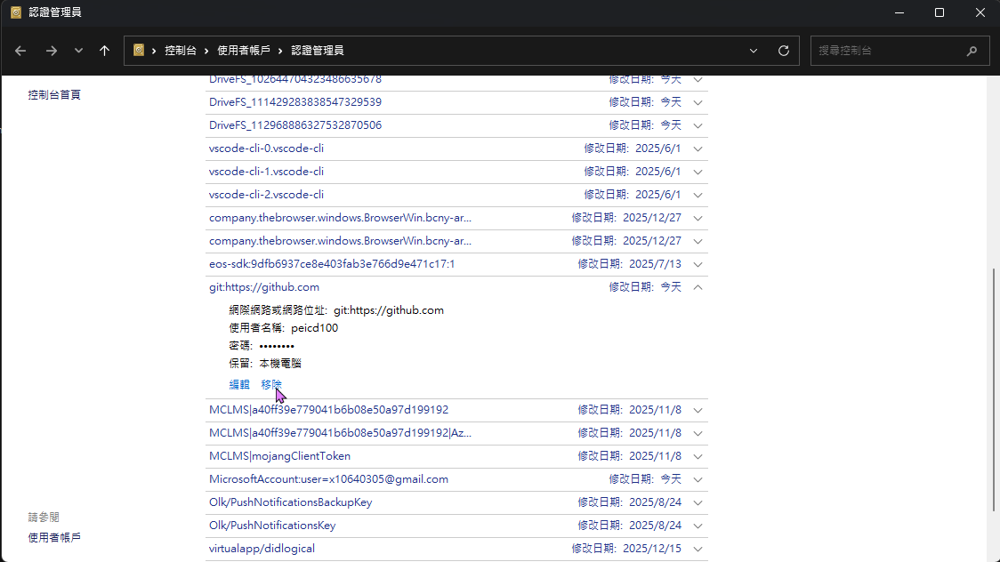

# Github+mkdocs+vscode製作網頁

## 創建帳號

請先擁有github帳號並登入

## 創建儲存庫

### 1.到主頁


### 2.創造儲存庫


選擇 New repository

### 3.選擇網頁名稱
其實輸入
```
{你的ID}.github.io
```
就好


> 假設輸入的是{你的ID}.github.io，那網址就會是

  `https://了{你的ID}.github.io/` 

> 如果不是{你的ID}.github.io，假設為「網頁」，那網址就會是

  `https://{你的ID}.github.io/{網頁}` 

> 個人覺得使用你的ID就好，因為加載好像會比較快  
> 除非你想在同一個帳號使用多個網址，做多個網頁


>選好名稱直接按建立儲存庫即可

### 4.下載(創建)檔案


接下來選一個資料夾，下載以下檔案
[https://drive.google.com/drive/folders/1DXs3hrqOpYwT8FgT0h4GEQDcjjxcLhef?usp=drive_link](https://drive.google.com/drive/folders/1azuu4sgo1n7qPlLQVaKkDBR-WgDtM4L_?usp=sharing)

### 5.連結Github

使用vscode開啟子資料夾(root)，在cmd執行以下程式(請選好你要使用的環境，python不要太舊即可)：

需要替換{你的儲存庫網址}
輸入`git remote set-url origin https://github.com/<user>/<repo>.git`

``` title="輸入至cmd"
git init
git remote add origin https://github.com/peicd100/peicd100.github.io.git
```


如果已經設定過，但不想要，可用以下指令
```
# 更換
git remote set-url origin https://github.com/peicd100/https-peicd100.github.io.git
# 刪除
git remote remove origin
```


### 6.安裝所需庫

執行
```
conda install pip -y #手動安裝pip
pip install -r requirements.txt
```

### 7.推上github

```
mkdocs gh-deploy

```

要用root


## 登入其他帳戶(已經有做過)


### 1.刪除原本帳戶憑證之後再推一次




## 全部重來

1. 安裝git   https://git-scm.com/downloads/win
2. 點開

3. ```
    git config --global user.name PEI 
    git config --global user.email x10640305@gmail.com
    ```
<!--       
4. github 桌面板 https://desktop.github.com/download/ -> 登入 
https://hackmd.io/_uploads/SyeDnf_nyl.png
https://hackmd.io/_uploads/r1qv3Gd21x.png
 -->

    
    
4. 在conda安裝git
    ```
    conda install git
    ```
5. 在conda設置git
    ```
    git init
    git remote add origin https://github.com/pei-yan-2147.git
    ```

6. 安裝所需
    ```
    pip install -r requirements.txt
    ```
    
7. 執行
    ```
    mkdocs gh-deploy
    ```    
    會跳出下面，就是「以管理員」和「登入」
    


就可以了


[vscode貼上圖片](../md-mkdocs筆記/mkdocs筆記.md#vscode貼上圖片)