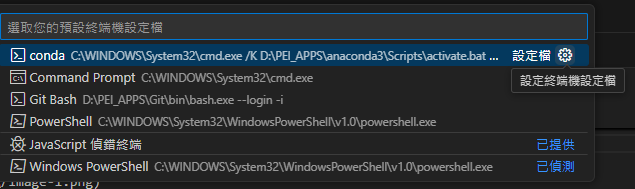
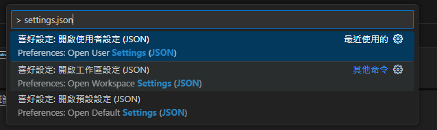

# mkdocs筆記

## 常用語法


```tex title="嵌入"

<iframe src="https://drive.google.com/file/d/1oO0sJSXeb9vxLrz9AjAvrsnqDtLMqWKz/preview" width="100%" height="300px"></iframe>


```
/// html | div.result

<iframe src="https://drive.google.com/file/d/1oO0sJSXeb9vxLrz9AjAvrsnqDtLMqWKz/preview" width="100%" height="300px"></iframe>


///


<!--  -->
````tex title="程式塊"

/// collapse-code  
```cpp  
#include<bits/stdc++.h>
using namespace std;
```
///

````
/// html | div.result

/// collapse-code  
````cpp
#include<bits/stdc++.h>
using namespace std;
int main(){
    //...//
}

````
///

///


````tex title="圖片設定大小"

```
{width=10%}
```

````
/// html | div.result

{width=10%}

///


```tex title="內文"
=== "部分一"
    早安

=== "部分二"
    你好
===! "部分三"
    午安

=== "部分四"
    晚安
```
/// html | div.result

=== "部分一"
    早安

=== "部分二"
    你好
===! "部分三"
    午安

=== "部分四"
    晚安
///


## 整理框框使用

```tex title="指令"
指令位置
```
/// html | div.result
呈現位置
///

```text title="settings"

/// settings |  title
Some content
///

```
/// html | div.result

/// settings |  title
Some content
///

///


/// settings |  settings 
Some content
///

/// note |  note
Some content
///

/// abstract |  abstract
Some content
///

/// info |  info
Some content
///

/// tip |  tip
Some content
///

/// success |  success
Some content
///

/// question |  question
Some content
///

/// warning |  warning
Some content
///

/// failure |  failure
Some content
///

/// danger |  danger
Some content
///

/// bug |  bug
Some content
///

/// example |  example
Some content
///

/// quote |  quote
Some content
///


=== "部分一"
    早安

=== "部分二"
    你好
===! "部分三"
    午安

=== "部分四"
    晚安


## 警告框

> - markdown.extensions.admonition: 

```tex title="指令"

!!! note "注意"
    這是一個提醒框。
    
!!! warning "警告"
    這是一個警告框。

!!! tip "提示"
    這是一個提示框。

!!! danger "危險"
    這是一個錯誤或危險框。

```
/// html | div.result

!!! note "注意"
    這是一個提醒框。
    
!!! warning "警告"
    這是一個警告框。

!!! tip "提示"
    這是一個提示框。

!!! danger "危險"
    這是一個錯誤或危險框。

///

---

##   禁用智能引號
> smart_quotes: false

不啟用：

{width="50%"}
啟用：

> "Hello", she said. 'It's a nice day!'


---

##   BetterEm 擴展，增強的 Markdown 語法支持

> - pymdownx.betterem:

斜體和粗體

```tex title="指令"
> This is *italic* and this is **bold**.
```
/// html | div.result
> This is *italic* and this is **bold**.
///


---


## 支持 Markdown 內的 HTML 屬性語法

>  - markdown.extensions.attr_list:

透過{}來加入class

像是
```tex title="指令"
{width="300px" height="200px"}
```
會被替換成
```tex title="指令"

```

所以可以透過在照片後面加入{width=50%}調整比例

## 定義列表擴展

> - markdown.extensions.def_list:  


```tex title="指令"
Term 1
Markdown
: A lightweight markup language with plain-text formatting syntax.

MkDocs
: A static site generator that's geared towards project documentation.
```
會被替換成

```tex title="指令"
<dl>
  <dt>Term 1</dt>
  <dd>Definition of term 1</dd>
  <dt>Term 2</dt>
  <dd>Definition of term 2, can span multiple lines</dd>
</dl>
```
/// html | div.result
<dl>
  <dt>Term 1</dt>
  <dd>Definition of term 1</dd>
  <dt>Term 2</dt>
  <dd>Definition of term 2, can span multiple lines</dd>
</dl>
///

## 表格支持

>   - markdown.extensions.tables:  #

```tex title="指令"
| Header 1 | Header 2 |
|----------|----------|
| Row 1 Col 1 | Row 1 Col 2 |
| Row 2 Col 1 | Row 2 Col 2 |
```
/// html | div.result
| Header 1 | Header 2 |
|----------|----------|
| Row 1 Col 1 | Row 1 Col 2 |
| Row 2 Col 1 | Row 2 Col 2 |
///


## 縮寫支持

> - markdown.extensions.abbr:

這個擴展允許你在 Markdown 中定義縮寫，並在讀者將滑鼠懸停在縮寫上時顯示完整說明。它是一個語義化的擴展，特別適合技術文檔和長篇文章，便於解釋專業術語。

```tex title="指令"

*[HTML]: Hyper Text Markup Language
The HTML standard is maintained by the W3C.


```
/// html | div.result

*[HTML]: Hyper Text Markup Language
The HTML standard is maintained by the W3C.


///


## 支持腳註

> - markdown.extensions.footnotes:  #

此擴展允許你在 Markdown 中使用腳註，使得文章中的附加說明可以用標記的方式靈活地插入，而不會打斷正文流暢性。腳註通常在學術和技術文章中使用。


```tex title="指令"

這是一段文字[^1]。

[^1]: 這是腳註的內容。


```
/// html | div.result

這是一段文字[^1]。
[^1]: 這是腳註的內容。


///


## 支持 HTML 中嵌入 Markdown

> - markdown.extensions.md_in_html:

/// failure | 好像不能用

```tex title="指令"

<div>
  **這是嵌入在 HTML 中的粗體文本**
</div>

```
/// html | div.result

<div>
  **這是嵌入在 HTML 中的粗體文本**
</div>

///


///


## 增強的程式碼塊擴展

>   - pymdownx.superfences: 

/// details | 全部
```
- pymdownx.superfences:  # 增強的程式碼塊擴展
    preserve_tabs: true  # 保持原始的縮排格式
    custom_fences:  # 自定義的 fenced blocks
    - name: diagram  # Mermaid 圖表支持
        class: diagram
        format: !!python/name:pymdownx.superfences.fence_code_format
    - name: math  # 數學公式支持
        class: arithmatex
        format: !!python/object/apply:pymdownx.arithmatex.arithmatex_fenced_format {kwds: {mode: generic, tag: pre}}
```
///

### Mermaid 語法繪製圖表
    

這段配置允許你在 Markdown 中使用以下兩種自定義區塊：

使用 Mermaid 語法繪製圖表（例如流程圖）。
使用 Arithmatex 語法來呈現數學公式。


```` title="範例"
```diagram
graph TD;
    A[1] --> B[2];
    A --> C[3];
    B --> D[4];
    B --> E[5];
    C --> F[6];
    C --> G[7];
    D --> H[8];
    D --> I[9];
    E --> J[10];
    E --> K[11];
    F --> L[12];
    F --> M[13];
    G --> N[14];
    G --> O[15];
```
````
/// html | div.result
`````diagram
graph TD;
    A[1] --> B[2];
    A --> C[3];
    B --> D[4];
    B --> E[5];
    C --> F[6];
    C --> G[7];
    D --> H[8];
    D --> I[9];
    E --> J[10];
    E --> K[11];
    F --> L[12];
    F --> M[13];
    G --> N[14];
    G --> O[15];
`````
///


/// success | Practical

/// details | diagram
```diagram
graph TD
    A[Hard] -->|Text| B(Round)
    B --> C{Decision}
    C -->|One| D[Result 1]
    C -->|Two| E[Result 2]
```
///

/// details | diagram
```diagram
sequenceDiagram
    participant Alice
    participant Bob
    Alice->>John: Hello John, how are you?
    loop Healthcheck
        John->>John: Fight against hypochondria
    end
    Note right of John: Rational thoughts <br/>prevail!
    John-->>Alice: Great!
    John->>Bob: How about you?
    Bob-->>John: Jolly good!
```
///

/// details | diagram


```diagram
classDiagram
    Class01 <|-- AveryLongClass : Cool
    Class03 *-- Class04
    Class05 o-- Class06
    Class07 .. Class08
    Class09 --> C2 : Where am i?
    Class09 --* C3
    Class09 --|> Class07
    Class07 : equals()
    Class07 : Object[] elementData
    Class01 : size()
    Class01 : int chimp
    Class01 : int gorilla
    Class08 <--> C2: Cool label
```
///
/// details | diagram


```diagram
erDiagram
    CUSTOMER ||--o{ ORDER : places
    ORDER ||--|{ LINE-ITEM : contains
    CUSTOMER }|..|{ DELIVERY-ADDRESS : uses
```

///
/// details | diagram


```diagram
stateDiagram
    [*] --> First
    First --> Second
    First --> Third

    state First {
        [*] --> fir
        fir --> [*]
    }
    state Second {
        [*] --> sec
        sec --> [*]
    }
    state Third {
        [*] --> thi
        thi --> [*]
    }
```

///

/// details | diagram

```diagram
gitGraph
    commit
    branch hotfix
    checkout hotfix
    commit
    branch develop
    checkout develop
    commit id:"ash" tag:"abc"
    branch featureB
    checkout featureB
    commit type:HIGHLIGHT
    checkout main
    checkout hotfix
    commit type:NORMAL
    checkout develop
    commit type:REVERSE
    checkout featureB
    commit
    checkout main
    merge hotfix
    checkout featureB
    commit
    checkout develop
    branch featureA
    commit
    checkout develop
    merge hotfix
    checkout featureA
    commit
    checkout featureB
    commit
    checkout develop
    merge featureA
    branch release
    checkout release
    commit
    checkout main
    commit
    checkout release
    merge main
    checkout develop
    merge release
```
///

/// details | diagram


```diagram
journey
    title My working day
    section Go to work
    Make tea: 5: Me
    Go upstairs: 3: Me
    Do work: 1: Me, Cat
    section Go home
    Go downstairs: 5: Me
    Sit down: 5: Me
```
///

///

### Arithmatex

這是行內公式：$E = mc^2$，它會嵌入在文本中。

這是一個塊級公式：Arithmatex 


```tex title="指令"

$$
E = mc^2
$$

```
/// html | div.result

$$
E = mc^2
$$

///


## 行內高亮擴展

>  - pymdownx.inlinehilite: 

當你啟用了這個配置之後，就可以在 Markdown 中使用自定義行內數學公式格式。以下是如何使用的示例：


/// details | 完整代碼
```
- pymdownx.inlinehilite:  # 行內高亮擴展
    custom_inline:
    - name: math  # 行內數學公式支持
        class: arithmatex
        format: !!python/object/apply:pymdownx.arithmatex.arithmatex_inline_format {kwds: {mode: generic}}
```
///
---

```tex title="指令"
這是一個行內數學公式 $E = mc^2$ 的示例。

```
/// html | div.result

這是一個行內數學公式 $E = mc^2$ 的示例。

///

 
##  Tilde 擴展，支持刪除線


>  - pymdownx.tilde: 

```tex title="指令"

這是一段包含刪除線的文字，~~這部分被刪除了~~。


```
/// html | div.result

這是一段包含刪除線的文字，~~這部分被刪除了~~。


///


## Caret 擴展，支持插入符號

>  - pymdownx.caret:  # 

```tex title="指令"

這是^插入^的文本。


```
/// html | div.result

這是^插入^的文本。

///


## 支持智能符號轉換

>   - pymdownx.smartsymbols: 

```tex title="指令"

省略號...       

短破折號--      

長破折號---     

雙箭頭>>        

反向雙箭頭<<   

```
/// html | div.result

省略號...       

短破折號--      

長破折號---     

雙箭頭>>        

反向雙箭頭<<        

///


## Emoji 擴展

>  - pymdownx.emoji: 

/// details |完整代碼
```
- pymdownx.emoji:  # Emoji 擴展
    emoji_index: !!python/name:material.extensions.emoji.twemoji  # 使用 Twemoji 作為 Emoji 索引
    emoji_generator: !!python/name:material.extensions.emoji.to_svg  # 將 Emoji 渲染為 SVG
```
///

```tex title="指令"

這是一個笑臉 Emoji :smile:
這是一個大拇指 Emoji :+1:
 

```
/// html | div.result

這是一個笑臉 Emoji :smile:
這是一個大拇指 Emoji :+1:
      

///


/// details |部分內容
### 表情符號和人物
- 😄 `:smile:`
- 😍 `:heart_eyes:`
- 😢 `:cry:`
- 😂 `:joy:`
- 😎 `:sunglasses:`
- 🤔 `:thinking:`
- 😱 `:scream:`
- 🤗 `:hugs:`
- 🤫 `:shushing_face:`
- 😇 `:innocent:`

### 手勢
- 👍 `:+1:`
- 👎 `:-1:`
- 👏 `:clap:`
- 🙌 `:raised_hands:`
- ✌️ `:v:`
- 🤟 `:love_you_gesture:`
- 👋 `:wave:`

### 動物和自然
- 🐶 `:dog:`
- 🐱 `:cat:`
- 🐼 `:panda_face:`
- 🦄 `:unicorn:`
- 🐍 `:snake:`
- 🌸 `:cherry_blossom:`
- 🌞 `:sun_with_face:`
- 🌈 `:rainbow:`

### 物品
- 💻 `:computer:`
- 📱 `:iphone:`
- ⌚ `:watch:`
- 🔑 `:key:`
- 🎧 `:headphones:`
- 🔥 `:fire:`
- 🚀 `:rocket:`

### 食物和飲料
- 🍎 `:apple:`
- 🍔 `:hamburger:`
- 🍕 `:pizza:`
- 🍣 `:sushi:`
- 🍩 `:doughnut:`
- ☕ `:coffee:`
- 🍻 `:beer:`

### 交通工具
- 🚗 `:car:`
- 🚌 `:bus:`
- 🚲 `:bike:`
- ✈️ `:airplane:`
- 🚢 `:ship:`

### 符號和標誌
- ❤️ `:heart:`
- 💔 `:broken_heart:`
- ✨ `:sparkles:`
- ⭐ `:star:`
- 🔔 `:bell:`
- 🔒 `:lock:`
- ⚠️ `:warning:`
///


## EscapeAll 擴展

> - pymdownx.escapeall:  #

/// failure | 好像沒啥用
///

/// details |完整代碼
```
- pymdownx.escapeall:  # EscapeAll 擴展
    hardbreak: True  # 啟用硬換行
    nbsp: True  # 啟用不間斷空格
```
///


##   任務清單擴展

>  - pymdownx.tasklist:

      custom_checkbox: true  # 自定義復選框樣式


/// details |完整代碼
```
- pymdownx.tasklist:  # 任務清單擴展
    custom_checkbox: true  # 自定義復選框樣式
```
///
```tex title="指令"

- [x] 完成任務一
- [ ] 完成任務二
- [ ] 完成任務三


```
/// html | div.result

- [x] 完成任務一
- [ ] 完成任務二
- [ ] 完成任務三      

///

## 進度條擴展

>   - pymdownx.progressbar:

這個擴展允許你用簡單的語法定義視覺化的進度條，展示某個項目的完成進度。


```tex title="指令"

[=0% "0%"]
[=5% "5%"]
[=25% "25%"]
[=45% "45%"]
[=65% "65%"]
[=85% "85%"]
[=100% "100%"]

```
/// html | div.result

[=0% "0%"]
[=5% "5%"]
[=25% "25%"]
[=45% "45%"]
[=65% "65%"]
[=85% "85%"]
[=100% "100%"]

///


##  Arithmatex 數學公式擴展

>   - pymdownx.arithmatex:

這是一個用於在 MkDocs 中支持數學公式的擴展，通常與 MathJax 或 KaTeX 一起使用。此擴展允許你在 Markdown 中渲染 LaTeX 或 TeX 數學公式。

/// details |完整代碼
```
- pymdownx.arithmatex:  # Arithmatex 數學公式擴展
    generic: true  # 通用模式
    block_tag: 'pre'  # 渲染為 `<pre>` 標籤
```
///

```tex title="Block"
$$
E(\mathbf{v}, \mathbf{h}) = -\sum_{i,j}w_{ij}v_i h_j - \sum_i b_i v_i - \sum_j c_j h_j
$$

\[3 < 4\]

\begin{align}
    p(v_i=1|\mathbf{h}) & = \sigma\left(\sum_j w_{ij}h_j + b_i\right) \\
    p(h_j=1|\mathbf{v}) & = \sigma\left(\sum_i w_{ij}v_i + c_j\right)
\end{align}
```

/// html | div.result
$$
E(\mathbf{v}, \mathbf{h}) = -\sum_{i,j}w_{ij}v_i h_j - \sum_i b_i v_i - \sum_j c_j h_j
$$

\[3 < 4\]

\begin{align}
    p(v_i=1|\mathbf{h}) & = \sigma\left(\sum_j w_{ij}h_j + b_i\right) \\
    p(h_j=1|\mathbf{v}) & = \sigma\left(\sum_i w_{ij}v_i + c_j\right)
\end{align}
///


## 高亮標記擴展

>    - pymdownx.mark: 

是一個用來在 Markdown 中支持高亮標記文本的擴展。它允許你使用簡單的語法來為某些部分的文本添加高亮樣式，類似於螢光筆效果，讓讀者能更容易注意到重點內容。

```text title="Marking"
==mark me==

==smart==mark==
```

/// html | div.result
==mark me==

==smart==mark==
///


## 移除 HTML 擴展

>   - pymdownx.striphtml:

/// failure | 看來沒用
///

```tex title="指令"

這是一段文本，<b>這部分是加粗的</b>，<i>這部分是斜體的</i>。

```
/// html | div.result

這是一段文本，<b>這部分是加粗的</b>，<i>這部分是斜體的</i>。


///


##  鍵盤按鍵樣式支持

>   - pymdownx.keys:

是一個擴展，用來在 Markdown 文檔中美化和格式化鍵盤按鍵的顯示。這個擴展允許將按鍵組合顯示為帶有按鍵樣式的格式，非常適合用於技術文檔中需要提及特定的鍵盤操作或快捷鍵的情況。

功能與應用場景：
按鍵顯示：將鍵盤按鍵顯示為專門樣式的按鍵圖標，讓文檔中的快捷鍵和按鍵組合更加易於理解。
自定義分隔符：可以設置自定義的按鍵組合分隔符號，讓按鍵顯示符合不同的語言習慣或樣式要求。


/// details | 完整代碼
```
- pymdownx.keys:  # 鍵盤按鍵樣式支持
    separator: "\uff0b"  # 自定義鍵位分隔符號
```
///
```tex title="指令"

++ctrl+alt+delete++


```
/// html | div.result

++ctrl+alt+delete++

///

##    詳情框擴展


> - pymdownx.details:  #

```tex title="指令"

/// details | 點擊展開詳細信息
這裡是隱藏的詳細信息。
可以包含多行內容，也可以使用其他的 Markdown 語法。
///

```
/// html | div.result

/// details | 點擊展開詳細信息
這裡是隱藏的詳細信息。
可以包含多行內容，也可以使用其他的 Markdown 語法。
///
///


##   標籤頁擴展


> - pymdownx.tabbed:  # 


/// details | 全部代碼
```
- pymdownx.tabbed:  # 標籤頁擴展
    alternate_style: true  # 啟用交替樣式
```
///


```text title="Tabs"
=== "Tab 1"
    Markdown **content**.

    Multiple paragraphs.

=== "Tab 2"
    More Markdown **content**.

    - list item a
    - list item b
```
/// html | div.result

=== "Tab 1"
    Markdown **content**.

    Multiple paragraphs.

=== "Tab 2"
    More Markdown **content**.

    - list item a
    - list item b
///


##  合理的標題擴展

>    - pymdownx.saneheaders:  

/// failure | 看來沒用
///

```text title="Tabs"

## 123
##123

```
/// html | div.result

## 123
##123

///


##  Blocks 警告框擴展

> - pymdownx.blocks.admonition:  

```text title="settings"

/// settings |  title
Some content
///

```
/// html | div.result

/// settings |  title
Some content
///

///


/// settings |  settings 
Some content
///

/// note |  note
Some content
///

/// abstract |  abstract
Some content
///

/// info |  info
Some content
///

/// tip |  tip
Some content
///

/// success |  success
Some content
///

/// question |  question
Some content
///

/// warning |  warning
Some content
///

/// failure |  failure
Some content
///

/// danger |  danger
Some content
///

/// bug |  bug
Some content
///

/// example |  example
Some content
///

/// quote |  quote
Some content
///


```text title="全部有這些"
settings
note
abstract
info
tip
success
question
warning
failure
danger
bug
example
quote
```


##  Blocks 詳情框擴展

> - pymdownx.blocks.details:  #

上一個提到了很多不同的框框，我們也可以讓這些框框折疊起來


```text title="指令"

/// details | "settings" 
Some content
///
```
/// html | div.result

/// details | "settings" 
Some content
///
///


```text title="全部有這些"
settings
note
abstract
info
tip
success
question
warning
failure
danger
bug
example
quote
```


##   支持 HTML Block

>  - pymdownx.blocks.html:  

透過：div[style='border: 1px solid red;']來讓整個區塊使用

```text title="這個東東"

/// html | div[style='border: 1px solid red;']
some *markdown* content
///

```
/// html | div.result

/// html | div[style='border: 1px solid red;']
some *markdown* content
///

///

##  支持定義列表 Block

> - pymdownx.blocks.definition:  

```text title="指令"
/// define
Apple

- Pomaceous fruit of plants of the genus Malus in
  the family Rosaceae.

///
```

/// html | div.result
//// define

Apple

- Pomaceous fruit of plants of the genus Malus in
  the family Rosaceae.

////
///

##  支持標籤頁 Block


>  - pymdownx.blocks.tab: 


/// details |  全部
``` 
- pymdownx.blocks.tab:  # 支持標籤頁 Block
    alternate_style: True  # 使用交替樣式
    combine_header_slug: True  # 合併標題 Slug
    slugify: !!python/object/apply:pymdownx.slugs.slugify {kwds: {case: lower}}  # 使用自定義 Slug 化方式
```
///
使用驚嘆號換行

````text title="Tab Breaks"
=== "Tab 1"
    Markdown **content**.

    Multiple paragraphs.

=== "Tab 2"
    More Markdown **content**.

    - list item a
    - list item b

=== "Tab A"
    Different tab set.

===! "Tab B"
    ```
    More content.
    ```
=== "Tab c"
    ```
    Hi.
    ```
````

/// html | div.result

=== "Tab 1"
    Markdown **content**.

    Multiple paragraphs.

=== "Tab 2"
    More Markdown **content**.

    - list item a
    - list item b

=== "Tab A"
    Different tab set.

===! "Tab B"
    ```
    More content.
    ```
=== "Tab c"
    ```
    Hi.
    ```
///


##   支持折疊程式碼塊

>  - tools.collapse_code:  

/// details |  全部
```
- tools.collapse_code:  # 支持折疊程式碼塊
    expand_text: ''  # 展開時顯示的文本
    collapse_text: ''  # 折疊時顯示的文本
```
///

````tex title="程式塊"

/// collapse-code  
```cpp
#include<bits/stdc++.h>
using namespace std;
```
///

````
/// html | div.result

/// collapse-code  
````cpp
#include<bits/stdc++.h>
using namespace std;
int main(){
    //...//
}

````
///

///


## 設定標籤

```title="在yml"
plugins:
  - tags
```

``` title="在文章(.md)前輸入"
---
tags:
  - HTML5
  - JavaScript
  - CSS
---
```

## 隱藏左右目錄

```
---
hide:
  - navigation
  - toc
---
```

## 有行號的code方塊
````
``` cpp linenums="1" hl_lines="3-5"  title="code"
def bubble_sort(items):
    for i in range(len(items)):
        for j in range(len(items) - 1 - i):
            if items[j] > items[j + 1]:
                items[j], items[j + 1] = items[j + 1], items[j]
```
````
/// html | div.result
``` cpp linenums="1" hl_lines="3-5"  title="code"
def bubble_sort(items):
    for i in range(len(items)):
        for j in range(len(items) - 1 - i):
            if items[j] > items[j + 1]:
                items[j], items[j + 1] = items[j + 1], items[j]
```

///


## 設定密碼

在文件開頭寫上
```txt
---
password: '88888888'
search:
  exclude: true  # 這會讓此頁面不被 mkdocs 的搜尋引擎索引
encryption_info_message: '密碼 八個八'    # 密碼提示

hide:        #隱藏右邊目錄，防止內容被偷看
  - toc
---
```


## 連結其他文件的標題

假設有一段文字
```
要連結的文字
```

先加上'[]'
```
[要連結的文字]
```

後面加上'()'
```
[要連結的文字]()
```

最後在裡面輸入 # / ## 就會跳出標題，然後繼續打字可以搜尋
- # ：同一個 .md 的標題
- # ：別篇 .md 的標題
```
[要連結的文字](#設定密碼)
```

<video controls src="images/mkdocs筆記/錄製內容 2026-01-26 153933.mp4" title="Title"></video>

[要連結的文字](../md-演算法筆記/貪心演算法(Greedy).md#貪心演算法greedy)


## vscode貼上圖片


在偏好設定，如圖


搜尋：
```cpp
markdown.copyFiles.destination
```
新增項目：
```cpp
docs/**/*
```
值：
```cpp
images/${documentBaseName}/
```

結果如下圖，按下確定：


## 把vscode終端機預設為conda


輸入
```
> Terminal: Select Default Profile
```

選第一個

選隨便一個的後面齒輪

輸入新名稱


輸入settings.json到設定檔
```
> settings.json
```



會看到最下面多一個new

更改成
```
        "conda": {
            "path": "C:\\WINDOWS\\System32\\cmd.exe",
            "args": [
                "/K",
                "C:\\ProgramData\\anaconda3\\Scripts\\activate.bat",
                "C:\\ProgramData\\anaconda3"
            ]
        }
```
也就是

```
        "conda": {
            "path": "C:\\WINDOWS\\System32\\cmd.exe", //不用動
            "args": [
                "/K",
                ""存放conda的資料夾"\\anaconda3\\Scripts\\activate.bat",
                ""存放conda的資料夾"\\anaconda3"
            ]
        },
```

其中的

