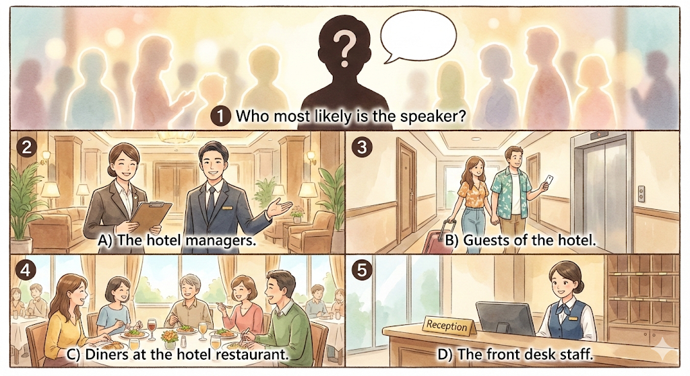
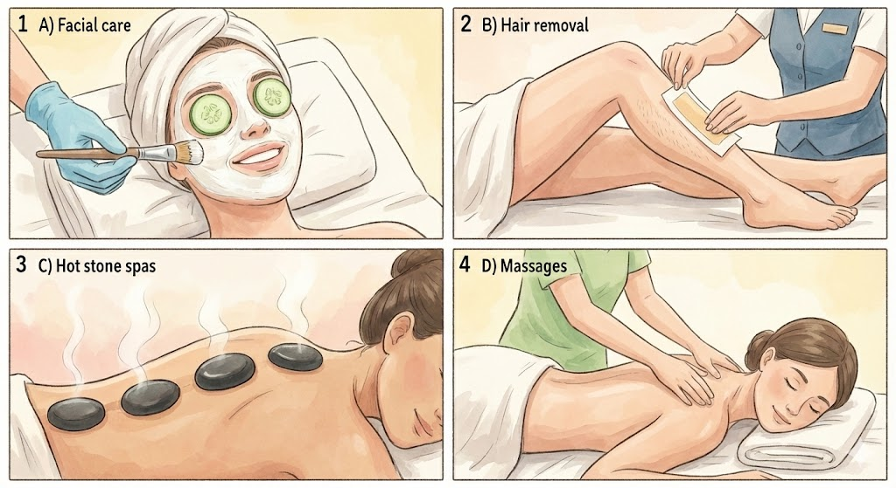

<!-- --8<-- "docs/md-多益600/includes/tts.md" -->

來源： [返現計劃 - 多益只是想考600分｜英文弱底 79 天多益達標訓練營](https://shop.wordup.com.tw/product/490?gad_source=1&gad_campaignid=22741560418&gbraid=0AAAAACugvD3L19YCk72XHbGwFRZcVFOYR&gclid=Cj0KCQiAvtzLBhCPARIsALwhxdrYXMOikrwA8sHLzm9RmzPwcUmxzoaxFCx1UTqtsr68et5zLANU9TQaAtnvEALw_wcB)

## 2

A) Several fishing boats are docked.

B) A boat is receiving maintenance.

C) The boats are being rocked by a storm.

D) The dock is empty of any boats. 

## 4

A) Several pedestrians are crossing the street.

B) Traffic congestion is blocking the intersection.

C) A sign in the road is being removed.

D) There are many traffic lights on the street.

## 5

A) Passengers are boarding an airplane.

B) The boarding gate has not opened yet.

C) People are checking in their luggage.

D) People are shopping for souvenirs. 

## 8

Where should we go to check in our luggage?

A) The counter is located right over there.

B) Your luggage has already been loaded.

C) You check it any time you want to.

## 10

What time does the shuttle depart from the hotel?

A) The time has not yet come.

B) Every hour, on the hour.

C) The shuttle bus will arrive shortly.

## 35-37

Questions 35 to 37 refer to the following conversation.

M: I have the tickets for the Chicago Philharmonic performance next month.

W: That's great. I was worried you wouldn't be able to get any. Their concerts are really popular now.

M: It wasn't easy, that's for sure. But we have them. Chicago is a bit far though.

W: That's true. I don't think we'll be able to get there and back in one day.

M: Well, we could always book a flight and stay the night in Chicago. It is on a weekend after all.

W: That sounds like a great idea. We could also take in some sights while we're there.

M: That's settled then. I'll check flights and see what's available for that weekend.

### 35

What are the speakers planning to do?

A) Go to see a popular movie.

B) Take in a musical performance.

C) Check out a museum exhibition.

D) Attend an auction for works of art.

### 36

Why does the man say "It wasn't easy."?

A) It's hard to get tickets for the event.

B) He failed to reserve their seats.

C) He has to work on the weekend.

D) The hotel is likely fully booked.

### 37

What does the man offer to do?

A) Book the accommodation for them.

B) Check trains to Chicago.

C) Look into flights to Chicago.

D) Find out the best way to get there.

## 95-97

Questions 95 to 97 refer to the following speech.

Good morning, folks. I hear you are looking to see some sights tomorrow morning. It just so happens I can help you out with that. 

We actually partner with several of the attractions nearby, 

and we have a shuttle to each that leaves every thirty minutes. 

Due to the weather, I don't think you'll want to go swimming or to the picnic grounds. 

That leaves the hot air balloon ride or a boat tour of the lake. 

Personally, I'd recommend the boat tour. The balloon ride is pretty short for the price. 

If you'd like to join the tour, the first shuttle will leave at 10 tomorrow morning. 

Guests are asked to meet right here in the lobby ten minutes before to sign up.

### 95

Who most likely is the speaker?

A) The hotel managers.

B) Guests of the hotel.

C) Diners at the hotel restaurant.

D) The front desk staff.

### 96

Look at the graphic. Where will the listeners likely go for tomorrow's excursion?

### 97

What are the listeners requested to do if they wish to join the activity?

A) Meet in the lobby ten minutes early.

B) Sign up for the activity the night before.

C) Pay a deposit for the shuttle bus ride.

D) Reserve spots on the shuttle bus an hour early.

## 107

Guests of the hotel may make use of the free housekeeping and laundry services by ^^dialing^^ "5" on the phones located in each room.

A) reading

B) dialing

C) observing

D) communicating

## 114

^^Regarding^^ the cost of the package, it includes the cost of a week-long stay at the ski resort and complimentary breakfast.

A) Despite

B) Regarding

C) So as to

D) Once

## 129

If the airplane had remained on the runway any longer, the passengers aboard would have missed their connecting flight.

A) misses

B) missed

C) would miss

D) would have missed

## 149-150

Sunnyvale Spa and Resort is pleased to introduce our Summer Spa Special, the best choice for you to relax and reenergize yourself this coming summer. 

Located next to beautiful Crystal Lake, Sunnyvale is of the leading providers of spa services in the area, 

with a professional and courteous staff ready to take care of your every need. 

Our services include full-body massage, facial care, hot stone spas, steam wraps, and mud baths, all designed to help you relax and recharge. 

For more information, visit our website at www.sunnyvalespa.com, or call us at 555-2254.

*The Summer Spa Special is available on weekdays only and is not available on holidays. Offer ends August 31st. Hours of operation are 7 am to 9 pm.*

### 149

Which service is NOT mentioned as being provided by Sunnyvale Spa?

A) Facial care

B) Hair removal

C) Hot stone spas

D) Massages

### 150

How can customers learn more about the special offer?

A) Contact the spa by email.

B) Go to the spa's website.

C) Find the spa on social media.

D) Use a messaging app.

## 176-180

https://www.bestjet.com/complaints

Name: Betty Banner

Date of Flight: September 23

Departing: Los Angeles

Arriving: Tokyo

Reason for Complaint: Booking Error

Date of Submission: October 20

Please explain the issue you encountered

I recently took an international flight to Tokyo with your company, 

and I am thoroughly unsatisfied with the experience. 

When booking my flight through your online booking service, 

I reserved a seat in business class. I paid for this with my credit card and can show the booking fee on my statement. 

However, when I checked in for the flight, I was told that the counter staff could not find my reservation for business class. 

Since the flight was leaving soon, I had no other choice but to accept a seat in economy. 

The person at the counter said they would have someone contact me after I arrived in Tokyo about the mistake. 

Even after we had taken off, the flight attendants refused to allow me to move to business class,  

saying my ticket showed economy and that there was nothing they could do.  

When I arrived in Tokyo, I had to rush to the conference I was supposed to be attending.  

It has been almost one month and I still have not heard anything. I would like this issue resolved as soon as possible.  

Please have a member of your company contact me as soon as possible, either through email or after 6pm at my phone number.

 

 

For your reference, my credit card number is 5555 8899 0989 4399 and my booking number was R593908-43G.  

I also have a frequent flier membership with your company. The membership number is 3028903893.

---

To: betty_banner@freemail.com

From: customerservice@bestjet.com

Subject: Your complaint submission

Date: October 23rd

Dear Ms. Banner,

 

We recently received your complaint regarding the mistake with your flight. We would like to sincerely apologize for the error. 

We have reviewed your initial reservation and found that you did indeed pay for a seat in business class. 

Unfortunately, it seems there was a problem with our servers at the time of your reservation and some information was incorrectly saved. 

As this mistake was entirely our fault, we will be refunding you the cost of your flight. 

This refund will be sent to the credit card used to make the booking. 

Additionally, we will provide you with an upgrade to business class on your next flight, completely free of charge. 

Again, we apologize for the mistake and any inconvenience it caused. 

 

Sincerely, Dave Parker Department Head, Customer Service

### 176

According to the complaint report, what happened at the airport on September 23?

A) Ms. Banner missed boarding her flight.

B) The airline canceled the flight unexpectedly.

C) Ms. Banner was not allowed to get on the plane.

D) The airline could not find her booking information.

 

### 177

How long did the airline take to respond to the issue?

A) One week

B) Two weeks

C) One month

D) Almost two months

 

### 178

What is indicated about Ms. Banner's trip to Tokyo?

A) She was not allowed to move to business class.

B) She was given a seat in first class as an apology.

C) The flight attendants tried to upgrade her seat.

D) She was late for the conference.

 

### 179

In the email, the word "servers" in paragraph 1, line 3 is closest in meaning to?

A) computers

B) attendants

C) employees

D) waiters

 

### 180

What can be inferred about Ms. Banner's next flight?

A) She will not have to pay anything for it.

B) She will receive better seating for free.

C) She will receive a discount on the fare.

D) She will be given priority treatment.

## Q191-Q195

https://www.lakeviewhotel.com

Have Your Next Conference Meeting at the Lakeview Hotel

The Lakeview Hotel, one of the top-rated hotels in the area, is now offering a two-day, one-night conference package for businesses. 

The package includes accommodation for one night, use of our fully equipped conference rooms, and a complimentary breakfast and dinner for each guest. 

It also includes access to all of the hotel's facilities, such as the sauna, swimming pool, and golf course. Wi-fi is provided for free throughout the hotel.

Our conference rooms are perfect for any business meeting. 

Provided equipment includes five wireless microphones, one projector and screen, and two laser pointers. 

We have rooms for any size of meeting, with a seating capacity of 15, 30, 50, or 100.

This offer is only available to groups of 15 or more and only from Monday to Friday, and is not valid on weekends or holidays. 

Additional equipment can be provided, for a fee. Conference rooms will open thirty minutes before the scheduled start time to allow guests to set up.

To make a reservation, click [here] or call us at 1-800-555-2222.

------------

To: *@deltamotorcompany.com

From: grant_g@deltamotorcompany.com

Subject: Annual Conference

Good morning, everyone. I hope you had a relaxing weekend and are ready to get back to work. 

I'm sending you this email to let you know our annual conference has been booked for December 1st and 2nd at the Lakeview Hotel. 

As you are no doubt aware, we will be discussing the sales for this past year, in addition to planned marketing campaigns and upcoming models for next year. 

We will be arriving at the hotel at 9am on the 1st, and the meetings are scheduled to last until 1pm. 

The hotel offers quite a few amenities for guests, so please feel free to make use of them. 

As I understand it, there is going to be a live musical performance by an up-and-coming pop star that night that is supposed to be quite popular and is highly recommended.

If you have any questions about the conference, please feel free to send me an email.

 

Sincerely, Grant Gustav National Manager, Marketing and Sales

------------

Scheduled Lakeview Hotel Performances for December 1st 

---

Talent Show

19:00 – 20:30

Come and watch would-be stars show off their talents. Includes a wide range of performances, including acrobatics and magic.

---

Live Show: Missy Zee

20:00 – 21:00

One of the hottest new singers on the scene will be giving a one-night-only live performance for guests of the Lakeview Hotel. 

*Seats must be reserved in advance*

---

Māori Haka

19:30 – 20:00

Be amazed by the traditional war dance of the Māori, as performed by actual Māori warriors.

---

Classical Piano Live

17:00 – 19:00

Enjoy the music of several classical pianists as you dine in our luxurious buffet restaurant.

 

 

### 191

What is the information on the website about?

A) How to book a limited vacation package.

B) An offer for a weeklong stay at a villa.

C) A special offer for short conferences.

D) Purchasing an all-access pass to the facilities.

 

### 192

According to the email, how long will the people stay in the hotel?

A) One day

B) Two days

C) One week

D) Two weeks

 

### 193

What is NOT mentioned about the package?

A) The method to make a reservation.

B) The price for each individual guest.

C) What equipment is available to use.

D) Any restrictions that may apply.

 

### 194

Which performance is the manager most likely encouraging the people to see?

A) Talent Show

B) Live Show: Missy Z

C) Māori Haka

D) Classical Piano Live

 

### 195

What can be inferred about the performance?

A) It will be a highly popular show.

B) The performer is past their prime.

C) It is only open to VIP guests.

D) People not staying at the hotel may attend.
