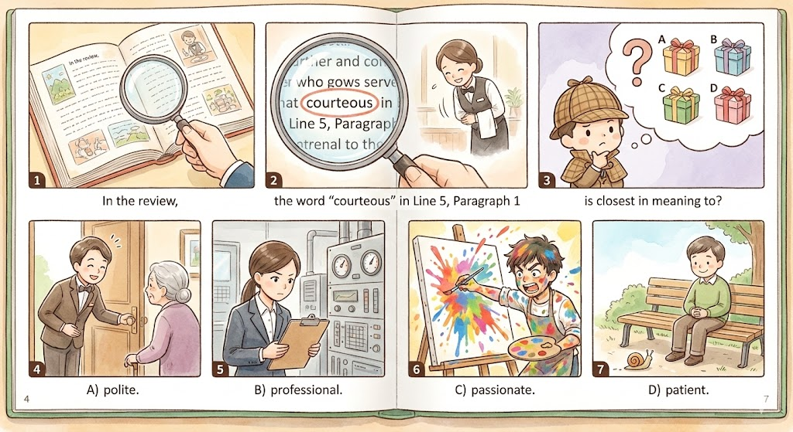

<!-- --8<-- "docs/md-多益600/includes/tts.md" -->

## 1

A) The people are queueing for a sample.

B) The woman is picking out some meat.

C) The couple are shopping for groceries.

D) The man is putting vegetables into the basket.

## 7

What time should we arrive at the restaurant?

A) The schedule is quite full now.

B) Ten minutes before our reservation.

C) The table will be ready in just a moment.

## 22

Didn't the caterer say they would be here by three? It's already three thirty.

A) The entrees will be served shortly.

B) They said they are stuck in traffic.

C) I think they already finished serving everyone.

## 41-43

Questions 41 to 43 refer to the following conversation.

M: Thank you for calling Tino's Fine Dining. How may I help you?

W: Yes, I'd like to book a table for four at six o'clock tomorrow night.

M: Not a problem. May I have your name, please?

W: Jean Branson. We will need a highchair for one of the seats please as we will be bringing our toddler.

M: Very good, I'll make sure they have the chair ready for you. Is there anything else you will need?

W: One member of our party is vegan. Do you offer vegan dishes?

M: We do offer several vegan dishes. I'll make sure to note it on your reservation.

W: Excellent, thank you. Can you also please provide tableware and dishes for our child?

M: It would be our pleasure. Just a reminder though, as your reservation is on the weekend there is a 90-minute limit for dining instead of the usual two hours.

### 41

Why does the woman request a special chair?

A) One person is physically disabled.

B) They will bring an elderly person.

C) One of the people requires back support.

D) They will bring their young child.

### 42

What concern does the woman mention?

A) A member of her group has a food allergy.

B) They might arrive late for their meal.

C) One person requires a special menu.

D) One of the group will arrive later.

### 43

How much time will the group have to enjoy their meal?

A) One hour.

B) Two hours.

C) Half an hour.

D) One and a half hours.

## 77-79

Questions 77 to 79 refer to the following message.

Hi, I'm calling about booking your services for a banquet being held after the Screen Actors Awards show next week. 

I've heard good things about your catering company, so I was hoping you'd be able to accommodate our needs. 

We will need a full five-course meal with appetizers, soup, salads, entrees, and desserts. 

We have a confirmed guest list of 150 people, so it will be quite a large affair. 

Several of the guests have a shellfish allergy, so they will need food free of all shellfish. 

Additionally, there are several guests who are vegan, so they will require appropriate dishes as well. 

Please get back to me within three days to let me know if you will be able to take the job.

### 77

What is the purpose of the call?

A) To cancel a booking for a banquet hall.

B) To arrange for seating at an awards show.

C) To hire a caterer for a banquet.

D) To prepare a specialized menu.

### 78

What is mentioned about the attendees?

A) They all enjoy eating red meat.

B) Some of them do not like seafood.

C) There are some with a food allergy.

D) None of the guests are vegans.

### 79

What is the listener asked to do?

A) Contact the speaker about the job.

B) Prepare some sample dishes.

C) Hire some extra servers for the job.

D) Find a replacement caterer.

## 109

The head chef of the restaurant gets furious when the cooks do not follow his recipes ^^completely^^ to the letter.

A) completely

B) accordingly

C) temporarily

D) automatically

## 117

Customers with special ^^dietary^^ requirements are asked to notify the restaurant in advance so that dishes can be prepared to meet their needs.

A) voluntary

B) monetary

C) complimentary

D) dietary

## 164-167

Foodie Reviews – Pie in the Sky

Member: Nancy Dawson 

Very happy with Pie in the Sky. 

I read about this restaurant on a blog I follow and since the writer said the food was fantastic, 

I thought I'd check it out. 

It's a bit of a drive to get to as it is located on Mt. 

Charles, but it is well worth the trip. 

There is a large open area in front of the restaurant that is perfect for taking pictures of the beautiful mountain scenery and for kids to play in. 

After going in, we were greeted by a very courteous server who took us to our table. 

Unfortunately, they got the seating for our reservation wrong but quickly corrected the mistake. 

They even gave us a window seat so we could look out on the mountains while we ate. 

The head chef, who has won several awards, made sure our pizzas were cooked perfectly, especially the chicken one my children ordered. 

The food itself was wonderful. 

To make up for the mistake with our reservation, they even gave us all a free dessert each, which was absolutely delicious. 

I will definitely be returning to Pie in the Sky and recommending it to all of my friends. 

Food 5 stars

Service 5 stars

Prices 4 stars

Atmosphere 5 stars

### 164

Why did Nancy decide to visit Pie in the Sky?

A) She heard about it on the news.

B) She read about it on a blog saying it was good.

C) Her friend recommended it to her.

D) She received a promotional coupon.

### 165

In the review, the word "courteous" in Line 5, Paragraph 1 is closest in meaning to?

A) polite.

B) professional.

C) passionate.

D) patient.

### 166

According to the review, what issue did Nancy have at the restaurant?

A) The food was not cooked properly.

B) She was overcharged for her meal.

C) The servers were rude to her.

D) Her reservation was not correct.

### 167

What is NOT mentioned about the restaurant?

A) The food tastes great.

B) The prices are reasonable.

C) The scenery is enjoyable.

D) The head chef has won multiple awards.

