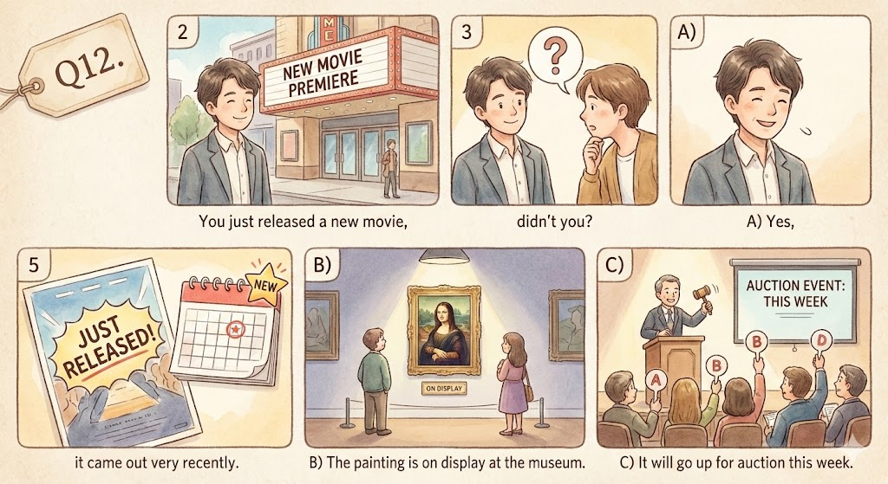
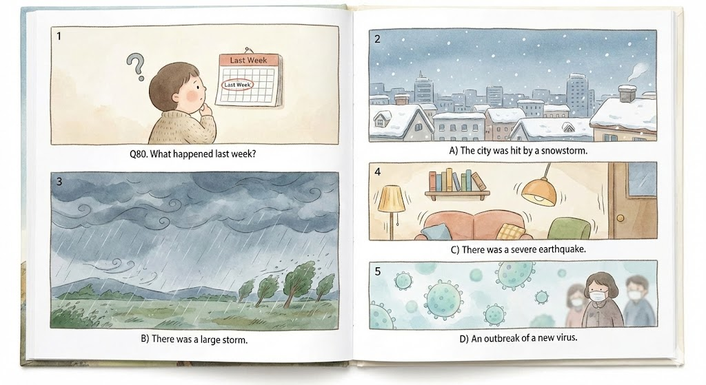
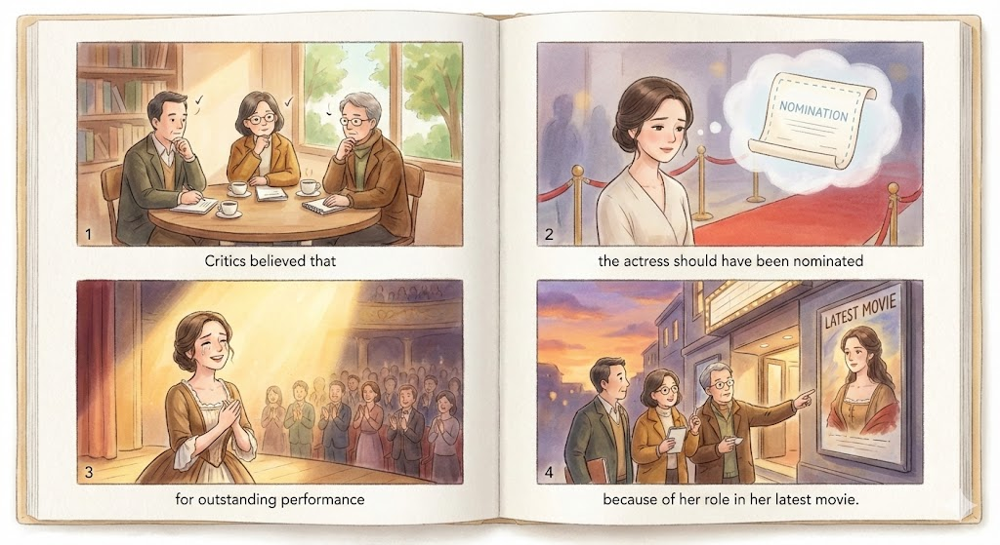
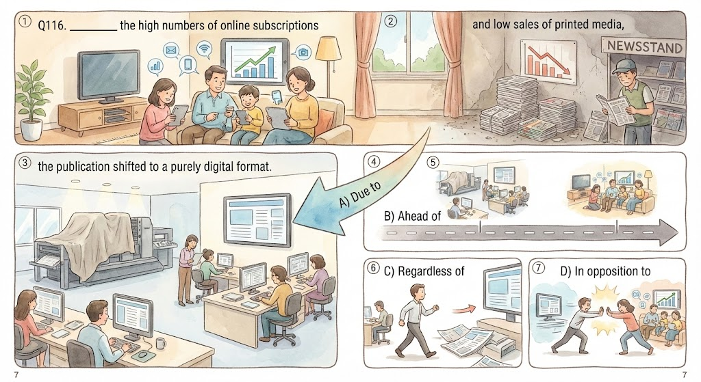

## 6

A) A customer is reading a book near the shelf.

B) The display has no books on the shelves.

C) The bookstore is crowded with patrons.

D) The woman is checking a label on a book cover.

## 12

You just released a new movie, didn't you?

A) Yes, it came out very recently.

B) The painting is on display at the museum.

C) It will go up for auction this week.

## 20

When will the marathon be taking place?

A) It's being held in March.

B) I've never run a marathon.

C) It took place a year ago.

## 27

How much of the concert proceeds are going to charity?

A) The singer is proceeding backstage.

B) I believe it's about half of all proceeds.

C) She donates money to charity every Christmas.

## 59-61

Questions 59 to 61 refer to the following conversation.

W: The exhibition is set to open next week. We've been working on it for weeks and still haven't got everything ready.

M: The only major thing to take care of is getting the displays set up.

W: Yes, but finding a reliable mover who can move so many different types of art safely is proving to be difficult.

M: I understand that. Pietro's incorporation of various forms of media into one piece of art makes his works unique, but incredibly difficult to move.

W: I really don't know who we should turn to.

M: Maybe try talking to Betty in Acquisitions. She's had lots of experience with unusual pieces in exhibitions. 

W: That's a great idea. I can't believe I didn't think of that myself. Thanks!

### 59

When will the exhibition be taking place?

A) In two days

B) In one week

C) In two weeks

D) In a few days

### 60

Why is the woman looking for a specific service?

A) She doesn't have experience moving display pieces.

B) There are multiple forms of art to move.

C) The last moving company has closed. 

D) Their current movers are having vehicle trouble.

### 61

What does the man recommend?

A) That the woman moves everything herself.

B) The woman should speak with a coworker.

C) The woman should talk to the artist about it.

D) That the woman speaks with their previous movers.

## 80-82

Questions 80 to 82 refer to the following phone call.

Hey, Frank. It's Gary. I just heard that the Rock Forever Concert next week has been canceled. 

Apparently, there was a pretty bad lightning storm last week near the stadium it was being held in and the electrical system was damaged. 

The concert has been postponed until they can repair the wiring. I called the ticket company, and now we have two choices. 

We can either get full refunds on our tickets or we can hold onto them and wait until a new date for the concert is announced. 

If we wait, then when the concert has been rescheduled, we can get two free drinks from the drink stand. Let me know what you want to do.

### 80

What happened last week?

A) The city was hit by a snowstorm.

B) There was a large storm.

C) There was a severe earthquake.

D) An outbreak of a new virus.

### 81

Why has the concert been delayed?

A) New speakers are being installed.

B) The seating was damaged in the stadium.

C) Lightning damaged the power grid.

D) The lead singer came down with a cold.

### 82

What does the speaker mean when he says "Let me know what you want to do."?

A) His friend should call the ticket company.

B) He wants his friend to make a decision.

C) He is asking if his friend has some free time.

D) He is curious about their plans for the night.

## 110

Critics believed that the actress should have been nominated for outstanding performance because of ^^her^^  role in her latest movie.

A) she

B) her

C) herself

D) hers

## 116

^^Due to^^ the high numbers of online subscriptions and low sales of printed media, the publication shifted to a purely digital format.

A) Due to

B) Ahead of

C) Regardless of

D) In opposition to

## 172-175

---

Metro Gallery to Hold Pierre Cousteau Exhibition

by Marjorie Beckham 

---

The Metro Gallery, located near City Hall, is set to hold an exhibition of various works from renowned artist Pierre Cousteau. 

Representatives from the Metro Gallery said they are highly enthusiastic to be given the opportunity to display many of his works of art, both new and old.

 
---

Originally from Rochefort-en-Terre, Mr. Cousteau began to gain acclaim with his vivid landscape paintings in the realist style. 

Said to be able to capture even the smallest of details, Mr. Cousteau quickly rose to prominence. 

His earliest works have been known to fetch upwards of twenty million dollars when put up for auction. 

 

---

After becoming a household name in his native France, Mr. Cousteau later moved to the United States where he began to dabble in other forms of artistic expression. 

His work with marble, while originally not as popular as his paintings, quickly gained fame once he began to create sculptures using abstract styling. 

---

Having recently finished an extensive renovation that replaced an aging electrical system and water drainage system, 

as well as overhauling its appearance, the Metro Gallery reopened to the public earlier this month. 

Originally constructed in the early 1900s, the Metro Gallery began to fall into disrepair in the late 1980s. 

A lack of high-profile artists and works, in addition to cut funding to maintain its appearance led to a decrease in patronage. 

 

---

However, the city government recently stepped in to provide the historic building with new funding in order to preserve the building and restore it to its former glory. 

Now officially recognized as a heritage site, funding for the Metro Gallery has been secured for the next thirty years, 

allowing it to host the works of famous artists, like Mr. Cousteau.

 
---

With a restored look to carry it forward into the twenty-first century, 

the Metro Gallery now makes for the perfect venue for the breath-taking and awe-inspiring works of Pierre Cousteau. 

### 172

What is this article mainly about?

A) An art museum that is closing down.

B) An exhibition being held by a gallery.

C) An artist trying to regain his fame.

D) A city trying to repair an old building.

### 173

What is implied about Pierre Cousteau?

A) He uses multiple forms of media for his art.

B) He originally gained fame for his stylistic designs.

C) He is from the United States and moved to France.

D) His sculptures never became popular.

### 174

According to the article, why did the gallery need to be remodeled?

A) People complained about the confusing layout.

B) It was damaged by a recent natural disaster.

C) It was showing its age due to lack of money.

D) Vandals painted the exterior of the building.

### 175

In which of the following positions marked [1], [2],[3], and [4] does the following sentence best belong?

"Said to be able to capture even the smallest of details, Mr. Cousteau quickly rose to prominence."

A) [1]

B) [2]

C) [3]

D) [4]
