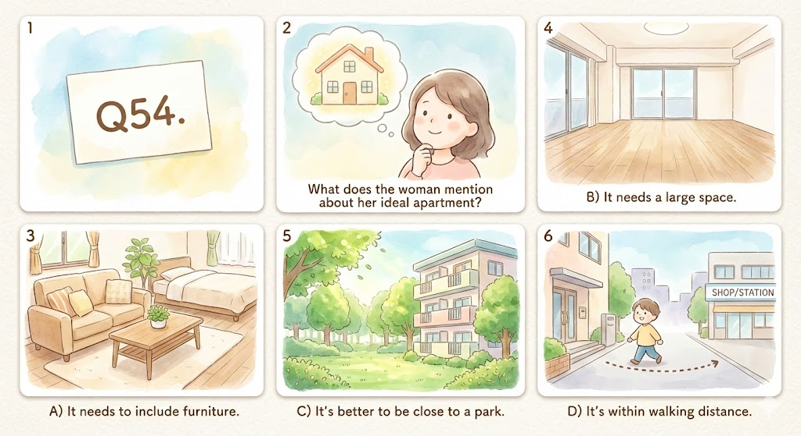
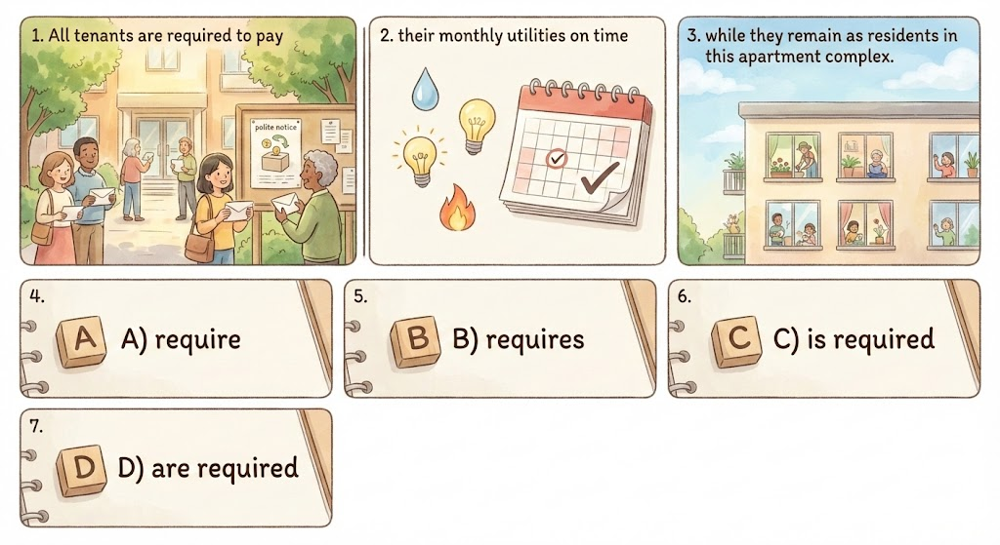

## 3

A) Paint is being poured onto the floor.

B) The brushes are resting on the ladder.

C) The worker is removing his gloves.

D) The workers are preparing to paint.

 

## 14

Will John replace the damaged garage door or remove it?

A) The renovations started two days ago.

B) I think he will have it repaired.

C) I will remove that for you later.

 

## 29

You put the down payment on the house this week, right?

A) Yes, the real estate agent is busy.

B) No, the property value hasn't gone down.

C) Of course. I did it first thing on Monday.

 
## 53-55

Questions 53 to 55 refer to the following conversation.

W: Good morning, Rick. I was hoping you could help me out with a problem I'm having.

M: Of course. What do you need help with?

W: Well, I'm not sure if you've heard, but I just got promoted to regional manager for our processor manufacturing plant in Asia.

M: Congratulations! That's fantastic news. 

W: Thank you. But it means I'm going to have to move there and, well, I'm having trouble finding a place.

M: Then you've come to the right spot. I can definitely help you find a new apartment. What kind are you looking for?

W: I don't need anything too spacious, so a studio apartment is fine. But I do need a kitchen and it needs to be furnished.

M: Not a problem. Anything else?

W: If it could be a short drive from work and have at least one supermarket nearby, that would be great.

M: And what kind of a budget are you looking at?

W: The company will cover half of the rent, so anything under $1200 is fine.

M: Great. I'll have a look and see what I can find.

### 53

What happened to the woman?

A) She was let go from her job.

B) She received a pay raise.

C) She opened a factory.

D) She was promoted.

### 54

What does the woman mention about her ideal apartment?

A) It needs to include furniture.

B) It needs a large space.

C) It's better to be close to a park.

D) It's within walking distance.

### 55

What does the woman imply about the rent?

A) She will only have to pay part of it.

B) She will be paying it entirely herself.

C) The company will cover the rent completely.

D) The rent should not be too high.

## 104

All tenants ^^are required^^ to pay their monthly utilities on time while they remain as residents in this apartment complex. 

A) require

B) requires

C) is required

D) are required

 

## 122

The architect ^^who^^ is responsible for the design of the new building will be coming by to check on the progress of construction.

A) which

B) who

C) when

D) what

# 135-138

For Rent

Modern apartment available for rent, located just a few minutes from downtown. 

The apartment is spacious, with two bedrooms, a living room, a dining room, a kitchen, and two bathrooms. 

The living room and dining room are fully furnished, and the kitchen has all the necessary appliances. 

Furnishings for the bedrooms are not provided. The apartment is only two years old and in excellent condition. 

Access to an elevator is included. 

Several supermarkets, a department store, a laundromat, bus stops and a subway stop can all be found within walking distance. 

Rent is $1500 a month, with two additional months' rent required as a deposit. The minimum renting time is one year, with longer options available. 

The deposit will be returned upon  completion of the rental agreement, minus the cost of any damage to the apartment. 

For more information, or to arrange a viewing, contact Roy at 555-4329.

## 135

A) space

B) spacious

C) specific

D) spatial

 

 

## 136

A) Furnishings for the bedrooms are not provided.

B) Furniture in the living room is extra.

C) Use of the refrigerator is not allowed.

D) Pets are only allowed to remain inside for short visits.

 

## 137

A) find

B) founding

C) founded

D) be found

 

## 138

A) in addition to

B) upon

C) due to

D) when

# 154-155

Tom Bradley 14:00

Hi, Mr. Hart. I'm sending this message to let you know that the pipes in the bathroom of my apartment are leaking quite badly. 

Also, the noise from the construction site across the road is really loud and distracting. 

These issues were not mentioned to me at the time of signing the lease.

 

Bill Hart 14:03

Tom, I'm sorry to hear about the problems with your apartment. 

I was unaware of the leaking problem. Don't worry though, your rental agreement states that the costs of repairs are to be covered by the leaseholder (應為landlord). 

As for the noise, the construction should wrap up in three weeks.

Tom Bradley 14:10

Three weeks is still a very long time. If possible, I'd rather just end the agreement early and look for a new apartment.

Bill Hart 14:16

I'm sorry to hear that. If you would really like to, we can end the lease. But be aware that ending the lease early forfeits your deposit.

## 154

What issue is being discussed?

A) Renewing a rental lease for an apartment.

B) Problems a tenant has with an apartment.

C) Who should cover the cost of installing a bath.

D) An unruly neighbor disturbing a tenant.

## 155

At 14:16, what does Bill Hart mean when he says "But be aware that ending the lease early forfeits your deposit."?

A) Tom will lose some money ending the lease early.

B) Tom will need to deposit extra money to leave.

C) Tom will have to give up any money he won.

D) Tom cannot end the lease agreement early.