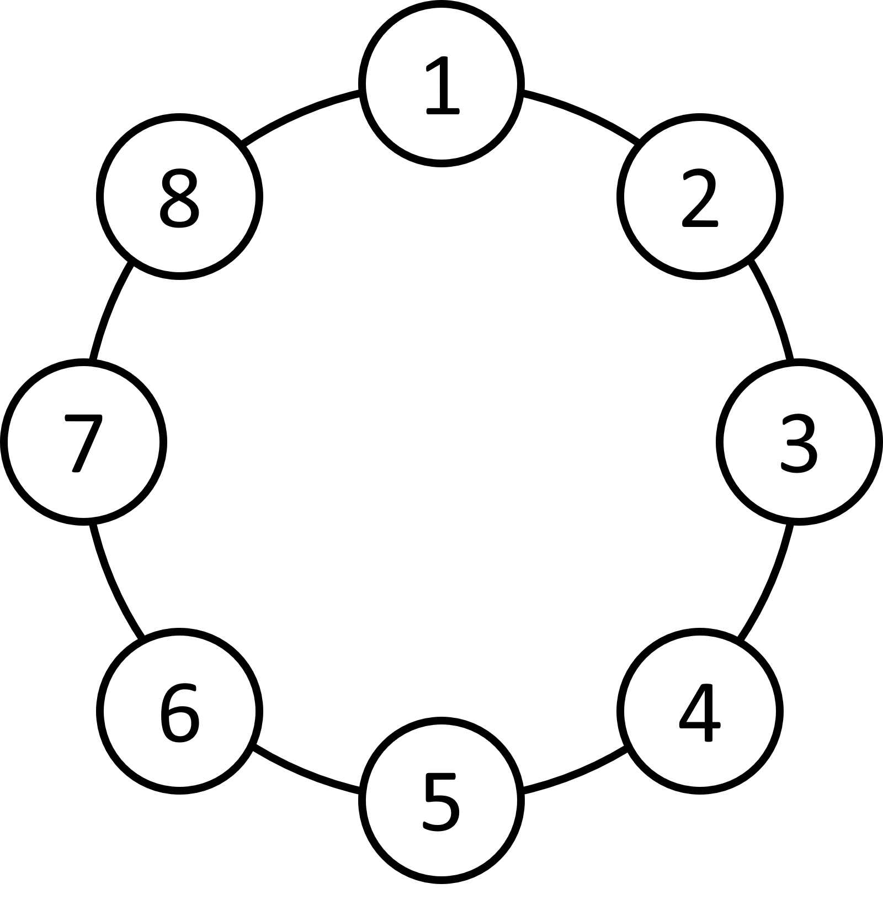

# 圈結構&約瑟夫問題
## 圈結構

{width=50%}
>原本在1號位，若要移動n步，如何知道接下來會到哪個位置
>假設原本在1


>要往後10，就會到1+10=11的位置，若要讓他回到8之內
>就看11一直減掉8之後剩下多少(剩下3)，變成11\%8=3，也就是到3的位置。

>便可以得到公式：
>(原本位置+移動位置)%總位置數=現在位置

## 約瑟夫問題

<!-- 資料來源1: https://openhome.cc/zh-tw/algorithm/randomness/josephus/ -->
資料來源: https://blog.csdn.net/u011500062/article/details/72855826

> 據說著名猶太歷史／數學家約瑟夫（Josephus）有過以下的故事：在羅馬人佔領喬塔帕特後，40 個猶太士兵與約瑟夫躲到一個洞中，眼見脫逃無望，一群人決定集體自殺，然而私下約瑟夫與某個傢伙並不贊成，於是約瑟夫建議自殺方式，41 個人排成圓圈，由第 1 個人開始報數，每報數到 3 的人就必須自殺，然後由下一個重新報數，直到所有人都自殺身亡為止。約瑟夫與不想自殺的那個人分別排在第 16 個與第 31 個位置，於是逃過了死亡。

>我們假設有8個人，每次找第三個人
{width=50%}


| &nbsp;&nbsp;&nbsp;&nbsp;0&nbsp;&nbsp;&nbsp;&nbsp; | &nbsp;&nbsp;&nbsp;&nbsp;1&nbsp;&nbsp;&nbsp;&nbsp; | &nbsp;&nbsp;&nbsp;&nbsp;2&nbsp;&nbsp;&nbsp;&nbsp; | &nbsp;&nbsp;&nbsp;&nbsp;3&nbsp;&nbsp;&nbsp;&nbsp; | &nbsp;&nbsp;&nbsp;&nbsp;4&nbsp;&nbsp;&nbsp;&nbsp; | &nbsp;&nbsp;&nbsp;&nbsp;5&nbsp;&nbsp;&nbsp;&nbsp; | &nbsp;&nbsp;&nbsp;&nbsp;6&nbsp;&nbsp;&nbsp;&nbsp; | &nbsp;&nbsp;&nbsp;&nbsp;7&nbsp;&nbsp;&nbsp;&nbsp; |
|:-------------------------------------------------:|:-------------------------------------------------:|:-------------------------------------------------:|:-------------------------------------------------:|:-------------------------------------------------:|:-------------------------------------------------:|:-------------------------------------------------:|:-------------------------------------------------:|
|                         1                         |                         2                         |  <span style="border: 1px solid yellow;">3</span>  |                         4                         |                         5                         |                         6                         |                         <span style="border: 1px solid #9affff;">7</span>                         |                         8                         |
|                         4                         |                         5                         |  <span style="border: 1px solid yellow;">6</span>  |                         <span style="border: 1px solid #9affff;">7</span>                         |                         8                         |                         1                         |                         2                         |                                                   |
|                         <span style="border: 1px solid #9affff;">7</span>                         |                         8                         |  <span style="border: 1px solid yellow;">1</span>  |                         2                         |                         4                         |                         5                         |                                                   |                                                   |
|                         2                         |                         4                         |  <span style="border: 1px solid yellow;">5</span>  |                         <span style="border: 1px solid #9affff;">7</span>                         |                         8                         |                                                   |                                                   |                                                   |
|                         <span style="border: 1px solid #9affff;">7</span>                         |                         8                         |  <span style="border: 1px solid yellow;">2</span>  |                         4                         |                                                   |                                                   |                                                   |                                                   |
|                         4                         |                         <span style="border: 1px solid #9affff;">7</span>                         |  <span style="border: 1px solid yellow;">8</span>  |                                                   |                                                   |                                                   |                                                   |                                                   |
|  <span style="border: 1px solid yellow;">4</span>  |                         <span style="border: 1px solid #9affff;">7</span>                         |                                                   |                                                   |                                                   |                                                   |                                                   |                                                   |
|  <span style="border: 1px solid #9affff;">7</span>  |                                                   |                                                   |                                                   |                                                   |                                                   |                                                   |                                                   |


>黃色位置為自殺位置

>接下來思考幾個問題：


**一、** 
>Q：當我們已知有8個人時，勝利者的下標位置為6。那下一輪7個人時，勝利者的下標位置為多少？
>
>A：其實，第一輪刪掉編號為3的人後，之後的人都往前面移動了3位，勝利者也往前移動了3位，所以他的下標位置由6變成3。


**二、**
>Q：假設我們已經知道10個人時，勝利者的下標位置為3。那下一輪11個人時，勝利者的下標位置為多少？
>
>
>A：這可以看作是上一個問題的逆過程，大家都往後移動3位，所以 
>f(11,3) = f(10,3) + 3。
>不過有可能數組會越界，所以最後模上當前人數的個數， 
>f(11,3) = (f(10,3) + 3) % 11


**三、**
>Q：現在改為人數改為N，報到M時，把那個人殺掉，那麼陣列是怎麼移動的？
>
>A：每殺掉一個人，下一個人成為頭，相當於把數組往前移動M位。若已知N-1個人時，勝利者的下標位置為f(N−1,M)，則N個人的時候，就是往後移動M位，(因為有可能數組越界，超過的部分會被接到頭上，所以還要模N)，即
>f(N,M)=(f(N−1,M)+M)%N

> **註：** 理解這個遞推式的核心在於關注勝利者的下標位置是怎麼變的。每殺掉一個人，其實就是把這個陣列向前移動了M位。然後逆過來，就可以得到這個遞推式。 因為求出來的結果是數組中的下標，最後的編號還要加1 下面給出程式碼實作：

```cpp
#include<bits/stdc++.h>
using namespace std;
int main(){
    int n,m,k;
    cin>>n>>m>>k;
    int ans=0;//原本在0位置(開頭)
    for(int i=n-k+1;i<=n;i++){//增加總人數
        ans=(ans+m)%i;//取模
    }
    cout<<ans+1;//從0開始變成從1開始
}
```

## 例題

### [定時K彈(APCS)](實作三.md#定時k彈)


> 可知，當開頭為n時，n在第0個位置。

> 一開始人數：n-k+1，最終人數：n

/// collapse-code  
```cpp
#include<bits/stdc++.h>
using namespace std;
int main(){
    int n,m,k;
    cin>>n>>m>>k;
    int ans=0;//原本在0位置(開頭)
    for(int i=n-k+1;i<=n;i++){//增加總人數
        ans=(ans+m)%i;//取模
    }
    cout<<ans+1;//從0開始變成從1開始
}
```
///

### [2169 . 出戰排序 (Arrangement)](https://tioj.ck.tp.edu.tw/problems/2169)

/// collapse-code  
```cpp
#include <bits/stdc++.h>
using namespace std;

int f(int n, int m) {
    int pos = 0;  
    for (int i = 2; i <= n; i++) {
        pos = (pos + m) % i;
    }
    return pos + 1;  
}

int main() {
    int n, k;
    cin >> n >> k;
    
    for (int m = 2; m <= 30000; m++) {
        if (f(n, m) == k) {
            cout << m << endl;
            return 0;
        }
    }
    
    cout << 0 << endl;
    return 0;
}
```
///