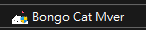

# 桌面貓咪                 
                 
[下載網址](https://drive.google.com/drive/folders/15vmSkt-DCswzuP4uwvu89yGiFmPEaRDe?usp=drive_link)                 
                 

1. 放C槽                      
2. 選全鍵盤或是部分鍵盤            
2. 開啟以下：                               
                             
3. 右鍵調整大小，左鍵移動位置
3. 開啟UI面板就可以設定                             
    