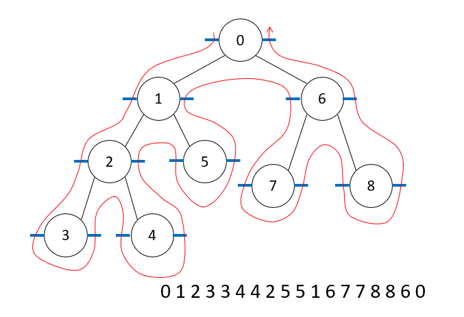
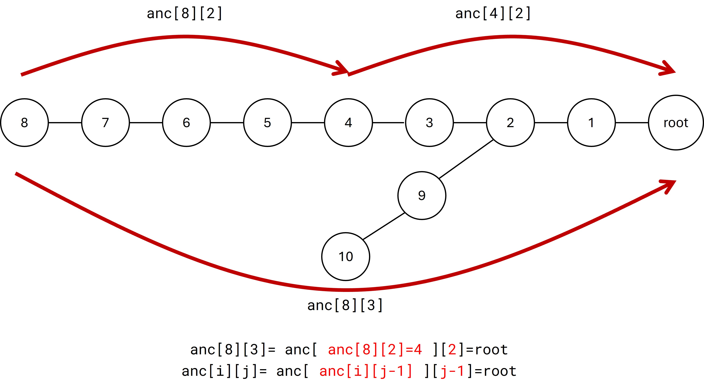

# 樹論


## 題型整理

1. 計算每個點到每個點之間距離  
[a129: P_8_3 購物中心選位置](#a129-p_8_3-購物中心選位置)       
[a223: Q_8_6 樹狀圖的距離總和](#a223-q_8_6-樹狀圖的距離總和)       
2. 由下往上計算(bottom-up)         
[a078: P_3_1 樹的高度與根 (bottom-up) (APCS201710)](#a078-p_3_1-樹的高度與根-bottom-up-apcs201710)       
3. 根節點比大小         
[a131: P_8_5 自動分裝 (APCS202002)](#a131-p_8_5-自動分裝-apcs202002)       
4. 陣列傳遞，計算極值         
[a132: P_8_7 寶石的顏色 (108全國高中賽)](#a132-p_8_7-寶石的顏色-108全國高中賽)       
5. 不相鄰DP         
[a133: P_8_8 樹的最大獨立集](#a133-p_8_8-樹的最大獨立集)       
[a224: Q_8_9 服務中心選位置](#a224-q_8_9-服務中心選位置)       
[a225: Q_8_10 竊聽間諜網](#a225-q_8_10-竊聽間諜網)       
6. 背包問題DP                    
[a134: P_8_11 公司派對 (NCPC)](#a134-p_8_11-公司派對-ncpc)：組合、選一個→倒序(bottom-up)           
[a144: Q_8_12 佔領連續的城鎮](#a144-q_8_12-佔領連續的城鎮)：bottom-up，連續元素的和        
7. 有夠難(DP)           
[a135: P_8_13 不同成本的購物中心 (@@)](#a135-p_8_13-不同成本的購物中心-)           
[a142: Q_8_16.病毒演化 (APCS202007)](#a142-q_8_16病毒演化-apcs202007)        
8. 直徑問題 【farthest of farthest 演算法】        
[a060: 201603_q4 血緣關係](#a060-201603_q4-血緣關係)           
[a143: Q_8_15 樹上一位不回家的推銷員](#a143-q_8_15-樹上一位不回家的推銷員)   


>樹的DP若在一個點有不同則方式(例如節點1可以放置A、B、C、D)直接設置多維陣列，如：dp[i][j]=節點i選擇放置j型態，例題如[a142: Q_8_16.病毒演化 (APCS202007)](#a142-q_8_16病毒演化-apcs202007)


## 樹簡介 

https://web.ntnu.edu.tw/~algo/Tree.html

https://tioj.ck.tp.edu.tw/uploads/attachment/5/13/3.pdf

樹沒有環，所以相較於有環的圖簡單很多。同時，也多出了很多性質可以利用。樹的
幾個性質列舉如下：
1. 連通且邊數等於點數減一。
2. 任意兩個點之間存在唯一的簡單路徑。
3. 連通，但去掉任意一條邊就不連通。
4. 沒有環，但加上任意一條邊就有環。
　　以上四個性質是等價的。這也是判斷一個圖是不是樹的方法。
  
## 基本性質
　　在此先介紹幾個基本的、專屬於樹的術語（樹語？）：      
1. 根（root）：在一個樹上可以選定一個點做為「根」。有限定根的樹稱為「有根樹」。      
2. 葉（leaf）：無根樹中，度數為1的點稱為「葉」；有根樹中，度數為1且非根的點稱為      
「葉」，但只有一個點的情況，根也是葉。      
3. 子樹（subtree）：移除一個點之後，原樹會被切割成很多棵樹，稱為子樹。在有根樹中，      
子樹通常指遠離根的那些樹。      
4. 父、子關係（parent,child）：有根樹中，如果vi,vj 相鄰，且vi 比較接近根，稱vi 是vj      
的父親、vj 是vi的兒子。      
5. 祖先、後代關係（ancestor,descendant）：一個點的小孩、小孩的小孩⋯⋯等等皆稱為其      
「後代」；一個點的父親、父親的父親⋯⋯等等皆稱為其「祖先」。      
6. 距離（distance）：兩點間的距離是它們之間路徑的邊數，或者是路徑上邊權的加總。      
7. 深度（depth）：有根樹中，一個點的深度是它到根的距離稱為深度。      
8. 高度（height）：有根樹中，一個點到與它距離最大的葉的距離稱為高度。根的高度稱為這整顆樹的高度。      

判斷父子關係、祖先後代關係可以用一次的DFS預處理，即可達到O(1)查詢。父子      
關係只要對每個點記錄它的父親是誰即可；祖先後代關係則可以在DFS時記錄進入該點      
和離開該點的時間，當點A的時間區間被點B完全覆蓋，則A是B的後代。      
距離、深度的部分，可用簡單的DFS求出一點到所有點的距離。高度的話，因為葉      
子的高度是0，而一個點的高度等於所有子樹中高度加連向子樹的邊權的最大值，所以照      
樣可以用DFS解決。      
順帶一提，因為樹沒有環，所以在DFS時不需要記錄一個點有沒有被造訪過，只要      
知道父親是哪個點，不要往回走即可。      


## 計算子樹大小
 [a129: P_8_3 購物中心選位置](#a129-p_8_3-購物中心選位置)

## 判斷根結點、葉節點

判斷根節點、葉節點方法(之一)：看入度、出度

## top-down、button-up

```cpp
for(int i:v[f]){
    //進入子節點  top-down
    dfs(i);
    //離開子節點  button-up
}
```

## 直徑問題
  
    
一棵樹的直徑定義為樹當中最遠的兩點間的簡單路徑；圓心是能使樹高度最小的根。  
要如何找出一棵樹的直徑呢？  
有一個很簡單的方法：先從任意一個點DFS到深度最深的點v，再從v點DFS到最遠的點u，則v、u的簡單路徑即為直徑。這個方法的正確性不難證，可以自己嘗試看看。    
　　    


### farthest of farthest 演算法

>GPT：      
>計算一棵樹的直徑是計算圖論中的一個常見問題。在這裡的「樹」指的是一種特殊的圖，其中任何兩個節點都有一條唯一的路徑連接它們，且不含任何循環。樹的直徑定義為樹中所有節點對的最長距離，      即最遠的兩個節點之間的路徑長度。      
> 計算樹的直徑通常有幾種方法，其中最常見的是使用兩次廣度優先搜索（BFS）：      
> 
> 1.  **隨機選擇一個節點**：從樹中隨機選擇一個節點 𝑣 v。      
>           
> 2.  **第一次 BFS**：從節點 𝑣 v 開始進行 BFS，找到距離 𝑣 v 最遠的節點 𝑢 。      
>           
> 3.  **第二次 BFS**：從節點 𝑢 u 開始進行第二次 BFS，找到距離 𝑢 最遠的節點 𝑤。      
>           
> 4.  **計算直徑**：節點 𝑢 到節點 𝑤 的距離就是樹的直徑。      
>           
> 
> 這個方法之所以有效，是因為從任意點出發，找到的最遠點一定是從這個點出發的最長路徑上的端點之一，再從這個端點開始找最遠點，這樣保證能找到整棵樹的最長路徑。      
> 如果需要更具體的實現或解釋，隨時告訴我！      

      
### [a060: 201603_q4 血緣關係](https://zerojudge.tw/ShowProblem?problemid=h032)

<iframe src="https://drive.google.com/file/d/1oO0sJSXeb9vxLrz9AjAvrsnqDtLMqWKz/preview" width="100%" height="1010px"></iframe>


>方法1：
>先計算出所以節點的最大樹枝長度
>再對於每個點，找到兩最大樹枝加總，
以下為範例一

{width=100%}

/// collapse-code  
```cpp title="找最大、第二大值方式"
#include <bits/stdc++.h>
using namespace std;

int main() {
    int m1=INT_MIN,m2=INT_MIN; // 初始化為最小整數
    int v[7]={1, 2, 5, 3, 4, 6, 7};
    for (int i=0;i<7;i++) {
        if (v[i]>m1) {
            m2=m1; // 將當前最大值更新為第二大值
            m1=v[i]; // 更新最大值
        } else if(v[i]>m2) {
            m2=v[i]; // 更新第二大值
        }
    }
    cout<<m1<<" "<<m2<<endl;
    return 0;
}
```
///

/// collapse-code  
```cpp  
#include<bits/stdc++.h>
using namespace std;
#define N int(1e5)+1
#define nn "\n"
vector<int>v[N];
bool visit[N];
int dp[N];
int ans=0;
int dfs(int f){
    visit[f]=true;
    int m1=0,m2=0;
    for(int i:v[f]){
        if(!visit[i]){
            dfs(i);
            dp[f]=max(dp[f],dp[i]);

            if(dp[i]>m1){                //找到子節點中兩個最大的長度
                m2=m1;
                m1=dp[i];
            }
            else if(dp[i]>m2){
                m2=dp[i];
            }
        }
    }
    ans=max(ans,m1+m2);
    dp[f]+=1;
}
int main(){
    //istringstream cin("8 \
0 1 \
0 2 \
0 3 \
7 0 \
1 4 \
1 5 \
3 6 \
");
    //istringstream cin("4 \
0 1 \
0 2 \
2 3");
    int n;
    cin>>n;
    for(int i=0;i<n;i++){
        int x,y;
        cin>>x>>y;
        v[x].push_back(y);
        v[y].push_back(x);
    }
    dfs(0);
    cout<<ans;
}
```
///

>方法2：       
>概念同方法一，變換找最大值、第二大值的合方式       
>如下：       
>假設數列是 S，pm 是prefix_max，則最大兩個元素之和其實就是max(S[i]+pm(i): for all i)。       
>所以我們只需要一路掃描並維護好目前看到的最大值，每次將當下看到的值加上他之前的最大值相加即可。       
       
/// collapse-code  
```cpp  
#include <bits/stdc++.h>
using namespace std;

int main() {
    int m1=INT_MIN,m2=INT_MIN;
    int v[7]={1, 2, 5, 3, 4, 6, 7};
    int prefix_max=-INT_MIN;
    int sum,ans=0;
    for (int i=0;i<7;i++) {
        ans=max(ans,v[i]+v[i-1]);  //ans=最大、第二大相加
        v[i]=max(v[i-1],v[i]);  //v[i]為prefix_max
    }
    cout<<ans;
    return 0;
}
```
///

/// collapse-code  
```cpp  
#include<bits/stdc++.h>
using namespace std;
#define N int(1e5)+1
#define nn "\n"
vector<int>v[N];
bool visit[N];

int m=0;
int dp[N];
int ans=0;
int dfs(int f){
    visit[f]=true;
    for(int i:v[f]){
        if(!visit[i]){
            dfs(i);
            m=max(m,dp[f]+dp[i]);
            dp[f]=max(dp[i],dp[f]);
        }
    }
    dp[f]+=1;
}
int main(){
    //istringstream cin("8 \
0 1 \
0 2 \
0 3 \
7 0 \
1 4 \
1 5 \
3 6 \
");
    //istringstream cin("4 \
0 1 \
0 2 \
2 3");
    int n;
    cin>>n;
    for(int i=0;i<n;i++){
        int x,y;
        cin>>x>>y;
        v[x].push_back(y);
        v[y].push_back(x);
    }
    dfs(0);
    cout<<m;
}
```
///
     
     
>方法三：     
>farthest of farthest 演算法     
>兩次DFS     
>第一次找f的最遠點i，第二次找i最遠點k     
     
/// collapse-code  
```cpp  
#include<bits/stdc++.h>
using namespace std;
#define N int(1e5)+1
#define nn "\n"
vector<int>v[N];
bool visit[N];

int m=0;
int d[N];
int mv=-1;
int md=-1;
int ans=0;

int dfs(int f){
    visit[f]=true;
    for(int i:v[f]){
        if(!visit[i]){
            d[i]=d[f]+1;
            if(d[i]>md){
                md=d[i];
                mv=i;
            }
            dfs(i);
        }
    }
}
int main(){
    //istringstream cin("8 \
0 1 \
0 2 \
0 3 \
7 0 \
1 4 \
1 5 \
3 6 \
");
    //istringstream cin("4 \
0 1 \
0 2 \
2 3");
    int n;
    cin>>n;
    for(int i=0;i<n;i++){
        int x,y;
        cin>>x>>y;
        v[x].push_back(y);
        v[y].push_back(x);
    }
    dfs(0);
    md=-1;
    for(int i=0;i<n;i++){
        visit[i]=false;
        d[i]=0;
    }
    dfs(mv);
    cout<<d[mv];
}
```
///

### a143: Q_8_15 樹上一位不回家的推銷員
https://judge.tcirc.tw/problem/d115

內容
有一個推銷員要走訪 n 個城市。這些城市以 (n−1)條道路連接，每條道路連接兩個不 同的城市並且雙向可以通行，而且已知每一個城市都可以到達，不會有到達不了的狀況。輸入道路的資料，請你幫推銷員找出一個最短的路徑走訪所有的城市，推銷員可 以從任何城市開始，也不必回到開始的城市，只要每個城市至少到一次就可以。 舉例來說，如右圖，有 5 個城市以 4條道路連接，假設 每條道路的長度都是 1。最短的拜訪路徑是 (1,0,4,2,4,3)，長度為 5。


{width=50%}
    
輸入說明    
第一行是正整數 n    
，代表城市的數量，城市是以 0∼(n−1)    
 編號，接下來有 n−1    
 行是道路的資料，每行三個整數 a,b    
 與 w    
，代表此道 路連接城市 a    
 與 b    
，道路的長度是 w    
。n    
 不超過 50000    
，每條道路長度是不超過 100    
 的正整數。    
    
輸出說明         
 輸出最短的旅行距離。     
     
範例輸入 #1     
5     
1 0 1     
0 4 1     
2 4 1     
4 3 1     
範例輸出 #1     
5     
範例輸入 #2     
3     
1 2 5     
0 2 3     
範例輸出 #2     
8     


>我們需要找到起點、終點，起點、終點間路徑只會路過一次，其餘路徑會路過兩次，全體最小化路徑，就是最大化起點、終點間路徑    
>使用權重作為距離，找出最大直徑。    
>全部路段長度\*2-直徑即為答案    
    
/// collapse-code  
```cpp  
#include <bits/stdc++.h>
using namespace std;
#define N 100000
#define nn "\n"

struct st{
    int x,y;
};

vector<st>v[N];

int vi[N];
int d[N];
int all_w=0;

int dfs(int f){
    vi[f]=true;
    for(st i:v[f]){
        if(!vi[i.x]){
//            cout<<f<<": "<<i.x<<nn;
            d[i.x]=d[f]+i.y;
            dfs(i.x);
        }
    }
}


int main(){
    //istringstream cin("5 \
1 0 1 \
0 4 1 \
2 4 1 \
4 3 1");

    int n;
    cin>>n;
    for(int i=0;i<n-1;i++){
        int x,y,z;
        cin>>x>>y>>z;
        all_w+=z;
        v[x].push_back({y,z});
        v[y].push_back({x,z});
    }
    dfs(0);
    int re=max_element(d,d+n)-d;
    for(int i=0;i<n;i++){
        d[i]=0;
        vi[i]=false;
    }

//    cout<<nn;

    dfs(re);

//    cout<<nn;

    re=max_element(d,d+n)-d;
    cout<<all_w*2-d[re]<<nn;
//    cout<<re;


}
```
///  
## 重心   
   
將重心刪掉後，分割後變成兩棵樹，兩棵樹總節點不超過總節點樹1/2   
ex：n=15，分割後兩棵樹節點皆為7。(15/2=7.5，7<=7.5)   
   


## 圓心

樹的圓心是這條最長路徑上的中間節點。如果直徑是奇數長度，則圓心是唯一的；如果直徑是偶數長度，則圓心是兩個相鄰的節點。

## 樹壓平

用途：  
判斷祖先
配合線段樹找LCA   

{width=100%}


樹壓平可以想樣成前序、後序的結合(有時候會加入中序，例如配合線段樹找LCA時)，經過前面和後面時紀錄，中間不紀錄。     
紀錄後可以得到一個序列，以圖片為例，可以發現被夾在同一個節點n之間的節點，皆為n的子節點。    


/// collapse-code  
```cpp  
#include <bits/stdc++.h>
using namespace std;
#define N 100

vector<int>v[N];

void dfs(int f){
    cout<<f<<" ";
    for(int i:v[f]){
        dfs(i);
    }
    cout<<f<<" ";
}

int main(){
    istringstream cin("9 8 \
0 1 \
1 2 \
2 3 \
2 4 \
1 5 \
0 6 \
6 7 \
6 8");
    int n,m;
    cin>>n>>m;
    for(int i=0;i<m;i++){
        int x,y;
        cin>>x>>y;
        v[x].push_back(y);
    }
    dfs(0);
}
```
///

/// html | div.result
```
0 1 2 3 3 4 4 2 5 5 1 6 7 7 8 8 6 0
```
///
## LCA

>from https://hackmd.io/@konchin/ryhgIlhMu


LCA (Lowest Common Ancestor / 最近共同祖先)

### 何謂 LCA

在一個有根樹 (或 DAG) 上，同時擁有 $u$, $v$ 兩個點作為後代的點即為 $u$, $v$ 兩點的 $LCA$

如圖

{width=50%}


另外要注意，一個點本身也是自己的祖先，所以 $LCA(x, v) = x$

### 如何求LCA

隨便都可以想到 $O(n)$ 的作法，只要DFS過去就好    
其中一個可行的演算法如下，假設我們要對 $u$, $v$ 做LCA   

可以對其中一個點，先假設是 $u$ 一直往上找，直到 $u'$ 成為 $v$ 的祖先    

如圖

{width=50%}


黃色框代表是 $v$ 的祖先，紅色則是往上找的路徑


```cpp  
int LCA(int u, int v) {
	if(isanc(u, v)) return u;  //如果u是v祖先
	if(isanc(v, u)) return v;  //如果v是u祖先
	while(!isanc(u, v))    //如果不是祖先，u往上走(u變為u祖先)
		u = anc[u];
	return u;
}
```

其中 isanc 是使用[樹壓平](#樹壓平)技巧，用來判斷第一個引數是否為第二個引數的祖先
anc 則是用來儲存每個點的父節點
anc 很直覺，DFS 就有了
isanc 則需要借助另外兩個陣列 tin 和 tout 來實現

tin：進入點的時間點
tout：離開點的時間點

```cpp  
bool isanc(int a, int b) {
	return tin[a] <= tin[b] && tout[a] >= tout[b];  //如果a比b早進，a比b晚離開，就是祖先
}
```


{width=50%}


從這張圖可以發現，一個子樹的根節點 tin 的值都會小於子節點 tin 的值  
根節點 tout 的值都會大於子節點 tout 的值  

所以只要有每個點 tin 和 tout 的值就可以判斷兩個點是否為對方的祖先

預處理具體實現如下


```cpp title="dfs"
int dfs(int f){
    t++;
    tin[f]=t;//計算進入f點的時間點
    for(int i:v[f]){
        anc[i]=f;
        dfs(i);
    }
    t++;
    tout[f]=t;//計算退出f點的時間點
}
```

完整程式碼(配合[d767. 血緣關係](#d767-血緣關係))：
/// collapse-code  
```cpp  
#include <bits/stdc++.h>
using namespace std;
#define N 40000
#define nn "\n"

vector<int>v[N];


int dfs(int f);
int lca(int v,int u);
bool isanc(int a, int b);


int anc[N];
int tin[N];
int tout[N];
int t;
int dis[N];


int main(){
//    istringstream cin("7 6 \
2 3 0 \
4 5 0 \
6 7 0 \
0 \
0 \
0 \
0 \
4 5 \
4 2 \
4 4 \
4 3 \
1 7 \
2 3");
    int n,m;
    cin>>n>>m;
    for(int i=1;i<=n;i++){
        int x;
        while(cin>>x && x!=0){
            v[i].push_back(x);
        }
    }
    dfs(1);
    for(int i=0;i<m;i++){
        int x,y;
        cin>>x>>y;
        int LCA=lca(x,y);

        cout<<LCA<<" "<<dis[x]-dis[LCA]+dis[y]-dis[LCA]<<nn;
    }
}
int lca(int u, int v) {
	if(isanc(u, v)) return u;
	if(isanc(v, u)) return v;
	while(!isanc(u, v))
		u = anc[u];
	return u;
}

bool isanc(int a, int b) {
	return tin[a] <= tin[b] && tout[a] >= tout[b];
}

int dfs(int f){


    //計算進入f點的時間點
    t++;
    tin[f]=t;


    for(int i:v[f]){
        anc[i]=f;
        dis[i]=dis[f]+1;
        dfs(i);
    }
    
    //計算退出f點的時間點
    t++;
    tout[f]=t;

}
```
///

/// details |  "NA (score:99%)"
#0: 94% AC (3ms, 1.2MB)     
通過檢測     
#1: 1% AC (3ms, 1.2MB)     
通過檢測     
#2: 1% AC (11ms, 1.3MB)     
通過檢測     
#3: 1% AC (15ms, 1.4MB)     
通過檢測     
#4: 1% AC (2s, 1.7MB)     
通過檢測     
#5: 1% AC (2.2s, 2.3MB)     
通過檢測     
#6: 1% TLE (1s)     
Killed     
/// 
     
     

由於一次往上找一格，所以這個演算法的時間複雜度為 $O(n)$  
但很可惜有 $O(\log n)$ 更快的作法，所以題目不會簡單的放過你  
所以接下來就要介紹倍增法


### 倍增法

我們在所有步驟中最慢的事情是向上找祖先     
換句話說就是在搜尋「第一個為共同祖先的人」 
我們將他畫成一條線     

{width=100%}

是不是有種莫名熟悉的感覺      
對對，可以使用[跳躍二分搜](搜尋、二分搜尋、跳躍二分搜.md#跳躍二分搜)

我們可以從節點8為起點，向右邊跳，如果可以跳就往後跳，直到不能跳，最後就會走到節點3，而我們的目標就是3的父節點2

該如何實作呢?
在這邊我們一樣用[跳躍二分搜](搜尋、二分搜尋、跳躍二分搜.md#跳躍二分搜)的概念，但是有點變化。


因為我們沒辦法直接在O(N)內跳躍，所以我們要先預處理，讓我們可以查詢祖先。  

於是發展出了一個方法：只記錄每個節點往上的$2^n (n=0,1,2....)$個祖先。   
假設我們在上圖中的目標是 $2$ ，我們會移動「$2^2+2^0=4+1=5$」個位置，從 $8$ 移動 $5$ 步到 $2$


<iframe width="1903" height="742" src="https://www.youtube.com/embed/lh-LX7rZhIU" title="LCA" frameborder="0" allow="accelerometer; autoplay; clipboard-write; encrypted-media; gyroscope; picture-in-picture; web-share" referrerpolicy="strict-origin-when-cross-origin" allowfullscreen></iframe>

步驟如下，配合上面影片(我們要找最後一個非共同祖先 $3$)：  

1. 試試看 $2^3=8$，節點 $8$ 往上 $8$ 是共同祖先(root)，不跳。   
2. 試試看 $2^2=4$，節點 $8$ 往上 $4$ 不是共同祖先(節點 $4$)，可以跳，所以跳到節點 $4$。    
3. 試試看 $2^1=2$，節點 $4$ 往上 $2$ 是共同祖先(節點 $2$)，不跳。   
4. 試試看 $2^0=1$，節點 $4$ 往上 $1$ 不是共同祖先(節點 $3$)，可以跳，所以跳到節點 $3$。      
5. 沒有 $2^{-1}$ 了，所以我們跳到了目標：節點 $3$。
6. 節點 $3$ 的祖先節點 $2$ 就是LAC。


接下來我們就可以實作跳躍二分搜(如下程式碼)：     

1. 下面的n為總節點數，我們直接假設樹的最壞情況是一條練，祖先最多會需要往上走 n-1 步。
    也就是說我們如果想要求最多步數 $x$， $x$ 要滿足 $2^x \geq  (n-1)$ ，可以得到 $x \geq \log_2(n - 1)$ ，也就是說我們的上限為 $\log_2(n - 1)$ ，也可以懶一點不打「-1」，變成 $\log_2(n)$  (多計算一點點)     
2. 我們使用`anc[i][j]`儲存「節點 $i$ 往上 $2^j$ 步的祖先編號」，先全部宣告為 $-1$ 來防止`anc[i][j]`的 $j$ 超出範圍。    

```cpp title="跳躍二分搜"
int lca(int a, int b) {
    if (isanc(a, b)) return a;
    if (isanc(b, a)) return b;
    for (int jump = __lg(n); jump >= 0; jump--) // 找到最高的非共同祖先
        if (anc[a][jump] != -1 && !isanc(anc[a][jump], b)) // 如果沒有超出範圍，而且非共同祖先(可以跳)
            a = anc[a][jump];                              //就跳
    return anc[a][0]; //「最高的非共同祖先」的祖先即為共同祖先
}
```

接下來我們要思考如何預先處理好所有的祖先`anc[i][j]`  
我們可以使用以下性質：$2^{n}=2^{n-1} \times 2$ ，也就是 $2^{n}=2^{n-1} + 2^{n-1}$

{width=100%}

```c++
anc[i][j]=anc[anc[i][j-1]][j-1];
```


所以我們可以在dfs時順便dp所有祖先關係，如下，但是要注意如果`anc[i][j-1] == -1`就不要再dp了，不然會變成：anc[i][j] = anc[-1][j-1]，超出陣列範圍。
```cpp title="dfs時順便dp所有祖先關係"
void dfs(int f) {
    t++;
    tin[f] = t;
    for (int i : v[f]) {
        // dp 所有祖先關係
        anc[i][0] = f; // 設定第一層祖先
        for (int j = 1; j <= __lg(n); j++) { // 從 1 開始，因為 anc[i][j-1] 中的 j-1=0
            if (anc[i][j-1] == -1) break;//往上太多了(如果沒有加這條件，遞迴式就會變成anc[i][j] = anc[-1][j-1]，超出範圍)
            anc[i][j] = anc[anc[i][j-1]][j-1];
        }
        dis[i] = dis[f] + 1;
        dfs(i);
    }
    t++;
    tout[f] = t;
}
```


最後就做完所有事情了，以下為完整程式碼。
/// collapse-code  
```cpp title="完整程式碼"
#include <bits/stdc++.h>
using namespace std;
#define N 40000
#define nn "\n"

vector<int> v[N];
int n, m;
int tin[N];
int tout[N];
int t;
int dis[N];
vector<vector<int>> anc(N, vector<int>(15, -1)); // 初始化為 -1 表示超出範圍(等同於int anc[N][15]，全部初始化為-1)

bool isanc(int a, int b) { // 判斷 a 是否是 b 的祖先
    return tin[a] <= tin[b] && tout[a] >= tout[b];
}

int lca(int a, int b) {
    if (isanc(a, b)) return a;
    if (isanc(b, a)) return b;
    for (int jump = __lg(n); jump >= 0; jump--) // 找到最高的非共同祖先
        if (anc[a][jump] != -1 && !isanc(anc[a][jump], b)) // 如果沒有超出範圍，而且可以跳
            a = anc[a][jump];                              //就跳
    return anc[a][0]; //「最高的非共同祖先」的祖先即為共同祖先
}

void dfs(int f) {
    t++;
    tin[f] = t;
    for (int i : v[f]) {
        // dp 所有祖先關係
        anc[i][0] = f; // 設定第一層祖先
        for (int j = 1; j <= __lg(n); j++) { // 從 1 開始，因為 anc[i][j-1] 中的 j-1=0
            if (anc[i][j-1] == -1) break;//往上太多了(如果沒有加這條件，遞迴式就會變成anc[i][j] = anc[-1][j-1]，超出範圍)
            anc[i][j] = anc[anc[i][j-1]][j-1];
        }
        dis[i] = dis[f] + 1;
        dfs(i);
    }
    t++;
    tout[f] = t;
}

int main() {
    ios::sync_with_stdio(0);
    cin.tie(0);
    // istringstream cin("7 6 \
2 3 0 \
4 5 0 \
6 7 0 \
0 \
0 \
0 \
0 \
4 5 \
4 2 \
4 4 \
4 3 \
1 7 \
2 3");
    cin >> n >> m;
    for (int i = 1; i <= n; i++) {
        int x;
        while (cin >> x && x != 0) {
            v[i].push_back(x);
        }
    }

    dfs(1); // 假設 root 為 1

    for (int i = 0; i < m; i++) {
        int x, y;
        cin >> x >> y;
        int LCA = lca(x, y);

        cout << LCA << " " << dis[x] - dis[LCA] + dis[y] - dis[LCA] << nn;
    }
}
```
///


### [d767. 血緣關係](https://zerojudge.tw/ShowProblem?problemid=d767)    
    
內容    
給一張祖譜,詢問 A , B 兩人關係最近的共同祖先 以及 A , B 之間的親等          
example 1    
          
          
{width=100%}          
          
          
親等計算 : 往上算到與要計算的人共同祖先處，再往下算到那個人，數多少就是幾親等。          
          
※ 輸入的人的編號，必為 1~N ，而兒女編號必大於父母本身的編號。          
          
          
輸入說明          
第一行兩個數字 N , Q          
分別代表接下來會有 N 行數字分別代表該人的兒女編號(以 0 表結束)，          
再來會有 Q 行          
每行上會有兩個數字 A , B ，代表要求出 A , B 兩人的關係最近的共同祖先          
以及 A , B 之間的親等。          
詳細請參考Sample Input。          
(N≦3,0000,    1≦A,B≦N,     Q≦N2)          
          
輸出說明          
輸出兩個數字最近的共同祖先 以及 A , B 之間的親等          
          
    
```cpp title="範例輸入 #1"
7 6
2 3 0
4 5 0
6 7 0
0
0
0
0
4 5
4 2
4 4
4 3
1 7
2 3
```

```cpp title="範例輸出 #1"
2 2
2 1
4 0
1 3
1 2
1 2
```


## 計算連通區塊數量


要計算一個圖中有幾個連通區塊

直接對所有點dfs，有經過的就不用找，看可以找幾次。
``` cpp
int count=0;
for(int i=0;i<n;i++){
    if(!vis[i]){
        dfs(i);
        count++;
    }
}
```

例題：[打卡遊戲](#2171--打卡遊戲-checkin)


## 題目練習

### P-8-1. 樹上的推銷員
https://judge.hwsh.tc.edu.tw/ShowProblem?problemid=a127

有一個推銷員要走訪n個城市並在結束後回到出發的城市。這些城市以n-1條道路連接，每條道路連接兩個不同的城市並且雙向可以通行，而且已知每一個城市都可以到達，不會有到達不了的狀況。

輸入道路的資料，請你找出一個長度最短的程式走訪順序，因為這樣的順序很多，你必須輸出字典順序最小的那一個。字典順序是用來比較兩個序列的先後順序，其方法是由前往後找到第一個不相同的位置，該元素比較小的序列就是順序比較小，如同在英文字典中單字的順序一般。例如 (0,2,3,1)<(0,3,1,2)，又(0,3,2,1)<(1,0,2,3)。

舉例來說，如右圖，有5個城市以4條道路連接，假設每條道路的長度都是1。字典順序最小的最短拜訪順序是(0,1,0,4,2,4,3,4,0)。

{width=50%}

輸入說明     
第一行是正整數 n，代表城市的數量，城市是以 0 ~ (n-1) 編號。     
接下來有 (n-1) 行是道路的資料，每行三個整數 a , b 與 w ，代表此道路連接城市 a 與 b，道路的長度是 w。     
n 不超過 50000，每條道路長度是不超過 100 的正整數。     
     

輸出說明     
第一行輸出最短的旅行距離，第二行輸出拜訪順序，相鄰的數字之間要以一個空白間格。     
     
範例輸入 #1     
5     
1 0 1     
0 4 1     
2 4 1     
4 3 1     
     
範例輸出 #1     
8     
0 1 0 4 2 4 3 4 0     

範例輸入 #2       
3       
1 2 5       
0 2 3       
       
範例輸出 #2       
16       
0 2 1 2 0       
       
/// collapse-code  
```cpp  
#include<bits/stdc++.h>
using namespace std;
#define N 50010
#define nn "\n"
#define nnn " "

vector<pair<int,int>>v[N];

bool visit[N]={false};

int ans1=0;
vector<int>ans2;

int dfs(int f){
    visit[f]=true;
    ans2.push_back(f);
    for(auto i:v[f]){
        if(!visit[i.first]){
            //cout<<i<<nnn;
            ans1+=i.second*2;
            dfs(i.first);
            ans2.push_back(f);
        }
    }
}
int main(){

    //istringstream cin("5 \
1 0 1 \
0 4 1 \
2 4 1 \
4 3 1");
    int n;
    cin>>n;
    for(int i=0;i<n-1;i++){
        int x,y,z;
        cin>>x>>y>>z;
        v[x].push_back({y,z});
        v[y].push_back({x,z});
    }
    for(int i=0;i<n;i++){
        sort(v[i].begin(),v[i].end());
    }
    dfs(0);
    cout<<ans1<<nn;
    for(int i:ans2){
        cout<<i<<" ";
    }
}

```
///

### a128: P\_8\_2 物流派送系統


 有一個物流派送系統，系統有n個工作站與n-1條輸送帶，工作站以0~n-1編號，其中0號站是進貨站，所有物品都是由0號站進入系統然後經過輸送帶配送到某個站。每個輸送帶都是單向的從某個站a把物品送到站b，輸送的時間是w(a,b)。

已知由進貨站可以經由輸送帶直接或間接轉送到達任何其他站，請計算下列兩者       
(1). 由進貨站到達運送時間最長的站需要多少時間       
(2). 由進貨站需要最多次轉運的需要經過幾次輸送帶。       
舉例來說，如右圖，有5個站以4條輸送帶連接，假設每條輸送帶的運送時間如圖上標示。需要最長運送的時間是3號站(2+4=6)，最多需要經過的輸送帶是兩次(2號站與3號站)。     
     
{width=100%}

輸入說明     
 第一行是正整數n，n>1，接下來有n-1行是輸送帶的資料，第i行2個整數x與w，代表此輸送帶連接x與i，輸送的時間是w。n不超過1e5，每條輸送帶的輸送時間是不超過1000的正整數。          
          
輸出說明     
 第一行輸出最長的運送總時間，第二行輸出最多經過幾次輸送帶。第一行與第二行的答案不一定是同一個站，除了輸送帶以外的時間均忽略不記。     
         
範例輸入 1    
5    
0 5    
4 1    
4 4    
0 2    
範例輸出 1    
6    
2    
範例輸入 2    
6    
0 9         
0 1     
2 1     
5 3     
3 2     
範例輸出 2     
9     
4     

/// collapse-code  
```cpp  
#include<bits/stdc++.h>
using namespace std;
#define N int(1e5+1)
#define nn "\n"
#define nnn " "
vector<pair<int,int>>v[N];
bool visit[N]={false};
int d[N]={0};
int d1[N]={0};
int ans1=0,ans2=0;
int dfs(int f){
    visit[f]=true;
    for(auto i:v[f]){
        if(!visit[i.first]){
            d[i.first]=d[f]+i.second;
            d1[i.first]=d1[f]+1;
            ans1=max(d[i.first],ans1);
            ans2=max(d1[i.first],ans2);
            dfs(i.first);
        }
    }
}
int main(){

    //istringstream cin("5 \
0 5 \
4 1 \
4 4 \
0 2");

    //istringstream cin("6 \
0 9 \
0 1 \
2 1 \
5 3 \
3 2");
    int n;
    cin>>n;
    for(int i=1;i<=n;i++){
        int y,z;
        cin>>y>>z;
        v[i].push_back({y,z});
        v[y].push_back({i,z});
    }
    dfs(0);
    cout<<ans1<<nn<<ans2;
}

```
///

### a129: P\_8\_3 購物中心選位置

https://judge.hwsh.tc.edu.tw/ShowProblem?problemid=a129

      
內容      
 有 n      
 個小村莊以 0      
 ~ n−1      
 編號，其中編號 0      
 的是市政府所在地，這些村莊以 n−1      
 條道路連接，每條道路都是雙向通行且連接兩個不同的村莊，已知從任一個村莊 i      
 都可以經由這些道路到達市政府所在的 0      
 號村莊，所以也可以到達任何其他村莊，而且由村莊 i      
 往市政府會經過的第一站村莊是 p(i)。      

現在某大集團希望選其中一個村莊來蓋一個購物中心，選址的判斷方式是購物中心到所有村莊的距離總和要越小越好，請你幫忙計算哪一個村莊是最好的位置，到各村莊的距離總和最小是多少。   

輸入說明     
 第一行是正整數 n，n>1，村莊以 0~ n−1編號。     
接下來有 n−1行是道路的資料， i由 1到 n−1，第 i行有 2個整數 p(i)與w(i)，代表 i往 0號村莊的道路第一個會經過 p(i)，而 i與 p(i)之間的道路長度是 w(i)。n不超過 105     
，每條道路的長度是不超過 1000的正整數。     
     
輸出說明     
第一行輸出最佳的村莊編號，如果有超過一個村莊都是最佳位置，則找離市政府最遠的那一個，         
第二行輸出最佳村莊到各村莊距離總和。         
         
範例輸入 #1         
5         
0 5         
4 1         
4 4         
0 2    
範例輸出 #1    
4    
14    
範例輸入 #2    
6        
0 9        
0 1    
2 1    
5 3    
3 2    
範例輸出 #2    
3    
21    
          
---      
這裡用到一個技巧：計算子數數量，也就是包含k，再k之下節點數量。      
可用button up計算數量      
      
---      


這題會錯很有可能是沒有把mi_dis設為LONG_LONG_MAX


/// collapse-code  
```cpp  
#include<bits/stdc++.h>
using namespace std;
#define nn "\n"
#define N int(1e5+10)
#define x first
#define y second

vector< pair<int,int>>v[N];

long long subtree[N];
long long sumdis[N];
long long ansdis[N];
long long dis[N];
long long n;
bool visit1[N]={false},visit2[N]={false};
long long dfs1(long long f){
    visit1[f]=true;
    subtree[f]=1;
    for(pair<int,int> i : v[f]){
        if(!visit1[i.first]){
            //cout<<i.first<<" ";
            sumdis[i.x]=sumdis[f]+i.y;
            dis[i.x]=dis[f]+1;
            dfs1(i.first);
            subtree[f]+=subtree[i.first];
        }
    }
}
long long dfs2(long long f){
    visit2[f]=true;
    for(pair<int,int> i : v[f]){
        if(!visit2[i.first]){
            ansdis[i.x] = ansdis[f] - subtree[i.x] * i.y + (n - subtree[i.x]) * i.y;
            dfs2(i.first);
        }
    }
}
int  main(){
    //istringstream cin("5 \
0 5 \
4 1 \
4 4 \
0 2 \
");
    cin>>n;
    for(long long i=1;i<n;i++){
        long long a,b;
        cin>>a>>b;
        v[i].push_back({a,b});
        v[a].push_back({i,b});
    }
    dfs1(0);
    for(long long i=0;i<n;i++){
        ansdis[0]+=sumdis[i];
    }
    dfs2(0);
    long long mi_tree=INT_MIN,mi_dis=LONG_LONG_MAX,mi_index;
    for(long long i=0;i<n;i++){
        if(ansdis[i]<mi_dis){
            mi_dis=ansdis[i];
            mi_tree=sumdis[i];
            mi_index=i;
        }
        else if(ansdis[i]==mi_dis && sumdis[i]>mi_tree){
            mi_dis=ansdis[i];
            mi_tree=sumdis[i];
            mi_index=i;
        }
    }
    cout<<mi_index<<endl<<mi_dis<<nn;
}
```
///

### a078: P\_3\_1 樹的高度與根 (bottom-up) (APCS201710)
https://judge.hwsh.tc.edu.tw/ShowProblem?problemid=a078

內容
有一個大家族有 N 個成員，編號 1~N，我們請每個成員寫下此家族中哪幾位是他的孩 子。我們要計算每個人有幾代的子孫，這個值稱為他在這個族譜中的高度，也就是說， 編號 i 的人如果高度記做 h(i)，那麼 h(i)就表示在所有 i 的子孫中，最遠的子孫 與他隔了幾代。本題假設除了最高的一位祖先(稱為 root)之外，其他成員的 parent 都在此家族中(且只有一個 parent)。本題要計算所有成員高度的總和以及根的編 號。 右圖是一個例子，每個成員是一個圈起來 的號碼，劃線相聯的表示上面的點是下面 點的 parent。編號 4 是根，有兩個孩子 1 與 7。編號 6, 9, 3, 8 都沒有孩子， h(6)=h(9)=h(3)=h(8)=0，此外 h(2)=2 因為 9 與他隔兩代。你可以看出 來 h(5)=h(1)=1，h(7)=3, h(4)=4， 所以高度總和是 11。

{width=50%}

輸入說明     
第一行有一個正整數 N。接下來有 N 行，第 i 行的第一個數字 k 代表 i 有 k 個孩子，第 i 行接下來的 k 個數字就是孩子的編號。每一行的相鄰數字間以空白隔 開。N ≤ 1e5。      
     
輸出說明     
第一行輸出根的編號，第二行輸出高度總和。     
     
範例輸入 #1     
9     
1 6     
3 5 3 8     
0     
2 1 7          
1 9          
0          
1 2          
0     
0     
     
範例輸出 #1     
4     
11     
     

>看到第11、12行
>```cpp
>dfs(i);
>dis[f]=max(dis[f],dis[i]+1);
>```
>上面這樣寫的話是bottom-up的DP
>
>如果換成：
>```cpp
>dis[f]=max(dis[f],dis[i]+1);
>dfs(i);
>```
>就是top-down的DP

/// collapse-code  
```cpp  
#include<bits/stdc++.h>
using namespace std;
#define nn "\n"
#define N 100000
vector<int>v[N];
bool visit[N];
int rool[N];
int dis[N]={0},rdis[N];
int dfs(int f){
    //dis[f]=1;
    for(int i:v[f]){
        dfs(i);
        dis[f]=max(dis[f],dis[i]+1);
    }
}
int main(){
    //istringstream cin("9 \
1 6 \
3 5 3 8 \
0 \
2 1 7 \
1 9 \
0 \
1 2 \
0 \
0");
    int n;
    cin>>n;
    for(int i=1;i<=n;i++){
        int x;
        cin>>x;
        for(int j=1;j<=x;j++){
            int y;
            cin>>y;
            rool[y]=1;
            v[i].push_back(y);
        }
    }
    int r;
    for(int i=1;i<=n;i++){
        if(rool[i]==0){
            r=i;
        }
    }
    cout<<r<<nn;
    dfs(r);
    int ans=0;
    for(int i=1;i<=n;i++){
        ans+=dis[i];
    }
    cout<<ans;
}

```
///

### a131: P\_8\_5 自動分裝 (APCS202002)
https://judge.hwsh.tc.edu.tw/ShowProblem?problemid=a131

內容
某工程公司設計了一個自動分裝的系統。貨物會一個一個的被送進此系統，經過一些切換器的轉送後，會被輸送到 n個貨箱。系統有n–1個切換器與n個貨箱。每個切換器有一個入口以及左右兩個出口，切換器的出口會接到其他切換器或是連接到貨箱，貨箱則只有入口。下圖是一個n=7的例子，圓代表切換器，方形代表貨箱，請注意編號1 ~ n–1的裝置是切換器，貨箱編號是 n ~ 2n–1，且貨物入口一定是1號切換器的入口。


每一個切換器會分別記錄左右兩個出口所通往貨箱的總重量，當貨物進入此切換器時，切換器會將貨物轉送到「貨箱總重量比較輕的那個出口」，如果兩邊一樣重，則送往左邊。以上圖的例子來說，假設每一個貨箱目前的重量如各矩形下方的標示，下一個到達的貨物的運送過程如下：一號切換器左邊出口是連到 {13, 10, 7} 三個貨箱，目前總重5+6+9=20；右邊出口連到的是 {12, 8, 11, 9} 四個貨箱，目前總重7+2+8+1=18，因此貨物會由右邊出口送到5號切換器。5號切換器的左邊與右邊的貨箱總重是一樣的（7+2=8+1），因此貨物由左出口送至6號切換器。最後，6號切換器將貨物送到8號貨箱（7>2)。貨物進入貨箱後就存放在該貨箱，該貨物的重量就會加入該貨箱的總重，因此可能影響下一個貨物的運送路徑。

輸入此系統的連接架構與貨箱目前的重量，以及接下來依序進入的 m個貨物的重量，請計算這 m 個貨物分別會被送到哪一個貨箱。

{width=100%}   


輸入說明    
第一行為兩個正整數n 和m，其中n ≤ 1e5且m ≤ 100。    
第二行有n 個非負整數，依序是編號為n ~ 2n–1各個貨箱初始的重量。    
第三行是m個正整數，代表接下來依序進入的貨物重量。全部貨箱初始的重量與貨物重量總和不會超過1e9。    
第四行開始有n–1行，這些是系統架構的資訊：每一行有三個整數p、s與t，代表裝置p的左右出口分別接到裝置s與t，其中p一定是一個切換器的編號(1 ≤ p < n)。同一行數字之間以空白間隔。    
     
輸出說明     
輸出一行有m個整數，依序代表接下來進入系統的m個貨物所進入到的貨箱編號，數字之間以一個空白間隔。     
     
範例輸入 #1     
範例一：     
4 5     
0 0 0 0     
5 3 4 2 1     
1 2 3     
2 4 5     
3 6 7     
          
範例二：   
7 2     
9 2 1 6 8 7 5     
2 3     
1 2 5     
2 3 7     
3 13 10     
4 11 9     
6 12 8     
5 6 4     
     
範例輸出 #1     
範例一：       
4 6 7 5 5     
     
範例二：  
8 7     
/// collapse-code  
```cpp     
#include<bits/stdc++.h>     
using namespace std;
#define N 200000
#define nn "\n"
#define int long long
int n,m;
int w[N];
int in[101];
int input=0;
vector<int>v[N]; // [0]:L  [1]:R
int dfs(int f){
    for(int i:v[f]){
        dfs(i);
        w[f]+=w[i];
    }
    return 0;
}
int dfsin(int f){
    if(f>=n){ //leaf
        cout<<f<<" ";
        return 0;
    }
    int l=v[f][0];
    int r=v[f][1];
    if(w[l]<=w[r]){
        w[l]+=input;
        dfsin(l);
    }
    else{
        w[r]+=input;
        dfsin(r);
    }
    return 0;
}
signed main(){
    ios::sync_with_stdio(0);
    cin.tie(0);
//    stringstream cin("7 2 \
9 2 1 6 8 7 5 \
2 3 \
1 2 5 \
2 3 7 \
3 13 10 \
4 11 9 \
6 12 8 \
5 6 4");
    cin>>n>>m;
    for(int i=n;i<=2*n-1;i++){
        cin>>w[i];
    }
    for(int i=0;i<m;i++){
        cin>>in[i];
    }
    for(int i=1;i<n;i++){
        int x,y,z;
        cin>>x>>y>>z;
        v[x].push_back(y);
        v[x].push_back(z);
    }
    dfs(1);
    for(int i=0;i<m;i++){
        input=in[i];
        w[1]+=input;
        dfsin(1);
    }
    return 0;
}
```
///


### a223: Q\_8\_6 樹狀圖的距離總和
https://judge.hwsh.tc.edu.tw/ShowProblem?problemid=a223
內容     
     
 輸入一個樹狀圖，請計算所有點到所有點的距離總和。本題假設編號 1  1 是根節點。     
     
輸入說明     
     
第一行是正整數 n  𝑛，代表點數，點以 1∼n  1∼𝑛編號，     
     
第二行有 n−1  𝑛−1 個正整數， p(2),p(3),…,p(n)  𝑝(2),𝑝(3),…,𝑝(𝑛) ，依序是編號 2∼n  2∼𝑛各點的parent，     
     
第三行有 n−1  𝑛−1 個正整數，依序代表 i  𝑖 從 2  2 到 n  𝑛，邊 (i,p(i))  (𝑖,𝑝(𝑖)) 的長度。n  𝑛 不超過 10 5   105，每條邊長度是不超過 1000  1000 的正整數。     
     
輸出說明     
     
 各點到各點的距離總和。請注意 i  𝑖 到 j  𝑗 與 j  𝑗 到 i  𝑖 都要納入總和，如範例。     
     
範例輸入 #1     
     
4     
1 2 3     
10 20 30     
     
範例輸出 #1     
     
400     
     
範例輸入 #2     
     
5     
1 1 1 2     
20 20 30 30     
     
範例輸出 #2     
     
880    

/// collapse-code  
```cpp  
#include<bits//stdc++.h>
using namespace std;
#define N  int(1e5+10)
#define nn "\n"
vector<int>v[N];
long long subtree[N];
long long w[N];
long long dis[N];
long long n;
long long dfs(long long f){
    subtree[f]=1;
    for(long long i:v[f]){
        dis[i]=dis[f]+w[i];
        dfs(i);
        subtree[f]+=subtree[i];
    }
}
long long dfs1(long long f){
    for(long long i:v[f]){
        dis[i]=  dis[f]   - subtree[i]*w[i] +    (n-subtree[i])*w[i]    ;
        //cout<<i<<": "<<dis[i]<<nn;
        dfs1(i);

    }
}
int main(){
    ios::sync_with_stdio(0);
    cin.tie(0);
    //istringstream cin("4 \
1 2 3 \
10 20 30");

    //istringstream cin("5 \
1 1 1 2 \
20 20 30 30");
    cin>>n;
    for(long long i=2;i<=n;i++){
        long long x;
        cin>>x;
        v[x].push_back(i);
    }
    for(long long i=2;i<=n;i++){
        cin>>w[i];
    }
    dfs(1);
    for(long long i=2;i<=n;i++){
            dis[1]+=dis[i];
    }
    dfs1(1);
    long long ans=0;
    for(long long i=1;i<=n;i++){
        ans+=dis[i];
    }
    cout<<ans;
}

```
///


### a132: P\_8\_7 寶石的顏色 (108全國高中賽)      
https://judge.hwsh.tc.edu.tw/ShowProblem?problemid=a132      
      
      
內容      
      
 尋寶之旅的遊戲有一個地圖，地圖上有 n 個站，以 0 到 (n – 1) 編號，此外有 (n – 1) 條道路，這些道路都是單向的，遊戲固定從 0 號站出發，且已知從 0 號站出發可以直接或間接到達任何其他      站。每一個站都有一顆寶石，寶石有分為多種顏色，第 i 站存放的寶石顏色為 c(i)。出發之前，你可以選定一種顏色的寶石收集箱，路途中遇到與你的收集箱相同顏色的寶石就可以收集(包含起點)，請你      計算最多可以收集到多少顆同色寶石。      
      
輸入說明      
      
 第一行有是一個正整數n， n ≤ 2e5，代表地圖上有 n 個站。第二行是 n 個非負整數，依序代表每一站的寶石顏色號碼 c(0), c(1), …, c(n – 1)；寶石的顏色號碼不超過1e9。接著有 (n–1) 行，每行      兩個以空白間隔的整數 s 與 t ，表示有一條 s 到 t 的道路。      
      
輸出說明      
      
 輸出爲一整數，代表最多可能收集到的寶石數量。      
      
範例輸入 #1      
      
6      
0 0 0 0 0 0      
0 1      
1 2      
0 3      
1 4      
1 5      
      
範例輸出 #1      
      
3      
      
範例輸入 #2      
      
10      
5 3 3 1 4 0 3 4 5 0      
0 1      
5 2      
7 3      
5 4      
0 5      
4 6      
1 7      
0 8      
4 9      
      
範例輸出 #2      
      
2      
/// collapse-code  
```cpp  
#include<bits/stdc++.h>
using namespace std;
#define N 200001
#define nn "\n"
#define int long long

int w[N];
vector<int>v[N];
map<int,int>b;
int ou[N]; //出度
int n;
vector<int>ans;
int dfs(int f){
    if(ou[f]==0){//leaf
        int ma=0;
        for(auto i:b){
            ma=max(ma,i.second);
        }
        ans.push_back(ma);
        return 0;
    
    for(int i:v[f]){
        b[w[i]]++;
        dfs(i);
        b[w[i]]--;

    }
    return 0;
}

signed main(){
    ios::sync_with_stdio(0);
    cin.tie(0);
//    stringstream cin("10 \
5 3 3 1 4 0 3 4 5 0 \
0 8 \
5 2 \
7 3 \
5 4 \
0 5 \
4 6 \
1 7 \
0 1 \
4 9");
    cin>>n;
    for(int i=0;i<n;i++){
        cin>>w[i];
    }
    for(int i=1;i<n;i++){
        int x,y;
        cin>>x>>y;
        v[x].push_back(y);
        ou[x]++;
    }
    dfs(0);
    cout<<*max_element(ans.begin(),ans.end());
    return 0;
}

/*


*/
```
///


### a133: P\_8\_8 樹的最大獨立集
https://judge.hwsh.tc.edu.tw/ShowProblem?problemid=a133
內容

 輸入一棵有n個點的樹，我們要挑選一群彼此不相鄰的點，而且挑選的點越多點越好。請計算最多可以挑多少點。以下圖為例，我們可以挑{0,3,4,5,6,7}共6點，沒有辦法挑出更多的不相鄰的點。      
      
{width=50%}    

輸入說明      
      
 第一行是正整數n，代表點數，點以0~n-1編號，0是根，第二行有n-1個正整數，p(1), p(2), …,p(n-1)，依序是編號1~n-1各點的parent。n不超過1e5，相鄰數字以空白間隔。      
      
輸出說明      
      
 最多可以挑選幾點。      
      
範例輸入 #1      
      
9      
0 0 1 1 2 2 2 6      
      
範例輸出 #1      
      
6      
      
範例輸入 #2      
      
8      
0 1 2 3 3 2 2      
      
範例輸出 #2      
      
5      
      
      
/// collapse-code  
```cpp  
#include<bits/stdc++.h>
using namespace std;
#define N 100001
#define nn "\n"
#define int long long

vector<int>v[N];
int out[N];
int dp[N];


int dfs(int f){
    dp[f]=1;
    if(out[f]==0){//leaf
        dp[f]=1;
        return 0;
    }
    for(int i:v[f]){
        dfs(i);
        if(dp[i]==1){
            dp[f]=0;
        }
    }
    return 0;
}


signed main(){
    ios::sync_with_stdio(0);
    cin.tie(0);
//    stringstream cin("8 \
0 1 2 3 3 2 2");//    stringstream cin("8 \


    int n;
    cin>>n;

    for(int i=1;i<n;i++){
        int p;
        cin>>p;
        v[p].push_back(i);
        out[p]++;
    }


    dfs(0);

    int ans=0;
    for(int i=0;i<n;i++){
        if(dp[i]==1){
            ans++;
        }
    }

    cout<<ans;


    return 0;
}

/*


*/
```
///


### a224: Q_8_9 服務中心選位置

https://judge.hwsh.tc.edu.tw/ShowProblem?problemid=a224     
     
內容     
     
 有 n  𝑛 個小村莊以 1∼n  1∼𝑛 編號，這些村莊以 n−1  𝑛−1 條道路連接，每條道路都是雙向通行且 連接兩個不同的村莊，已知從任兩個村莊之間都可以經由這些道路通達，兩個村莊稱為鄰近的村     莊，如果它們之間有一條道路直接相連。     
     
現在要選一些村莊成立服務中心， 因為預算的關係無法每個村莊都成立一個服務中心，政府的政策決定：如果某個村莊沒有設服務中心，那麼他一定有一個鄰近的村莊有服務中心。也就是說，任何一個村     莊最多只要經過一條道路就可以到達一個有設服務中心的村莊。請你計算至少需要成立幾個服務中心。     
     
輸入說明     
     
第一行是正整數 n  𝑛，n>1  𝑛>1，村莊以 1∼n  1∼𝑛 編號。接下來有 n−1  𝑛−1 行是道路的資料，每一行有兩個正整數 u  𝑢 與 v  𝑣，代表有一條道路連接 u  𝑢 與 v  𝑣。n  𝑛 不超過 10      5   105。     
     
輸出說明     
     
 最少需要成立的服務中心數量。     
     
範例輸入 #1     
     
5     
1 2     
5 1     
5 3     
5 4     
     
範例輸出 #1     
     
2     
     
範例輸入 #2     
     
7     
1 2     
2 3     
4 3     
5 4     
5 6     
7 6     
     
範例輸出 #2     
     
3     
     
/// collapse-code  
```cpp  
#include<bits/stdc++.h>
using namespace std;
#define nn cout<<"\n";
#define N int(1e5)+1

vector<int>v[N];
int c[N];
bool visit[N];

int n;

void clv(){
    for(int i=1;i<=n;i++){
        visit[i]=false;
    }
}


int dfs(int f){
    visit[f]=true;
    if(v[f].size()==0){
        c[f]=0;
        return 0;
    }
    for(int i:v[f]){
        if(!visit[i]){
            //cout<<f<<": "<<i;
            //nn
            dfs(i);//1架設 2旁邊架設 0無架設
            if(c[f]==1){

                continue;
            }

            if(c[i]==0){
                c[f]=1;
            }
            else if(c[i]==1){
                c[f]=2;
            }
            else if(c[i]==2 && c[i]==-1){
                c[f]=0;
            }
        }
    }
}


int main(){
    ios::sync_with_stdio(0);
    cin.tie(0);


    //istringstream cin("5 \
1 2 \
5 1 \
5 3 \
5 4");

//istringstream cin("7 \
1 2 \
2 3 \
4 3 \
5 4 \
5 6 \
7 6");


    cin>>n;
    for(int i=1;i<=n;i++){
        int x,y;
        cin>>x>>y;
        v[x].push_back(y);
        v[y].push_back(x);
    }

    clv();

    dfs(1);
//nn
    int ans=0;
    for(int i=1;i<=n;i++){
        if(c[i]==1){
            ans++;
        }
        //cout<<c[i]<< " ";
    }


    for(int i=1;i<=n;i++){
        //cout<<c[i]<<" ";
    }

    int p=1;
    for(int i:v[1]){
        if(c[i]==1){
            p=0;
        }
    }

//nn
    cout<<ans+p;

}

```
///

### a225: Q\_8\_10 竊聽間諜網
https://judge.hwsh.tc.edu.tw/ShowProblem?problemid=a225
      
內容      
      
有 n  𝑛 個間諜，他們的 ID 以 0∼(n−1)  0∼(𝑛−1) 編號，間諜頭子的 ID 是 0  0，除了他以外每個間諜 都有一個領導，每個間諜只會與他的領導相互通話，現在我們要竊聽間諜們彼此的通話，所以      要在一些間諜的通話裝置上安裝竊聽器，要竊聽到某個間諜與他領導的通話， 必須至少在他們其中一人的通話裝置上安裝竊聽器。如果不想漏掉任何通話，至少要 安裝幾台竊聽器。      
      
輸入說明      
      
第一行是正整數 n  𝑛，代表間諜數，每個間諜的 ID 必定大於他領導的 ID。 第二行有 n−1  𝑛−1 個整數分別是 t 1 ,t 2 ,…,t n−1   𝑡1,𝑡2,…,𝑡𝑛−1，其中 t i   𝑡𝑖 就是 i  𝑖 的領導。n        𝑛 不超過 10 5   105。      
      
輸出說明      
      
 最少的竊聽器數量。      
      
範例輸入 #1      
      
5      
0 1 1 3      
      
範例輸出 #1      
      
2      
      
範例輸入 #2      
      
7      
0 1 1 1 1 1      
      
範例輸出 #2      
      
1      
      

/// collapse-code  
```cpp  
#include<bits/stdc++.h>
using namespace std;
#define nn cout<<"\n";
#define N int(1e5)+1

vector<int>v[N];
int c[N];
bool visit[N];

int n;

void clv(){
    for(int i=1;i<=n;i++){
        visit[i]=false;
    }
}


int dfs(int f){
    visit[f]=true;
    if(v[f].size()==0){
        c[f]=0;
        return 0;
    }
    for(int i:v[f]){
        if(!visit[i]){
            //cout<<f<<": "<<i;
            //nn
            dfs(i);//1有 0無
            if(c[f]==1){

                continue;
            }

            if(c[i]==0){
                c[f]=1;
            }
            else if(c[i]==1){
                c[f]=0;
            }
        }
    }
}


int main(){
    ios::sync_with_stdio(0);
    cin.tie(0);

    //istringstream cin("5 \
0 1 1 3");

//istringstream cin("7 \
0 1 1 1 1 1");

    cin>>n;
    for(int i=1;i<n;i++){
        int x,y;
        cin>>x;
        v[x].push_back(i);
    }

    clv();
    dfs(0);


    int ans=0;
    for(int i=0;i<n;i++){
        if(c[i]==1){
            ans++;
        }
    }


    cout<<ans;

}
```
///


### a134: P\_8\_11 公司派對 (NCPC)
https://judge.hwsh.tc.edu.tw/ShowProblem?problemid=a134

內容

有一個公司有 n  𝑛 個成員，成員以 1∼n  1∼𝑛 編號，每個人都有一個領導，除了編號 1  1 是公司的總裁，他沒有領導。現在要辦一個公司派對，想要邀請一些人來參加，如果邀請了編號i的人來參加，就會有 r(i)  𝑟(𝑖) 的歡樂指數，可是，這個公司的任何人都不想跟他的領導一起參加派對，請你幫忙計算要邀請那些人來參加，才可以讓參加者的歡樂指數的總和最大。

右圖是一個例子，每個圓圈代表一個人，圓圈內的數字是他的歡樂指數，每個人上方與他連線的就是他的領導，你可以看到，總裁的歡樂指數是 1  1，也全公司最低的。我們可以看到此例中有兩個人的歡樂指數是 14  14 與 11  11 ，可惜 14  14 是 11  11 的領導，所以不能同時邀請這兩人參加。這個例子的最大歡樂指數總和是 66  66 ，扣除歡樂指數分別為 1,3,3,4,14  1,3,3,4,14 那 5  5 個人，其餘的人都參加。

  
{width=50%}


輸入說明

第一行是兩個正整數 n  𝑛 與 r(1)  𝑟(1) ，接下來有 n−1  𝑛−1行，每行兩個正整數，由 i=2∼n  𝑖=2∼𝑛，依序是 p(i)  𝑝(𝑖) 與 r(i)  𝑟(𝑖)。 n  𝑛 不超過 10 5   105， r(i)  𝑟(𝑖) 不超過 1000  1000 的正整數。

輸出說明

輸出參加派對的最大歡樂指數總和。

範例輸入 #1

4 7
1 5
2 6
3 8

範例輸出 #1

15

範例輸入 #2

15 1
1 5
1 3
1 10
2 14
2 4
3 8
4 3
5 2
5 11
6 2
6 6
8 9
8 6
8 7

範例輸出 #2

66


/// collapse-code  
```cpp  
#include <bits/stdc++.h>
using namespace std;

const int N = 1e5 + 10;
vector<int> v[N];
int w[N], dp[N][2], p[N];

void dfs(int f) {
    dp[f][0] = 0;
    dp[f][1] = w[f]; // 如果選擇這個節點，歡樂指數至少包括它自己

    for (int i : v[f]) {
        dfs(i);
        dp[f][0] += max(dp[i][0], dp[i][1]); // 如果 f 不被選，則其子節點可以選或不選，取較大值
        dp[f][1] += dp[i][0]; // 如果 f 被選，則其子節點必須不被選
    }
}

int main() {
    ios::sync_with_stdio(0);
    cin.tie(0);

    int n;
    cin >> n >> w[1];
    for (int i = 2; i <= n; i++) {
        int x, y;
        cin >> x >> y;
        v[x].push_back(i);
        w[i] = y;
    }

    dfs(1);

    cout << max(dp[1][0], dp[1][1]) << endl; // 從根節點的不選和選中選較大的一個
    return 0;
}
```
///


### a144: Q\_8\_12 佔領連續的城鎮

https://judge.hwsh.tc.edu.tw/ShowProblem?problemid=a144     
內容          
     
某個遊戲中有 n  𝑛 個城鎮以 1∼n  1∼𝑛 編號，這些城鎮以 n−1  𝑛−1 條道路連接，每條道路都是雙向通行且連接兩個不同的城鎮，已知從任兩個城鎮之間都可以經由這些道路通達。          
     
現在你要佔領一些城鎮來獲取最大的利益，佔領編號 i  𝑖 的城鎮可以獲得 w i   𝑤𝑖的利益， 但是你佔領的城鎮必須內部可以互相通達，也就是說，若 i  𝑖 與 j  𝑗 都是你的領地，則從 i       𝑖      出發可以只經過你自己的城鎮到達 j  𝑗。請計算你最多可以獲得多少總和利益。          
     
輸入說明          
     
第一行是正整數 n  𝑛，n>1  𝑛>1，村莊以 1∼n  1∼𝑛 編號。          
     
第二行有 n  𝑛 個整數，依序是 w 1 ,w 2 ,…,w n   𝑤1,𝑤2,…,𝑤𝑛。          
     
接下來有 n−1  𝑛−1 行是道路的資料，每一行有兩個正整數 u  𝑢 與 v  𝑣， 代表有一條道路連接 u  𝑢 與 v  𝑣。          
     
n  𝑛 不超過 10 5   105，每個城鎮利益的絕對值不超過 10 4   104。          
     
輸出說明          
     
 最多可以獲得的總和利益。          
     
範例輸入 #1          
     
5          
-2 3 -1 3 -4          
1 2          
5 1          
5 3          
5 4          
     
範例輸出 #1          
     
3          
     
範例輸入 #2          
     
7          
2 -1 4 -3 5 -3 2          
1 2          
2 3          
4 3          
5 4          
5 6          
7 6          
     
範例輸出 #2          
     
7          
     
{width=100%}


/// collapse-code  
```cpp title="程式碼 (GPT4，如圖)"
#include <bits/stdc++.h>
using namespace std;

const int MAX_N = 100005; // 定義最大節點數
vector<int> adj[MAX_N];   // 用來存儲樹的鄰接表
int w[MAX_N];             // 每個城鎮的利益值
int dp[MAX_N];            // DP數組，用於存儲包含節點i的最大利益
bool visited[MAX_N];      // 用於DFS中標記已訪問的節點
int ans=-INT_MIN;


// 深度優先搜索(DFS)函數
void dfs(int f) {
    visited[f] = true;
    dp[f] = w[f];  // 首先只考慮節點u自己的利益

    // 遍歷所有子節點（相鄰的頂點）
    for (int i : adj[f]) {
        if (!visited[i]) {
            dfs(i);
            // 如果dp[i]是正的，則將它加到當前節點的利益中
            if (dp[i] > 0) {
                dp[f] += dp[i];
            }
        }
    }
    ans=max(dp[f],ans);
}

int main() {
    //istringstream cin("5 \
-2 3 -1 3 -4 \
1 2 \
5 1 \
5 3 \
5 4");
    int n;
    cin >> n; // 輸入城鎮數

    for (int i = 1; i <= n; i++) {
        cin >> w[i]; // 輸入每個城鎮的利益值
    }

    for (int i = 1; i < n; i++) {
        int u, v;
        cin >> u >> v; // 讀入每條道路連接的兩個城鎮
        adj[u].push_back(v);
        adj[v].push_back(u);
    }

    memset(visited, 0, sizeof(visited)); // 初始化訪問標記
    dfs(1); // 從節點1開始進行DFS

    cout<<ans;


    return 0;
}

```
///

/// collapse-code  
```cpp title="程式碼 加入條件"
#include <bits/stdc++.h>
using namespace std;
#define N int(1e5+10)
#define nn "\n"

vector<long long>v[N];
long long n;
long long w[N];
bool visit[N];
long long dp[N][2];
long long ans=-LONG_LONG_MIN;


//dp[i][1]=dp[i-1]+w[i];
//dp[i][0]=0;


long long dfs(long long f){
    visit[f]=true;

    dp[f][1]=w[f];
    dp[f][0]=0;

    for(long long i:v[f]){
        if(!visit[i]){
            dfs(i);
            dp[f][1]+=max(dp[i][1],dp[i][0]);
            dp[f][0]=0;
            //cout<<f<<": "<<i<< " "<< dp[i][1]<<" "<< dp[i][0]<<nn;
        }
    }
    ans=max({dp[f][1],dp[f][0],ans});
}


int main(){
    ios::sync_with_stdio(0);
    cin.tie(0);


    //istringstream cin("5 \
-2 3 -1 3 -4 \
1 2 \
5 1 \
5 3 \
5 4");
    //istringstream cin("7 \
2 -1 4 -3 5 -3 2 \
1 2 \
2 3 \
4 3 \
5 4 \
5 6 \
7 6");


    cin>>n;
    for(long long i=1;i<=n;i++){
        cin>>w[i];
    }
    for(long long i=1;i<n;i++){
        long long x,y;
        cin>>x>>y;
        v[x].push_back(y);
        v[y].push_back(x);
    }


    dfs(1);


    cout<<ans;


}

```
///


### a135: P\_8\_13 不同成本的購物中心 (@@)
https://judge.hwsh.tc.edu.tw/ShowProblem?problemid=a135

內容     

 有 n  𝑛 個小村鎮以 1∼n  1∼𝑛 編號，這些村鎮以 n−1  𝑛−1 條道路連接，每條道路都是雙向通行且連接兩個不同的村鎮，已知從任兩個村莊之間都可以經由這些道路通達，兩個村莊稱為鄰近的村     莊，如果它們之間有一條道路直接相連。     

現在要選一些村莊成立服務中心，因為預算的關係無法每個村莊都成立一個服務中心，政府的政策決定：如果某個村莊沒有設服務中心，那麼他一定有一個鄰近的村莊有服務中心。也就是說，任何一個村莊     最多只要經過一條道路就可以到達一個有設服務中心的村莊。每個村莊設立服務中心的成本不同，在編號 i  𝑖 的村莊成立服務中心需要的成本是 w i   𝑤𝑖，我們希望以最少的總成本設置服務中心，請     你計算最少的總成本。     

輸入說明     

第一行是正整數 n  𝑛，n>1  𝑛>1，村莊以 1∼n  1∼𝑛 編號。       
第二行有 n  𝑛 個正整數，依序是 w 1 ,w 2 ,…,w n   𝑤1,𝑤2,…,𝑤𝑛。       
接下來有 n−1  𝑛−1 行是道路的資料，每一行有兩個正整數 u  𝑢 與 v  𝑣，代表有一條道路連接 u  𝑢 與 v  𝑣。     

n  𝑛 不超過 10 5   105，每個村莊設置成本不超過 1000  1000。     

輸出說明     

最少需要成立的服務中心數量。     

範例輸入 #1     

5     
2 4 1 3 7     
1 2     
5 1     
5 3     
5 4     

範例輸出 #1     

6     

範例輸入 #2     

7     
1 3 3 1 2 2 1     
1 2     
2 3     
4 3     
5 4     
5 6     
7 6     

範例輸出 #2     

3     

{width=100%}


/// collapse-code  
```cpp  
// P-8-13 min domination set of a tree
// top-down DP d1(r): min cost with root,
// d01(r): without root but root is dominated
// d00(r): without root and root is not necessarily dominated
// d1(r)=w(r)+sum(min(d00(v),d1(v)): all child v of r), d00<=d01
// d00(r)=sum(min(d1(v),d01(v)))
// d01(r)=sum(min(d1(v),d01(v)))+ max(0,min(d1[v}-d01(v)))
// not all d01
#include <bits/stdc++.h>
using namespace std;
#define N 100020
#define oo 1000000000
vector<int> v[N];
int w[N], d1[N], d01[N], d00[N];

bool visit[N];

// set min domination set of subtree(r) with parent p
void dfs(int f){
    visit[f]=true;
    d1[f] = w[f], d01[f]=oo, d00[f]=0;
    for (int i: v[f]) {
        if(!visit[i]){
            dfs(i);
            d1[f] += min(d00[i], d1[i]);  //自己有
            d00[f] += min(d1[i], d01[i]); //其一子有
            d01[f] = min(d01[f], d1[i]-d01[i]); //沒有子有
        }
    }
    d01[f] = d00[f] + max(0, d01[f]);
    return;
}
int main() {

    //istringstream cin("5 \
2 4 1 3 7 \
1 2 \
5 1 \
5 3 \
5 4");
    //istringstream cin("7 \
1 3 3 1 2 2 1 \
1 2 \
2 3 \
4 3 \
5 4 \
5 6 \
7 6");

    int i, n;
    cin>>n;
    for (i=1; i<=n; i++) cin>>w[i];
    for (i=1; i<n; i++) {
        int x,y;
        cin>>x>>y;
        v[x].push_back(y);
        v[y].push_back(x);
    }
    // parent of root(1) is set to 0(dummy);
    dfs(1);
    cout<<min(d1[1], d01[1]);
    return 0;
}

```
///


### a142: Q\_8\_16.病毒演化 (APCS202007)
https://judge.hwsh.tc.edu.tw/ShowProblem?problemid=a142
內容

 在資訊科學上，RNA 病毒可以看成一個由 A、U、G、C 這四種字母構成的字串。病毒 演化中，某些字元可能變異成其他字元，例如將 AAUGG 中的第 3 個位置的 U 換成 C， 則得到 AACGG，變異可能發生在多個位置。有個實驗團隊取得了某種 RNA 病毒的數 個 RNA 片段樣本，並且掌握到這些樣本演化的親緣關係，用  
（樣本編號，親代編號，RNA 字串）  
的格式記錄，其中「樣本編號」與「親代編號」為兩個整數，若兩數字相同，則該樣 本即為演化的源頭。例如，  
（1, 1, AAAA）（2, 1, GCAA）  
表示樣本 1 的 RNA 字串為 AAAA，樣本 2 的為 GCAA，且樣本 2 是由樣本 1 在兩個位置發生變異演化而來，樣本 1 為演化的源頭。

然而，字串中每個位置的字元無法確定，實驗團隊以@來表示這些字元，換言之，@可能為 A、U、G、C 中任何一個。請注意，一個字串中可能有多個@，並非代表這些位 置的字元是相同的。例如 A@C@可能是任何第一個字元為 A 且第三個字元為 C 的字串，像是 ACCU 或 AACC。團隊猜測演化過程發生的變異總數會盡可能的少。請你利 用親緣關係，來計算最小的變異總數量。

輸入說明

 第一行有兩個正整數 n 與 m，表示共有 n 個樣本，由 1 至 n 編號；每 個樣本之 RNA 字串長度均為 m，其中 n ≤ 1000 且 m ≤ 80。

接下來 n 行，每行包含以空白間隔的兩個正整數 i 與 j 以及一個 RNA 字串 si，對應一個樣本（i, j, si），si由 A、U、G、C 與@五種字元所組成。若 i=j=1，則該樣本即為演化的源頭， 源頭以外的樣本皆恰有一個親代。

輸出說明

 輸出最小可能的變異總數。

範例輸入 #1     
     
2 3     
1 1 AAC     
2 1 A@@     
     
範例輸出 #1     
     
0     
     
範例輸入 #2     
     
6 1     
1 1 @     
2 1 @     
3 1 C     
4 1 C     
5 2 A     
6 2 A     
     
範例輸出 #2     
     
1     
     

/// collapse-code  
```cpp  

```cpp
#include <iostream>
#include <vector>
#include <map>
using namespace std;
 
int n, m, root, dp[1005][85][5], ans, inf = 1e9;
string s[1005];
vector <int> v[1005];
map <char, int> mp = {{'@', 0}, {'A', 1}, {'U', 2}, {'C', 3}, {'G', 4}};
 
void f(int now, int pos){
    if (v[now].empty()){
        if (s[now][pos] == '@') return;
        for (int i = 0; i <= 4; i++){
            dp[now][pos][i] = inf;
        }
        dp[now][pos][0] = dp[now][pos][mp[s[now][pos]]] = 0;
        return;
    }
    for (auto i:v[now]){
        f(i, pos);
    }
    int c = mp[s[now][pos]];
    if (c != 0){
        for (int i = 0; i <= 4; i++){
            dp[now][pos][i] = inf;
        }
        dp[now][pos][c] = 0;
        for (auto i:v[now]){
            dp[now][pos][c] += min(dp[i][pos][0]+1, dp[i][pos][c]);
        }
        dp[now][pos][0] = dp[now][pos][c];
        return;
    }
    for (c = 1; c <= 4; c++){
        for (auto i:v[now]){
            dp[now][pos][c] += min(dp[i][pos][0]+1, dp[i][pos][c]);
        }
    }
    dp[now][pos][0] = min(min(dp[now][pos][1], dp[now][pos][2]), min(dp[now][pos][3], dp[now][pos][4]));
}
 
int main() {
    cin >> n >> m;
    for (int i = 0, a, b; i < n; i++){
        cin >> a >> b;
        cin >> s[a];
        if (a == b) root = a;
        else v[b].push_back(a);
    }
    for (int i = 0; i < m; i++){
        f(root, i);
        ans += dp[root][i][0];
    }
    cout << ans << "\n";
}
```

///


### 	[2171 . 打卡遊戲 (Checkin)](https://tioj.ck.tp.edu.tw/problems/2171)


/// collapse-code  
```cpp  
#include<bits/stdc++.h>
using namespace std;
#define nn "\n"
#define nnn " "
#define N 2000
// #define int long long

int n,m,x,y,z,k;
vector<int>v[N];
bool vis[N];
int odd=0;

void dfs(int f){
    vis[f]=true;
    if(v[f].size()&1){
        odd++;
    }
    for(int i:v[f]){
        if(!vis[i]){
            dfs(i);
        }
    }
}
signed main(){
    ios::sync_with_stdio(0);
    cin.tie(0);
    //istringstream cin("3 3 100 20 5 \
1 1 5 \
1 2 4 \
3 3 8 \
2 1 4 \
2 2 4");
    cin>>n>>m>>x>>x>>k;
    for(int i=0;i<k;i++){
        cin>>x>>y>>z;
        v[x].push_back(y+n);
        v[y+n].push_back(x);
    }
    int ans=0;
    for(int i=1;i<=n+m;i++){
        if(!vis[i] && v[i].size()){
            odd=0;
            dfs(i);
            ans+=max( odd/2 , 1);
        }
    }
    cout<<ans;
}
```
///


