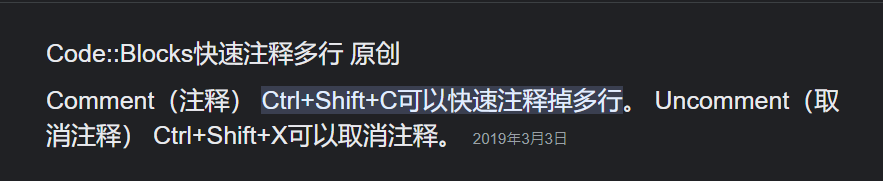

# 考前必看


## return絕對不能忘記

```cpp
int dfs(int x){
    return 0;
}
void dfs(int x){
    return;
}
int main(){
    return 0;
}
```

## memset(只能用在0!!!!!!!!!)

```cpp
#include<bits/stdc++.h>
using namespace std;

#define MEM(x,v) memset(x,v,sizeof(x));

int main(){
    ios::sync_with_stdio(0);
    cin.tie(0);

    int v[]={2,4,6,8,10};

    MEM(v,1);

    for(int i:v){
        cout<<i<<" ";
    } // 16843009 16843009 16843009 16843009 16843009

    cout<<"\n";

    MEM(v,0);

    for(int i:v){
        cout<<i<<" ";
    } // 0 0 0 0 0

    return 0;
}
```


## sort 的 cmp

```cpp
#include<bits/stdc++.h>
using namespace std;
#define pii pair<int,int>
#define all(x) x.begin(),x.end()
#define x first
#define y second

bool cmp(pii a,pii b){
    return a.y<b.y;
}

int main(){
    vector<pii>v={{4,4},{5,2},{2,3},{6,1}};
    sort(all(v),cmp);
    for(pii i:v){
        cout<<i.x<<" "<<i.y<<"\n";
    }
}
```

## io加速
```cpp
ios::sync_with_stdio(0);
cin.tie(0);
```

## 注意long long！！！
```cpp
#define int long long
signed main(){

}
```


## 易忘英文


### iterator

STL 的指標

### 拆解元素 (tie)

```cpp  
#include<bits/stdc++.h>
using namespace std;

using  pii = pair<int,int>;

int main(){
    pii p={9,2};
    int a,b;
    tie(a,b)=p;
    cout<<a; //9
}
```

### tuple 、 get

```cpp
#include <bits/stdc++.h>
using namespace std;
int main(){
    tuple<int,int,int> t;
    t={8,2,3};

    cout<<get<1>(t);
}
```

### atoi、stoi、to_string

```cpp
#include <bits/stdc++.h>
using namespace std;

int toint(char c[11]){
    if(c[0]=='-'){
        int re=0;
        for(int i=1;c[i]!='\0';i++){
            re*=10;
            re+=c[i]-'0';
        }
        return -re;
    }

    int re=0;
    for(int i=0;c[i]!='\0';i++){
        re*=10;
        re+=c[i]-'0';
    }
    return re;
}

int main(){
    char c[11]("1000");
    cout<<c<<"\n";

        cout<<atoi(c)-1<<"\n";

    string s=c;
    cout<<s<<"\n";

        cout<<stoi(s)-1<<"\n";
        cout<<to_string(1000)<<"\n";
        cout<<toint(c)<<"\n";
        cout<<toint("-1000");
}
```


### system、pause

```cpp
#include <bits/stdc++.h>
using namespace std;
int main(){
    system("pause");
    cout<<"hello";
}
```


### 資料型態

#### istringstream cin(" ");
> istringstream cin("5 17 \
> 5 5 8 3 10");

### STL

#### priority_queue
> 優先駐列

#### multiset
> 多元素set(會排序)

#### unordered_set
> 不排序set(單元素)

#### unordered_multiset
> 不排序且多重元素

#### priority_queue
> [優先駐列](https://hackmd.io/@peicpp/rJDZ4R4WA)

### [prev_permutation/next_permutation](https://hackmd.io/@peicpp/Sk3SU6VZ0/https%3A%2F%2Fhackmd.io%2F%40peicpp%2FSyqZ-8LZ0)

> 排列  
> prev_permutation(v,v+n)

### [isdigit(字元)/isalpha(字元)](https://hackmd.io/@peicpp/Sk3SU6VZ0/https%3A%2F%2Fhackmd.io%2F%40peicpp%2FBk2DcbO-R)
> 數字、字母判斷

### [toupper(字元)/tolower(字元)](https://hackmd.io/@peicpp/Sk3SU6VZ0/https%3A%2F%2Fhackmd.io%2F%40peicpp%2FHJ6p-dGSA)
> 大小寫轉換


## [陣列](https://hackmd.io/@peicpp/HyK_fR4ZA)

### 取字串長度(strlen)

### 字串轉數字(atoi)

### 複製(strcpy)


## codeblocks使用技巧

### 尋找與取代 ctrl + R
> ctrl + R

### 多行註解Ctrl+Shift+C / Ctrl+Shift+x


### 換行反斜線「\」不能tab

{width=50%}

> 可以配合懶人法使用

> 注意!!在```\```之前要空格，不然會黏在一起變成：  
> 原本：7 6 5 2 4 2 1 1 8 5 1 1 3 1 4 2 0 2 0 3 3  
> 變成：7 65 2 4 2 1 1 85 11 31 42 02 03 3

{width=50%}

