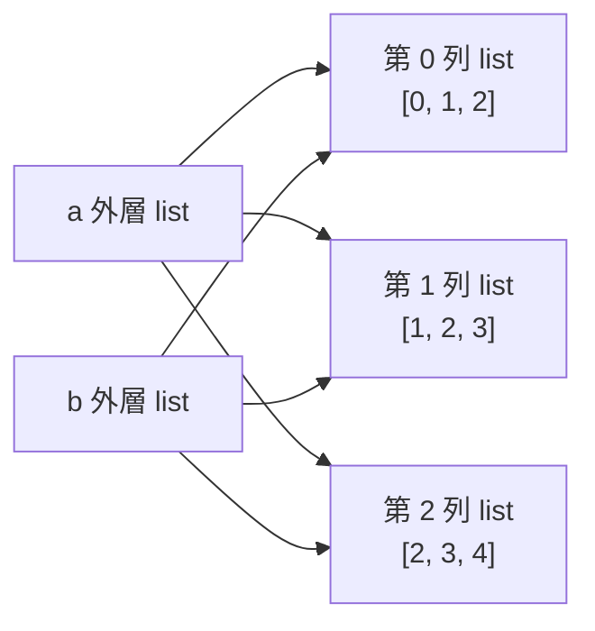

List 中可以擺任何型態的資料

```py
a = [1, 3.1416, 'Python', 'x']
```

Python 用 list of list 來實作二維陣列，也就是 a 是一個有 m 個元素的 List，
而 a 的每個元素都是一個有 n 個元素的 list。如果執行下面的程式：

> 先注意 list 乘法是把 \*n 相鄰的 list 裡面的資料給重複。
> 也就是 [[[0]]]\*3 其實是重複三次 list 的內容 `[[0]]`，變成 `[[[0]], [[0]], [[0]]]`

## 二維陣列宣告


宣告一個全部為 0 的二維陣列

`a = [[0]*4 for i in range(3)]`
=>`a = [[0,0,0,0] for i in range(3)]`
=>`a = [[0,0,0,0],[0,0,0,0],[0,0,0,0]]`

## 輸入資料

第一行的兩個數字是 `m` 與 `n`，我們可以用以下方式讀入：

```python
import io
import sys

sys.stdin = io.StringIO("""\
2 3 
1 2 3
4 5 6                                                
""")


m, n = map(int, input().split())
a = []

for i in range(m):
    a.append([int(x) for x in input().split()])
    
    
for row in a:
    print(*row)
```

output:

```py
1 2 3
4 5 6

```


## 二維陣列函數

### 用法

可以配合 map 使用
```py
a = [
    [1,2,3],
    [4,5,6],
    [7,8,9]
]


for row in a:
    print(*row)

print()
    
    
ma = max(map(max,a))
mi = min(map(min,a))
su = sum(map(sum,a))

print(ma,mi,su)
# 1 2 3
# 4 5 6
# 7 8 9

# 9 1 45

```


### 原因

```python
ma = max(map(max, a))
```

假設 `a` 是二維串列：

```python
a = [
    [1, 5, 3],
    [8, 2, 4],
    [6, 7, 0]
]
```

* `map(max, a)`：對每一列執行 `max()`，得到每列最大值：

```python
[5, 8, 7]
```

* 外層的 `max()`：再從每列最大值中找最大值：

```python
max([5, 8, 7])  # 8
```

所以：

```python
ma = max(map(max, a))
```

意思就是：

> **先找每列最大值，再找這些最大值中的最大值，也就是整個二維串列的最大值。** ([docs.python.org][1])

[1]: https://docs.python.org/3/library/functions.html?utm_source=chatgpt.com "Built-in Functions"


## 複製

看下面程式：

```py
a = [[i+j for j in range(3)] for i in range(3)]

b = a.copy()

a[0][0] = -1

for row in a:
    print(*row)

print()

for row in b:
    print(*row)
    
```

output:

```py
-1 1 2
1 2 3
2 3 4

-1 1 2
1 2 3
2 3 4

```

可以發現這時用 copy 就不管用了。

///details|講解


### 1. 原因：`a.copy()` 只複製「外層 list」

你的程式：

```python
a = [[i+j for j in range(3)] for i in range(3)]

b = a.copy()

a[0][0] = -1
```

重點在這行：

```python
b = a.copy()
```

它是 **shallow copy(淺拷貝)**。

意思是：

> `b` 會得到一個新的外層 list，但是裡面的每一列小 list 還是跟 `a` 共用同一份。

---

### 2. 原本的 `a`

```python
a = [[i+j for j in range(3)] for i in range(3)]
```

產生：

```python
a = [
    [0, 1, 2],
    [1, 2, 3],
    [2, 3, 4]
]
```

印出來是：

```txt
0 1 2
1 2 3
2 3 4
```

---

### 3. `b = a.copy()` 後的狀態

看起來好像是：

```python
b = [
    [0, 1, 2],
    [1, 2, 3],
    [2, 3, 4]
]
```

但真正的記憶體概念比較像這樣：



所以 `a[0]` 和 `b[0]` 其實是同一個 list。

---

### 4. 所以你改 `a[0][0]`，`b` 也會變

這行：

```python
a[0][0] = -1
```

意思是：

> 去 `a` 的第 0 列，再把那一列的第 0 個元素改成 `-1`。

但 `a[0]` 和 `b[0]` 共用同一個小 list，所以 `b[0][0]` 也會看到變化。

結果 `b` 印出：

```txt
-1 1 2
1 2 3
2 3 4
```

---

### 5. 可以用 `id()` 驗證

你可以試試看：

```python
a = [[i+j for j in range(3)] for i in range(3)]
b = a.copy()

print(a is b)        # False，外層不是同一個
print(a[0] is b[0])  # True，第 0 列是同一個
print(a[1] is b[1])  # True，第 1 列是同一個
print(a[2] is b[2])  # True，第 2 列是同一個
```

輸出：

```txt
False
True
True
True
```

也就是：

```python
a is b
```

代表整個外層 list 是否同一個。

```python
a[0] is b[0]
```

代表第 0 列小 list 是否同一個。

---

### 6. 正確複製二維 list 的方法

如果你想讓 `b` 完全獨立，競程裡最常用這種：

```python
b = [row[:] for row in a]
```

完整範例：

```python
a = [[i+j for j in range(3)] for i in range(3)]

b = [row[:] for row in a]

a[0][0] = -1

for row in b:
    print(*row)
```

這樣 `b` 不會被改到，輸出：

```txt
0 1 2
1 2 3
2 3 4
```

---

### 7. 記法

一維 list：

```python
b = a.copy()
```

通常可以。

二維 list：

```python
b = [row[:] for row in a]
```

比較安全。

更深層，例如三維、裡面還有 list 包 list，可以用：

```python
import copy

b = copy.deepcopy(a)
```

但競程裡二維陣列通常用這個就夠了：

```python
b = [row[:] for row in a]
```
///

其實原因可以看成：

```py
L1, L2 = [1, 2], [3, 4]

L3 = [L1, L2]

a = L3

b = a[:]  # b = L4 , L4 = [L1,L2]

```

所以我們要改成：
```py
a = [[i + j for j in range(3)] for i in range(3)]

b = [row[:] for row in a] # 等同於 b = [row.copy() for row in a]

a[0][0] = -1

for row in a:
    print(*row)

print()

for row in b:
    print(*row)

```

output:

```py
-1 1 2
1 2 3
2 3 4

0 1 2
1 2 3
2 3 4

```


