## vscode貼上圖片


在偏好設定，如圖


搜尋：
```cpp
markdown.copyFiles.destination
```
新增項目：
```cpp
docs/**/*
```
值：
```cpp
images/${documentBaseName}/
```

結果如下圖，按下確定：


## 把vscode終端機預設為conda


輸入
```
>Open User Settings (JSON)
```
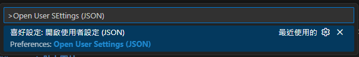

點進去之後，在`"terminal.integrated.profiles.windows": `裡面新增以下

```
        "conda": {
            "path": "C:\\WINDOWS\\System32\\cmd.exe",
            "args": [
                "/K",
                "C:\\ProgramData\\anaconda3\\Scripts\\activate.bat",
                "C:\\ProgramData\\anaconda3"
            ]
        }
```
如果希望是直接進入某一個環境（ex. PEICD100）

```
        "conda": {
            "path": "C:\\Windows\\System32\\cmd.exe",
            "args": [
                "/K",
                "call C:\\ProgramData\\anaconda3\\Scripts\\activate.bat C:\\ProgramData\\anaconda3 && conda activate PEICD100"
            ]
        }
```


最後會變成

/// collapse-code 
```json linenums="1" hl_lines="25-31"
{
    // 預設UTF-8
    "files.encoding": "utf8",
    // 讓 Code Runner 將 C++ 執行在終端機中
    "code-runner.runInTerminal": true,
    //先儲存再執行
    "code-runner.saveFileBeforeRun": true,
    // 預設 conda 開始
    "terminal.integrated.profiles.windows": {
        "PowerShell": {
            "source": "PowerShell",
            "icon": "terminal-powershell"
        },
        "Command Prompt": {
            "path": [
                "${env:windir}\\Sysnative\\cmd.exe",
                "${env:windir}\\System32\\cmd.exe"
            ],
            "args": [],
            "icon": "terminal-cmd"
        },
        "Git Bash": {
            "source": "Git Bash"
        },
        "conda": {
            "path": "C:\\Windows\\System32\\cmd.exe",
            "args": [
                "/K",
                "call C:\\ProgramData\\anaconda3\\Scripts\\activate.bat C:\\ProgramData\\anaconda3 && conda activate PEICD100"
            ]
        }
    },
    "terminal.integrated.defaultProfile.windows": "conda",
    "terminal.integrated.enableMultiLinePasteWarning": "always",
    // 預設 conda 結束
    "workbench.editorAssociations": {
        "*.pdf": "pdf.view",
        "*.xlsx": "gc-excelviewer-excel-editor"
    },
    "security.workspace.trust.untrustedFiles": "open",
    "explorer.sortOrder": "type",
    "[python]": {
        "diffEditor.ignoreTrimWhitespace": false,
        "editor.defaultColorDecorators": "never",
        "editor.formatOnType": true,
        "editor.wordBasedSuggestions": "off"
    },
    "git.openRepositoryInParentFolders": "never",
    "files.associations": {
        "*.md": "markdown",
        "*.txt": "chatagent"
    },
    "workbench.secondarySideBar.defaultVisibility": "hidden",
    "editor.formatOnSave": true,
    // C++ 格式化設定
    "C_Cpp.clang_format_style": "{ BasedOnStyle: Google, IndentWidth: 4, ColumnLimit: 0 }",
    // txt 邊界換行
    "[plaintext]": {
        "editor.wordWrap": "on"
    },
    "workbench.settings.applyToAllProfiles": [
        "markdown.copyFiles.destination"
    ],
    "markdown.copyFiles.destination": {
        "docs/**/*": "images/${documentBaseName}/"
    },
    "xlsxViewer.md.wordWrap": false,
    "xlsxViewer.md.syncScroll": false,
    "xlsxViewer.md.previewPosition": "right",
    "xlsxViewer.md.stickyToolbar": false,
    "documentViewer.readOnly": false,
    "chatgpt.localeOverride": "zh-TW",
    "http.systemCertificatesNode": true,
    "chat.tools.terminal.autoApprove": {
        "/^powershell -Command \"Get-Date -Format 'yyyyMMdd_HHmmss'\"$/": {
            "approve": true,
            "matchCommandLine": true
        },
        "/^call \"C:\\\\ProgramData\\\\Anaconda3\\\\Scripts\\\\activate\\.bat\" \"C:\\\\ProgramData\\\\Anaconda3\" ; conda env list$/": {
            "approve": true,
            "matchCommandLine": true
        }
    },
    // =========================
    // 封鎖所有 AI 自動在編輯器內顯示文字（ghost text / inline suggestion / hint）
    // =========================
    // VS Code 核心：關閉 inline suggest（多數 AI ghost text 都走這個）
    "editor.inlineSuggest.enabled": false,
    // VS Code 核心：關閉 hover（常見的「Press Ctrl+I...」類型提示來源之一）
    "editor.hover.enabled": "off",
    // VS Code 核心：關閉以文字為基礎的建議（避免外掛假裝是一般字詞建議）
    "editor.wordBasedSuggestions": "off",
    "editor.suggest.showWords": false,
    // Gemini Code Assist：關掉自動 inline suggestions / next edit prediction / inline hint
    "geminicodeassist.project": "eminent-age-hlf0d",
    "geminicodeassist.inlineSuggestions.enableAuto": false,
    "geminicodeassist.inlineSuggestions.nextEditPredictions": false,
    "geminicodeassist.displayInlineContextHint": false,
    "geminicodeassist.chat.automaticScrolling": true,
    // GitHub Copilot：全面關閉
    "github.copilot.enable": {
        "*": false,
        "plaintext": false,
        "markdown": false,
        "scminput": false
    },
    // Codeium：全面關閉（避免在編輯器自動補全）
    "codeium.enableConfig": {
        "*": false
    },
    "workbench.editor.empty.hint": "hidden",
    "git.autofetch": true,
    "editor.largeFileOptimizations": false,
    "cmake.showConfigureWithDebuggerNotification": false,
    "files.autoSave": "afterDelay",
    "git.enableSmartCommit": true,
    "editor.fontFamily": "Cascadia Mono, Consolas, 'Courier New', monospace",
    "files.autoSave": "afterDelay",
    "security.allowedUNCHosts": [
        "vmware-host"
    ],
    //在寫 C++ 時 VS Code 會把你剛剛自動插入在空白行上的縮排空白視為「可修剪的自動空白」，當游標離開那一行（你按第二次 Enter 就離開了）就把它刪掉。
    //以下是關閉他的方法
    "[cpp]": {
        "editor.trimAutoWhitespace": false
    },
    "[c]": {
        "editor.trimAutoWhitespace": false
    }
}
```


///


這些參數可以在這裡找：

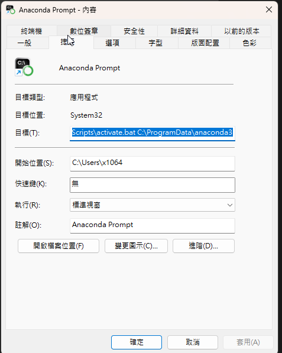


## 使用vscode撰寫c++
### mingw設置
資料來源：
1.https://ithelp.ithome.com.tw/articles/10190235
2.https://blog.yangjerry.tw/2021/09/24/vscode-cpp-2021-part1/

下載網址，按綠色那個
https://sourceforge.net/projects/mingw/files/


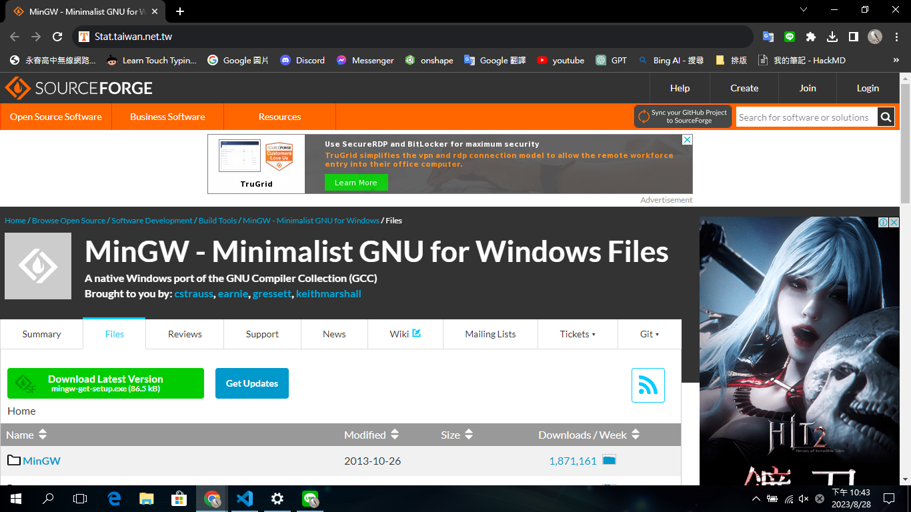


安裝完後會跳出視窗選擇要安裝的套件，這裡選擇 base 和 g++，選好後點左上角的 Installation 選 Apply Change 開始安裝。

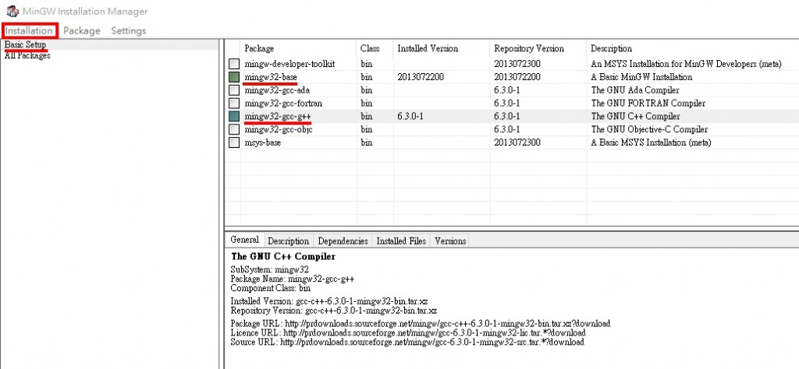

安裝完後要將 MinGW 的安裝路徑 C:\MinGW\bin (自己的位置)加入系統環境變數。
我的電腦 -> 右鍵內容 -> 左邊選單 進階系統設定 -> 進階 環境變數。


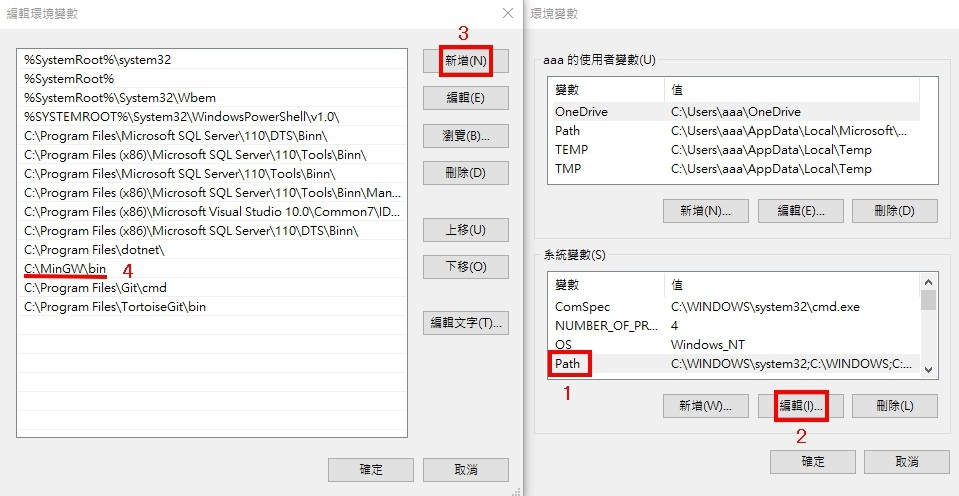

完成


----


### vscode設置
下載這些

1.偵錯/自動填字用

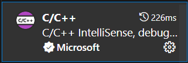

按下後可設定


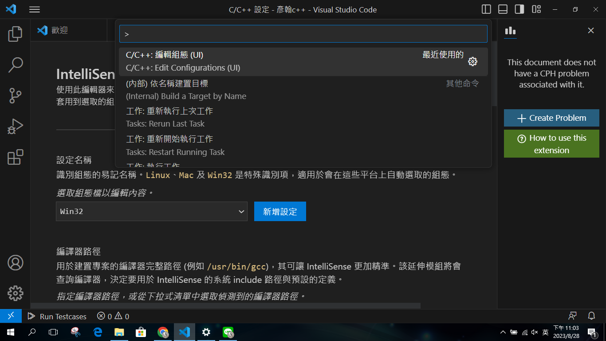


選這些

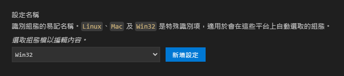

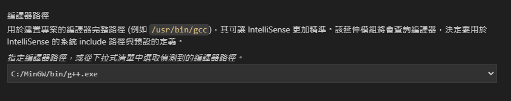

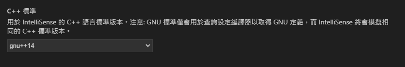


### CPH 對測資答案


> 以下為其他網站之資料：https://hackmd.io/@smallshawn95/vscode_write_cpp_2
 
### Code Runner
能夠讓執行程式更方便的延伸模組，極度推薦安裝。
連結：https://marketplace.visualstudio.com/items?itemName=formulahendry.code-runner


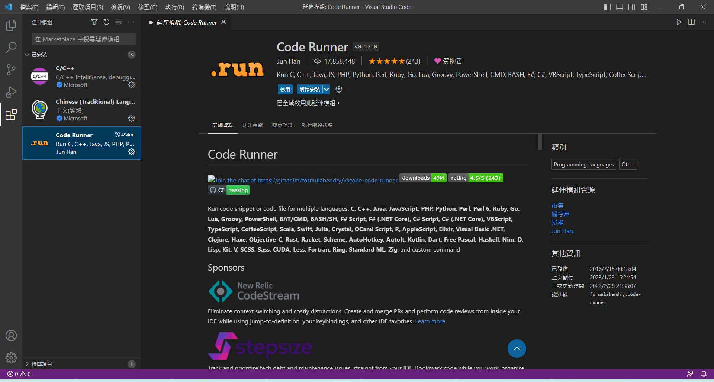
### 設置 Vscode 環境：


查詢框輸入 `> Open User Settings`，打開 Vscode Setting Json 檔。
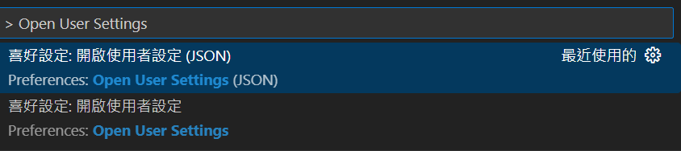

```cpp
{
    // 讓 Code Runner 將 C++ 執行在終端機中
    "code-runner.runInTerminal": true,
    // 預設 C++ 程式碼的編碼方式為 Big5(繁體中文標準庫)
    "[cpp]":{
        "files.encoding": "cp950"
    },
    //先儲存再執行
    "code-runner.saveFileBeforeRun": true
}
```

### 執行程式：


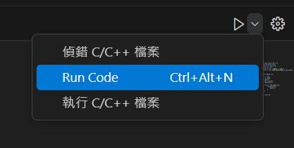

## 題外話


### 執行時要儲存：ctrl+s，或是選擇自動儲存 
1. 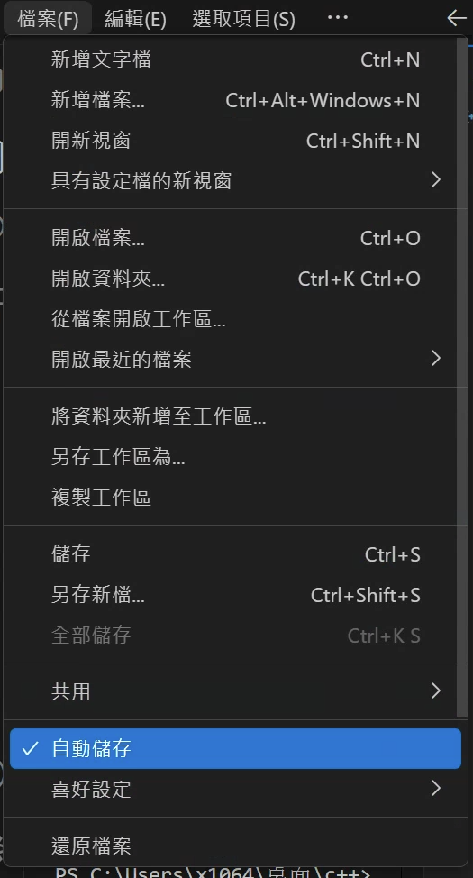
2. 或是確保json設定檔有加上
    ```cpp
    //先儲存再執行
    "code-runner.saveFileBeforeRun": true
    ```

### 變更執行程式快捷鍵

1. 找到快捷鍵設定


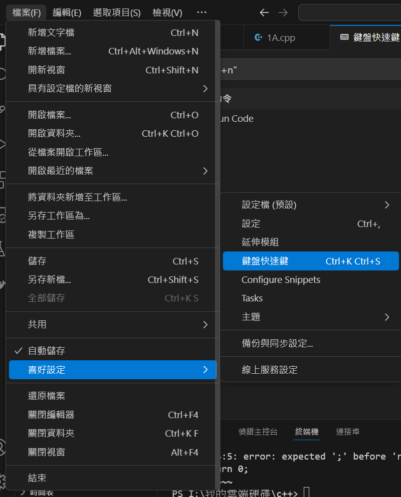


2. 輸入"ctrl+alt+n"，變更為F9


### 設定左側檔案排序方式


1. 找到設定


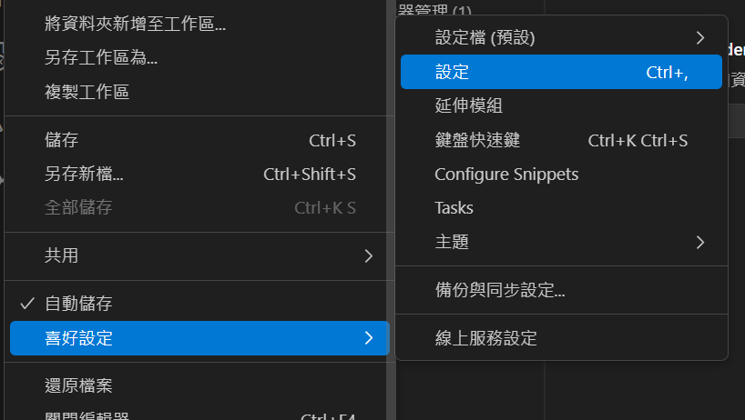

2. 選擇以type排序


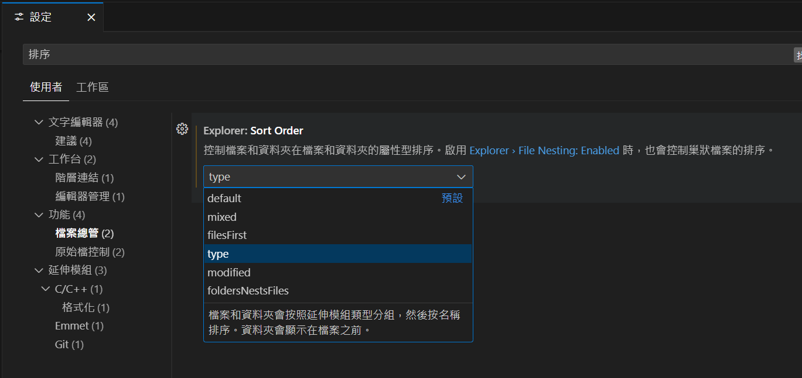


/// details | 使用chroombook

codeblocks-----


```cpp
sudo apt update
sudo apt install codeblocks
```

```cpp
sudo apt update
sudo apt install g++
```


vscode-----

來源：https://code.visualstudio.com/docs/setup/linux

將下面全部執行
```cpp
sudo apt-get install wget gpg
wget -qO- https://packages.microsoft.com/keys/microsoft.asc | gpg --dearmor > packages.microsoft.gpg
sudo install -D -o root -g root -m 644 packages.microsoft.gpg /etc/apt/keyrings/packages.microsoft.gpg
sudo sh -c 'echo "deb [arch=amd64,arm64,armhf signed-by=/etc/apt/keyrings/packages.microsoft.gpg] https://packages.microsoft.com/repos/code stable main" > /etc/apt/sources.list.d/vscode.list'
rm -f packages.microsoft.gpg
```
```cpp
sudo apt install apt-transport-https
sudo apt update
sudo apt install code # or code-insiders
```


///

## 關閉自動修剪空白

在寫C++時VS Code 會把你剛剛自動插入在空白行上的縮排空白視為「可修剪的自動空白」，當游標離開那一行（你按第二次 Enter 就離開了）就把它刪掉。
以下是關閉他的方法

```json title="settings.json"
"[cpp]": {
    "editor.trimAutoWhitespace": false
},
"[c]": {
    "editor.trimAutoWhitespace": false
}
```

