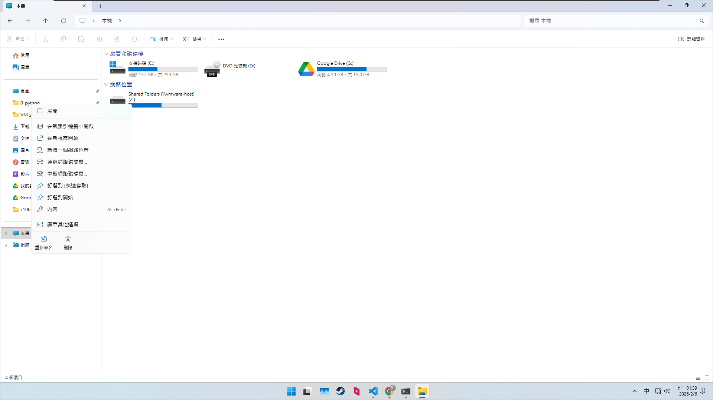

## GPT 對話

[連結](PEICD - windows 虛擬機.html)

## 配置

/// details | 配置圖片


///

## 磁碟更正路徑



你這張圖裡，右鍵選單**就有你要的那個**：

### 你要把 Shared Folders 變成「磁碟代號（永久）」

請點右鍵選單裡的 **「連線網路磁碟機…」**（有鏈結圖示那一個）。

接著在跳出的視窗這樣填：

1. **磁碟機代號**：選你想要的（例如 `V:`；你現在已經有 `Z:` 也可以不用改）
2. **資料夾**：輸入
   `\\vmware-host\Shared Folders`
3. 勾選 **「在登入時重新連線」**
4. 完成

---

### 如果你只是想打開它

就點右鍵選單最上面的 **「開啟」**（或直接雙擊那個 `Shared Folders (Z:)`）。

---

### 補一句：你其實已經成功映射成 Z: 了

所以要解你之前 CMD 的 UNC 問題，直接在 CMD 這樣用就行：

1. 輸入 `Z:` 按 Enter
2. 再 `cd` 到你的子資料夾路徑

你現在是想**沿用 Z:** 就好，還是想**改成 V:**？我就照你的選擇給你下一步的最短路徑。


## 網路

你畫面上的 5 種「Network connection」本質差在：VM 對外呈現的身分（獨立一台電腦、還是躲在主機後面）、以及能不能被外部主動連進來。

---

### Bridged（橋接）

* 概念：VM 直接「接到你的實體網路」上，看起來就像同一台路由器底下又多了一台電腦，**在網路上有自己的身分**（通常也會拿到自己的一個 IP）。 ([Support Portal][1])
* 優點：同網段的其他設備（同 Wi-Fi/同路由器底下）比較容易直接連到 VM（例如你在 VM 開伺服器、要被別台電腦連）。
* 缺點：VM 暴露在同一個實體網路，隔離性較差；有些公司/校園網路可能不給你多拿一個 IP 或限制較多。

適合：你希望 VM「就像一台真電腦」在同網路裡被看見、被連線（例如區網測試、跑服務給別台連）。

---

### NAT

* 概念：VM 藏在主機後面，**VM + 主機對外共用同一個網路身分**；VM 對外送出的連線，看起來像是「主機送出的」。 ([Support Portal][1])
* 優點：通常最省事、最穩；VM 幾乎一定能上網；外部通常「看不到 VM」，隔離性較好。
* 缺點：外部要主動連進 VM（例如別台電腦要連你 VM 的服務）通常需要做 **port forwarding**（連埠轉發），不然外面進不來。

適合：一般上網、更新、開發、跑爬蟲/機器人「只需要對外連出去」的情境。

---

### Host-only（僅主機）

* 概念：VM 只跟「主機」在同一個私有網路裡，**整個網路被限制在主機內部**。 ([Support Portal][1])
* 優點：隔離最好（外網/區網都碰不到 VM）。
* 缺點：預設通常沒辦法直接上外網（除非你另外再加一張網卡用 NAT/Bridged，或你自己做路由/分享）。

適合：你要做隔離測試環境（惡意程式分析、封閉實驗室、怕被掃描）。

---

### Custom（自訂：指定 VMnet）

* 概念：你可以在下拉選單指定某個 **VMnetX**（例如 VMnet0/1/8 或你自己新增的 VMnet2…），用來搭出多個「不同網段/不同虛擬交換器」的拓樸。VMware 手冊也提到 VMnet0/1/8 通常分別對應 Bridged/Host-only/NAT 常用網路。 ([kak.kornev-online.net][2])
* 優點：彈性最高（多網段、多台 VM、分區隔離、模擬企業網路）。
* 缺點：需要你理解 VMnet/Virtual Network Editor 的配置，不然容易把自己搞到「沒網路/互通不了」。

適合：你要玩多台 VM 組網路拓樸、或需要固定特定虛擬網段。

---

### LAN segment（區域網路區段）

* 概念：這是一個「只給 VM 彼此互連」的私有網路段（通常用來讓多台 VM 在同一個隔離二層網路互通）。 ([kak.kornev-online.net][2])
* 優點：非常適合做「VM 對 VM 的封閉內網」測試。
* 缺點：通常不會自動幫你接到外網；而且常見情況需要你自己處理 IP/DHCP（看你怎麼規劃）。 ([kak.kornev-online.net][2])

適合：你要做完全隔離的內網（多台 VM 互通，但不想讓主機/外網參與）。

---

### 你現在該選哪個？

* 只想「像一般電腦」上網、裝軟體、跑程式：**NAT** 最省事。
* 你希望 VM 在同一個路由器底下能被其他設備直接連到（像一台獨立電腦）：選 **Bridged**。
* 要高度隔離測試：選 **Host-only** 或 **LAN segment**（多台 VM 互連時）。

如果你告訴我：你是否需要「從外面主動連進 VM」（例如遠端桌面/服務/被同網段朋友連），我可以直接依你的用途給你最合適的選擇與該勾的細項（例如是否需要 port forwarding、是否要第二張網卡）。

[1]: https://knowledge.broadcom.com/external/article/309842/understanding-networking-types-in-hosted.html?utm_source=chatgpt.com "Understanding networking types in hosted products"
[2]: https://kak.kornev-online.net/FILES/KAK%20-%20VMWare%20Workstation%20Pro%2010%20User%20Guide.pdf "Using VMware Workstation - VMware
  Workstation 10"


### 一鍵背景開啟


```bat title="一鍵開啟.bat"

@echo off
setlocal

REM 1) 改成你的 .vmx 完整路徑
set "VMX=D:\VM\Windows11-Parsec\Windows11-Parsec.vmx"

REM 2) vmrun 路徑（通常在這裡）
set "VMRUN=C:\Program Files (x86)\VMware\VMware Workstation\vmrun.exe"

REM 啟動（nogui = 不開視窗）
"%VMRUN%" -T ws -vp "你的密碼" start "%VMX%" nogui

endlocal


```