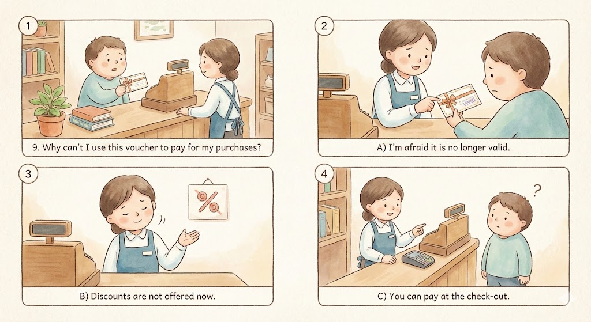

## 9

 Why can't I use this voucher to pay for my purchases?

A)  I'm afraid it is no longer valid.

B)  Discounts are not offered now.

C)  You can pay at the check-out.

## 38-40

W: Excuse me, I'd like to return this camera. 

M: May I ask what the problem is with it?

W: It's much too complicated to use. I cannot figure out how to do anything except turn it on.

M: All right. Did you bring your receipt with you?

W: Yes, I have it right here.

M: Oh, I'm sorry ma'am, but it looks like you used a discount coupon on the camera.

W: Yes, that's right. I had a coupon for twenty percent off. Is that a problem?

M: Unfortunately, because you used the coupon, we are unable to refund you the money.

W: Are you kidding? That's ridiculous.

M: I'm sorry. It's company policy. What I can do though is have one of the sales representatives show you step-by-step how to operate the camera.

 

### 38

Who most likely is the man?

A) A fellow customer

B) A customer service representative

C) The regional sales manager

D) The front door store greeter

### 39

What does the woman say about the camera?

A) She doesn't understand how to use it.

B) It cannot hold a charge for more than an hour.

C) The included software is too complicated for her.

D) It will not turn on no matter what she does.

 

### 40

What does the man suggest that the woman do?

A) Figure out how to use it on her own.

B) Speak with his manager about a refund.

C) Use a coupon to buy a cheaper camera.

D) Have an expert show her how to use it.