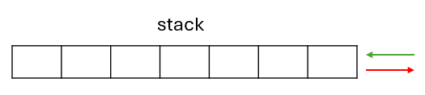

# STL

## 通用語法

### .empty()

是否為空

### .clear

刪除所有內容

### .size()

內容數量

### .resize()

```cpp
v={2,4,6,8,10};
v.resize(7,0);
->v={2,4,6,8,10,0,0};
v.resize(2,0);
->v={2,4};
```

## 重新賦值

```cpp
#include<bits/stdc++.h>
using namespace std;
int main(){
    vector<int>v={2,4,6,8,10};
    int arr[]={2,4,6,8,10};

    for(int &i:v){
        i=0;
    }
    memset(arr,0,sizeof(arr));
    for(int i:v){
        cout<<i<<" ";
    }cout<<"\n";

    for(int i=0;i<5;i++){
        cout<<arr[i]<<" ";
    }
    return 0;
}
```


## 常用STL


### vector
就是陣列
### pair
.first .second 
### tuple/get
```cpp
#include<bits/stdc++.h>
using namespace std;

int main(){
    tuple<int,char,int,string> t={1,'a',2,"PEICD100"};
    cout<<get<0>(t);
    cout<<get<1>(t);
    cout<<get<2>(t);
    cout<<get<3>(t);   //1a2PEICD100
    return 0;
}
```
### set(unorder_set/multiset)
.insert() .erase() .find .lower_bound() .upper_bound()
### map(unorder_map/multimap)
.insert() .erase() .find .lower_bound() .upper_bound()
### queue

後進前出(中間不能動)

{width=70%}

### deque

雙向進出(中間不能動)

{width=70%}

### stack

{width=70%}

### priority_queue

{width=70%}

### list

用++和--操作

```cpp
#include<bits/stdc++.h>
using namespace std;

int main(){


    int v[9]={1,2,3,4,5,6,7,8,9};
    list<int> a(v,v+9);

    auto it=a.begin();
    it++;it++;it++;it++;

    cout<<*it;
    it++;
    cout<<*it;
    it--;
    cout<<*it;     // 565

    return 0;
}
```


## 會自動排序的

> 小到大 (12345  
> 1. set  
> 2. multiset  
> 2. map  
> 3. multimap  


> 大到小 (54321  
> 1. priority_queue  
> 2. sort()函數  (離題!!  


## 陣列重點


### 一般陣列

> int v[10];
> 
> v回傳第一個v[0]的指標

### vector

>`vector<int> v(5, 10);` // 建立大小為5的vector，每個元素初始化為10      
>`vector<vector<int>> v(100, vector<int>(15, -1));` //(等同於int v[100][15]，全部初始化為-1)


> vector <int\> v[10] ;
> v.resize(大小,賦值)重新配置大小，若原本size從3變為5，不會更改v[2]以內的數值，只會新增v[3]、v[4]為-1;
> v.begin()回傳**第一個**元素位置
> v.end()回傳**最後一個元素的後一個**位置
> v.begin()回傳**最後一個**元素位置
> v.end()回傳**第一個元素的前一個**位置

## 賦值操作

GPT:
大多數 STL 容器都支持直接賦值操作，包括：

- vector
- list
- deque
- array
- set
- map
- unordered_set
- unordered_map

賦值：


```cpp  
#include <bits/stdc++.h>
using namespace std;
int main() {
    vector<int>v1,v2;
    v1={1,2,3,4,5};
    v2=v1;
    for(int i:v2){
        cout<<i<<" ";
    }
}
```

/// html | div.result
```
1 2 3 4 5 
```
///

## 語法整理

### .push()/.pop()/.top()

> 進出位置固定
1. stack(堆疊)後進先出
3. priority_queue(優先駐列)後進先出，自動排序
2. queue(列隊)先進先出


### .insert()/.erase()   (括號內放it或數字)

#### list

1. list(鏈結) 括號內要放it

#### set

2. set
4. multiset
5. unordered_set
6. multiset
7. unordered_multiset

#### map

7. map
9. multimap
10. unordered_map
11. multimap
12. unordered_multimap

## set/map 的刪除

.erase(數值)是所有匹配元素  
.erase(it)是該位置元素


## 拆解元素 (tie)

```cpp  
#include<bits/stdc++.h>
using namespace std;

using  pii = pair<int,int>;

int main(){
    pii p={9,2};
    int a,b;
    tie(a,b)=p;
    cout<<a; //9
}
```

## tuple、get<1>使用

```cpp  
#include<bits/stdc++.h>
using namespace std;
using  tiii = tuple<int,int,int>;
int main(){
    tiii t;
    t={1,2,3};
    int ans=get<1>(t);
    cout<<ans;
}
```

## 可能會用到所以放這


| \(R\)   \\  \(C\) |  0 | 1     | 2     | 3     | 4     | 5     | 6     | 7     | 8     | 9     |
| --- | ------- | ----- | ----- | ----- | ----- | ----- | ----- | ----- | ----- | ----- |
| 0   | (0,0)   | (0,1) | (0,2) | (0,3) | (0,4) | (0,5) | (0,6) | (0,7) | (0,8) | (0,9) |
| 1   | (1,0)   | (1,1) | (1,2) | (1,3) | (1,4) | (1,5) | (1,6) | (1,7) | (1,8) | (1,9) |
| 2   | (2,0)   | (2,1) | (2,2) | (2,3) | (2,4) | (2,5) | (2,6) | (2,7) | (2,8) | (2,9) |
| 3   | (3,0)   | (3,1) | (3,2) | (3,3) | (3,4) | (3,5) | (3,6) | (3,7) | (3,8) | (3,9) |
| 4   | (4,0)   | (4,1) | (4,2) | (4,3) | (4,4) | (4,5) | (4,6) | (4,7) | (4,8) | (4,9) |
| 5   | (5,0)   | (5,1) | (5,2) | (5,3) | (5,4) | (5,5) | (5,6) | (5,7) | (5,8) | (5,9) |
| 6   | (6,0)   | (6,1) | (6,2) | (6,3) | (6,4) | (6,5) | (6,6) | (6,7) | (6,8) | (6,9) |
| 7   | (7,0)   | (7,1) | (7,2) | (7,3) | (7,4) | (7,5) | (7,6) | (7,7) | (7,8) | (7,9) |
| 8   | (8,0)   | (8,1) | (8,2) | (8,3) | (8,4) | (8,5) | (8,6) | (8,7) | (8,8) | (8,9) |
| 9   | (9,0)   | (9,1) | (9,2) | (9,3) | (9,4) | (9,5) | (9,6) | (9,7) | (9,8) | (9,9) |
