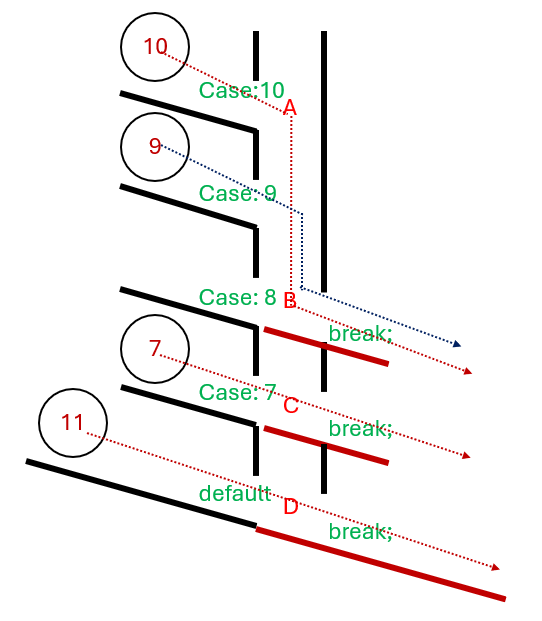

# switch之使用

/// html | dir.i

`switch` 可以用的資料型態只有這些：

1. **整數型別（integral types）**

* `char` / `signed char` / `unsigned char`
* `short` / `unsigned short`
* `int` / `unsigned int`
* `long` / `unsigned long`
* `long long` / `unsigned long long`
* `bool`

2. **列舉型別**

* `enum`
* `enum class`

其餘像 `float/double`、`string`、`class/struct`、`vector` 都 **不能** 放進 `switch(...)`。

///


## switch之使用
```cpp  
#include <bits/stdc++.h>
using namespace std;
#define nn "\n"

int main(){
    switch(10) { 
        case 10:
            cout << "A" <<"\n";
        case 9:  
        case 8: 
            cout << "B" << endl; 
            break; 
        case 7: 
            cout << "C" << endl; 
            break; 
        default: 
            cout << "D" << endl; 
            break;
    }   
}
```
/// html | div.result
```
A
B
```
///


> 1.沒有break就會一直執行下一層的，直到找到break。  
> 2.可以不放敘述，如4、5行，如同or(多重條件)。





## 設置範圍

>使用「...」設置範圍，3 ... 5是3<=x<=5

```cpp  
#include<bits/stdc++.h>
using namespace std;
int main(){
    int n;
    n=4;
    switch (n) {
        case 1:
            cout<<'A';
            break;
        case 2:
            cout<<'B';
            break;
        case 3 ... 5:
            cout<<'C';
            break;
        default :
            cout<<'D';
            break;
    }
}

```
輸出：
```
C
```

>整理好看一點
```cpp
switch (op) {
    case '+': return a + b;
    case '-': return a - b;
    case '*': return a * b;
    case '/': return b ? a / b : throw runtime_error("divide by zero");
    case '%': return a % b;
}
```