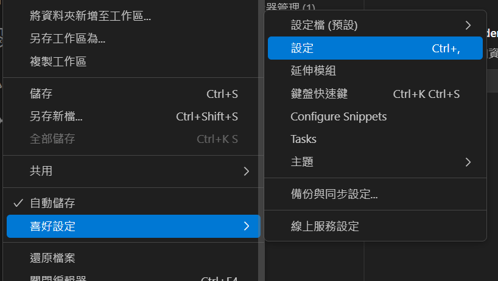

# 使用vscode撰寫c++
## mingw設置
資料來源：
1.https://ithelp.ithome.com.tw/articles/10190235
2.https://blog.yangjerry.tw/2021/09/24/vscode-cpp-2021-part1/

下載網址，按綠色那個
https://sourceforge.net/projects/mingw/files/


安裝完後會跳出視窗選擇要安裝的套件，這裡選擇 base 和 g++，選好後點左上角的 Installation 選 Apply Change 開始安裝。


安裝完後要將 MinGW 的安裝路徑 C:\MinGW\bin (自己的位置)加入系統環境變數。
我的電腦 -> 右鍵內容 -> 左邊選單 進階系統設定 -> 進階 環境變數。


完成


----


## vscode設置
下載這些

1.偵錯/自動填字用


按下後可設定


選這些


## CPH 對測資答案


> 以下為其他網站之資料：https://hackmd.io/@smallshawn95/vscode_write_cpp_2
 
## Code Runner
能夠讓執行程式更方便的延伸模組，極度推薦安裝。
連結：https://marketplace.visualstudio.com/items?itemName=formulahendry.code-runner


## 設置 Vscode 環境：


查詢框輸入 `> Open User Settings`，打開 Vscode Setting Json 檔。


```cpp
{
    // 讓 Code Runner 將 C++ 執行在終端機中
    "code-runner.runInTerminal": true,
    // 預設 C++ 程式碼的編碼方式為 Big5(繁體中文標準庫)
    "[cpp]":{
        "files.encoding": "cp950"
    },
    //先儲存再執行
    "code-runner.saveFileBeforeRun": true
}
```

## 執行程式：


# 題外話


## 執行時要儲存：ctrl+s，或是選擇自動儲存 
1. 
2. 或是確保json設定檔有加上
    ```cpp
    //先儲存再執行
    "code-runner.saveFileBeforeRun": true
    ```

## 變更執行程式快捷鍵

1. 找到快捷鍵設定


2. 輸入"ctrl+alt+n"，變更為F9


## 設定左側檔案排序方式


1. 找到設定



2. 選擇以type排序


----

/// details | 使用chroombook

codeblocks-----


```cpp
sudo apt update
sudo apt install codeblocks
```

```cpp
sudo apt update
sudo apt install g++
```


vscode-----

來源：https://code.visualstudio.com/docs/setup/linux

將下面全部執行
```cpp
sudo apt-get install wget gpg
wget -qO- https://packages.microsoft.com/keys/microsoft.asc | gpg --dearmor > packages.microsoft.gpg
sudo install -D -o root -g root -m 644 packages.microsoft.gpg /etc/apt/keyrings/packages.microsoft.gpg
sudo sh -c 'echo "deb [arch=amd64,arm64,armhf signed-by=/etc/apt/keyrings/packages.microsoft.gpg] https://packages.microsoft.com/repos/code stable main" > /etc/apt/sources.list.d/vscode.list'
rm -f packages.microsoft.gpg
```
```cpp
sudo apt install apt-transport-https
sudo apt update
sudo apt install code # or code-insiders
```


///

