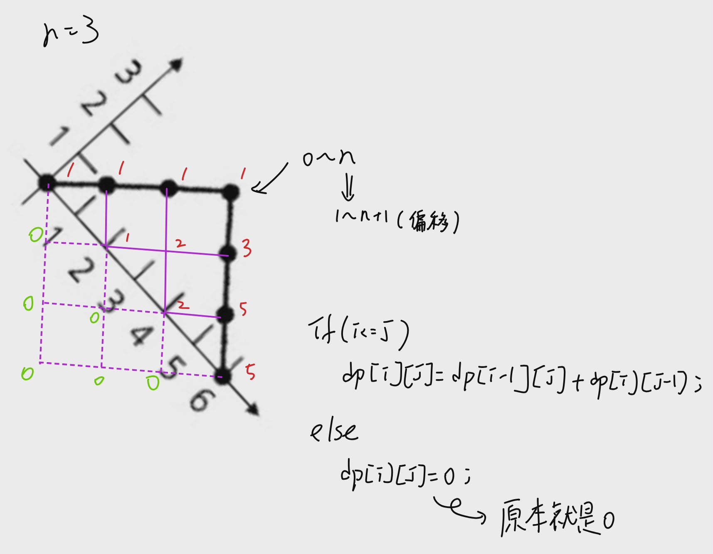
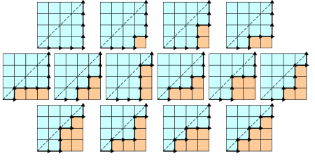
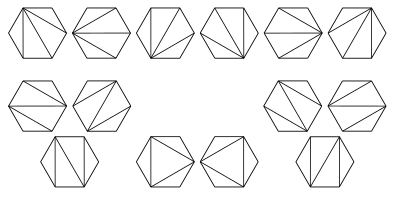
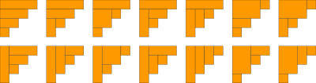

# 卡塔蘭數

只要一個問題可以被拆成「左邊一個小問題 + 右邊一個小問題」，
而且所有可能切法都要加總，就很可能是 Catalan number。

**第 0 項到第 19 項的卡塔蘭數為**：             
1, 1, 2, 5, 14, 42, 132, 429, 1430, 4862, 16796, 58786, 208012, 742900, 2674440, 9694845, 35357670, 129644790, 477638700, 1767263190


## 公式


/// html | div.i

[from wiki](https://zh.m.wikipedia.org/wiki/%E5%8D%A1%E5%A1%94%E5%85%B0%E6%95%B0)     

$$
C_n = \frac{1}{n+1} \binom{2n}{n} = \frac{(2n)!}{(n+1)!n!}
$$

---

$$
其中，\binom{2n}{n} = \frac{(2n)!}{n!(2n-n)!} = \frac{(2n)!}{n!n!}
$$

///

## 程式

/// collapse-code  
```cpp title="用原式，(2*25)!會爆掉 long long 裝不下"
#include <bits/stdc++.h>
using namespace std;
#define int long long

vector<int> dp(2 * 21, -1);

int f(int x) {  // !

    if (x == 0) return 1;

    if (dp[x] != -1) return dp[x];

    return dp[x] = f(x - 1) * x;
    
}

signed main() {
    vector<int> c(21);

    c[0] = 1;

    for (int n = 1; n <= 20; n++) {
        c[n] = f(2 * n) / (f(n + 1) * f(n));
    }

    int n;
    while (cin >> n) {
        cout << c[n] << "\n";
    }

    return 0;
}
```
///


/// details | 參考圖片

///

/// collapse-code  
```cpp title="用表格，不會爆掉，一維"
#include <bits/stdc++.h>
using namespace std;
#define int long long

signed main() {
    vector<int> c(26);

    c[0] = 1;

    for (int i = 1; i <= 25; i++) {
        for (int j = i; j <= 25; j++) {
            c[j] += c[j - 1];
            // cout << c[j] << " ";
        }
        // cout << "\n";
    }

    int n;
    while (cin >> n) {
        cout << c[n] << "\n";
    }

    return 0;
}
```
///


/// collapse-code  
```cpp title="用表格，不會爆掉，二維"
#include <bits/stdc++.h>
using namespace std;
#define int long long

signed main() {
    vector<vector<int>> dp(27, vector<int>(27));

    dp[1][1] = 1; 

    for (int i = 1; i <= 26; i++) { //偏移
        for (int j = 1; j <= 26; j++) {
            if (i == 1 && j == 1) {
                continue;
            }
            if (i <= j) {
                dp[i][j] = dp[i][j - 1] + dp[i - 1][j];
            }
        }
    }

    int n;
    while (cin >> n) {
        cout << dp[n + 1][n + 1] << "\n";
    }

    return 0;
}
```
///


/// collapse-code  
```cpp title="推導後"
#include <bits/stdc++.h>
using namespace std;

#define int long long

signed main() {
    vector<int> C(26);

    C[0] = 1;

    for (int n = 1; n <= 25; n++) {
        C[n] = C[n - 1] * (4 * n - 2) / (n + 1);
    }

    int n;
    while (cin >> n) {
        cout << C[n] << "\n";
    }

    return 0;
}
```
///


## 應用

1. $C_n$ 表示長度 $2n$ 的 [dyck word](https://en.wikipedia.org/wiki/Dyck_language) 的個數。Dyck 詞是一個有 $n$ 個 X 和 $n$ 個 Y 組成的字串，且所有的前綴字串皆滿足 X 的個數大於等於 Y 的個數。以下為長度為 6 的 dyck words：    
XXYYYY XYXXYY XYXYXY XXYYXY
1. 將上例的 X 換成左括號，Y 換成右括號，$C_n$ 表示所有包含 $n$ 組括號的合法運算式的個數：   
((())) 、 ()(()) 、 ()()() 、 (())() 、 (()())
1. $C_n$ 表示所有在 $n \times n$ 棋盤中不越過對角線的單調路徑的個數。一個單調路徑從左下角出發，在右上角結束，每一步均為向上或向右。計算這種路徑的個數等價於計算 Dyck word 的個數：X 代表「向右」，Y 代表「向上」。下圖為 $n = 4$ 的情況：

1. $C_n$ 表示通過連結頂點將 $n + 2$ 邊的凸多邊形分成三角形的方法個數。下圖中為 $n = 4$ 的情況：   

1. $C_n$ 表示不用 $n$ 個長方形填充一個高為 $n$ 的階梯狀長方形的方法個數。下圖為 $n = 4$ 的情況：        



## 例題
[e876. Q1 - 配對連線](https://zerojudge.tw/ShowProblem?problemid=e876)


[a229. 括號匹配問題](https://zerojudge.tw/ShowProblem?problemid=a229)


[d837. NOIP2003 3.栈](https://zerojudge.tw/ShowProblem?problemid=d837)

[d887. 1.山脈種類(chain)](https://zerojudge.tw/ShowProblem?problemid=d887)