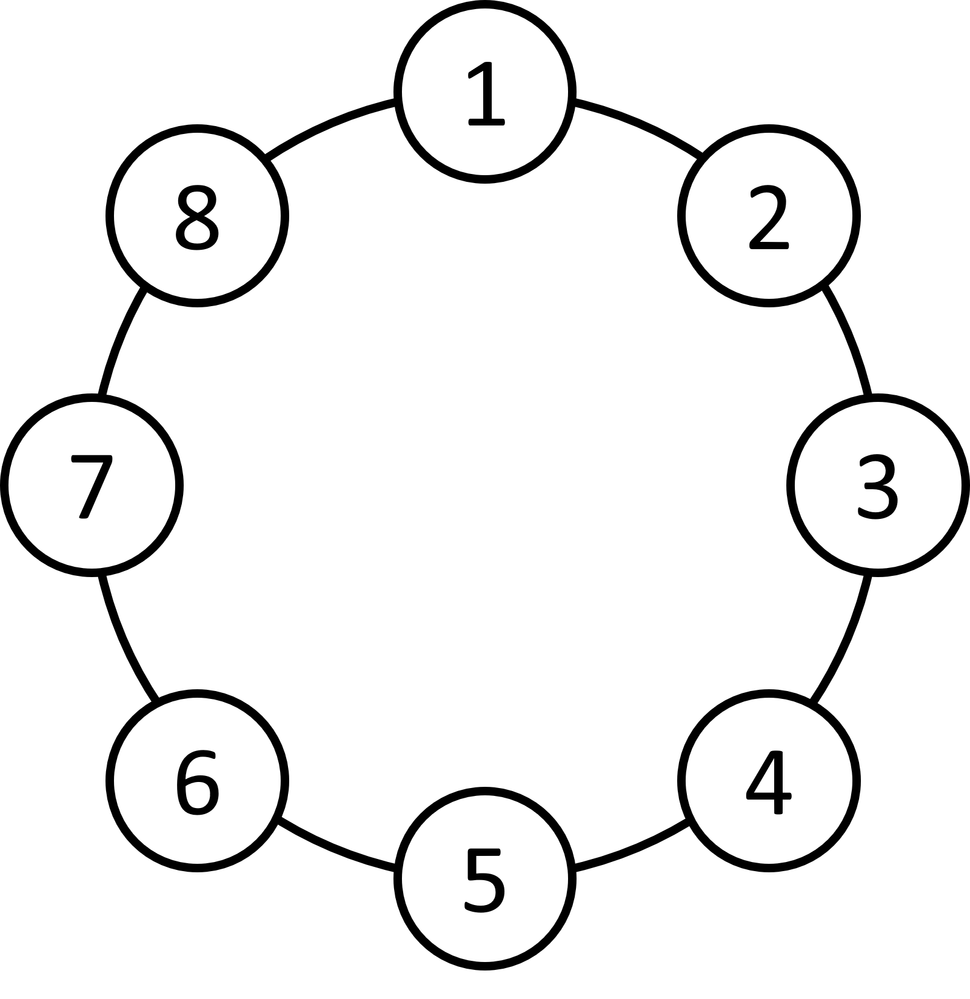
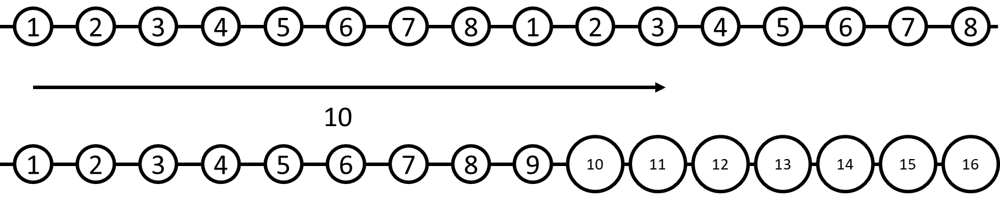

# 圈結構&約瑟夫問題
## 圈結構

{width=50%}
>原本在 0 號位（0-based），若要移動 n 步，如何知道接下來會到哪個位置


>總共有 8 個位置（0~7）。
>若原本在 0，往後 10 步：0 + 10 = 10。
>要讓它回到 0~7 的範圍，就對 8 取模：10 % 8 = 2，也就是到 2 的位置。

>便可以得到公式（0-based）：
>(原本位置 + 移動步數) % 總位置數 = 現在位置

>補充：若題目用 1~N 編號（1-based），先把位置減 1 轉成 0-based 套用上式，最後再把結果加 1 轉回 1-based：
>現在位置(1-based) = ((原本位置(1-based) - 1 + 移動步數) % 總位置數) + 1

## 約瑟夫問題

<!-- 資料來源1: https://openhome.cc/zh-tw/algorithm/randomness/josephus/ -->
資料來源: https://blog.csdn.net/u011500062/article/details/72855826

> 據說著名猶太歷史／數學家約瑟夫（Josephus）有過以下的故事：在羅馬人佔領喬塔帕特後，40 個猶太士兵與約瑟夫躲到一個洞中，眼見脫逃無望，一群人決定集體自殺，然而私下約瑟夫與某個傢伙並不贊成，於是約瑟夫建議自殺方式，41 個人排成圓圈，由第 1 個人開始報數，每報數到 3 的人就必須自殺，然後由下一個重新報數，直到所有人都自殺身亡為止。約瑟夫與不想自殺的那個人分別排在第 16 個與第 31 個位置，於是逃過了死亡。

>我們假設有 8 個人（位置用 0-based：0~7），每次報數到 M=3 的人出局（也就是每輪等價於把勝利者位置往前推 M 位；推導見下方遞推式）。
{width=50%}


| &nbsp;&nbsp;&nbsp;&nbsp;0&nbsp;&nbsp;&nbsp;&nbsp; | &nbsp;&nbsp;&nbsp;&nbsp;1&nbsp;&nbsp;&nbsp;&nbsp; | &nbsp;&nbsp;&nbsp;&nbsp;2&nbsp;&nbsp;&nbsp;&nbsp; | &nbsp;&nbsp;&nbsp;&nbsp;3&nbsp;&nbsp;&nbsp;&nbsp; | &nbsp;&nbsp;&nbsp;&nbsp;4&nbsp;&nbsp;&nbsp;&nbsp; | &nbsp;&nbsp;&nbsp;&nbsp;5&nbsp;&nbsp;&nbsp;&nbsp; | &nbsp;&nbsp;&nbsp;&nbsp;6&nbsp;&nbsp;&nbsp;&nbsp; | &nbsp;&nbsp;&nbsp;&nbsp;7&nbsp;&nbsp;&nbsp;&nbsp; |
|:-------------------------------------------------:|:-------------------------------------------------:|:-------------------------------------------------:|:-------------------------------------------------:|:-------------------------------------------------:|:-------------------------------------------------:|:-------------------------------------------------:|:-------------------------------------------------:|
|                         1                         |                         2                         |  <span style="border: 2px solid #ff0000;">3</span>  |                         4                         |                         5                         |                         6                         |                         <span style="border: 2px solid #0011ff;">7</span>                         |                         8                         |
|                         4                         |                         5                         |  <span style="border: 2px solid #ff0000;">6</span>  |                         <span style="border: 2px solid #0011ff;">7</span>                         |                         8                         |                         1                         |                         2                         |                                                   |
|                         <span style="border: 2px solid #0011ff;">7</span>                         |                         8                         |  <span style="border: 2px solid #ff0000;">1</span>  |                         2                         |                         4                         |                         5                         |                                                   |                                                   |
|                         2                         |                         4                         |  <span style="border: 2px solid #ff0000;">5</span>  |                         <span style="border: 2px solid #0011ff;">7</span>                         |                         8                         |                                                   |                                                   |                                                   |
|                         <span style="border: 2px solid #0011ff;">7</span>                         |                         8                         |  <span style="border: 2px solid #ff0000;">2</span>  |                         4                         |                                                   |                                                   |                                                   |                                                   |
|                         4                         |                         <span style="border: 2px solid #0011ff;">7</span>                         |  <span style="border: 2px solid #ff0000;">8</span>  |                                                   |                                                   |                                                   |                                                   |                                                   |
|  <span style="border: 2px solid #ff0000;">4</span>  |                         <span style="border: 2px solid #0011ff;">7</span>                         |                                                   |                                                   |                                                   |                                                   |                                                   |                                                   |
|  <span style="border: 2px solid #0011ff;">7</span>  |                                                   |                                                   |                                                   |                                                   |                                                   |                                                   |                                                   |


>紅色位置為出局位置，位置從 0 開始計算（0-based）。
>接下來思考幾個問題：


**一、** 
>Q：當我們已知有 8 個人時（0~7），報數到 3 的人出局，勝利者的位置為 6。那第一輪出局之後（剩 7 個人）勝利者的位置為多少？
>0,1,<span style="border: 2px solid #ff0000;">2</span>,3,4,5,<span style="border: 2px solid #0011ff;">6</span>,7
>
>A：第一輪出局的是位置 2（0-based）。出局後，下一個人（原本位置 3）成為新的開頭，相當於把陣列往前移動 3 位（0,1,2 三個位置），因此勝利者位置也會往前移動 3 位。
>6 往前移動 3 位，在 7 個人（0~6）的新編號下變成 3。
>如下（示意）：
>0,1,<span style="border: 2px solid #ff0000;">2</span>,3,4,5,<span style="border: 2px solid #0011ff;">6</span>,7
>（刪掉 2，從下一位 3 開始接著報數，相當於把陣列往前移動 3 位）
>3,4,5,<span style="border: 2px solid #0011ff;">6</span>,7,0,1
>（新編號 0~6 對應到原編號）
>0,1,2,<span style="border: 2px solid #0011ff;">3</span>,4,5,6


**二、**
>Q：已知 10 個人（0~9）、報數到 3 的人出局時，勝利者的位置為 3。那 11 個人（0~10）時，勝利者的位置為多少？
>
>A：這可以看作是上一個問題的逆過程：從 10 人擴到 11 人時，勝利者位置等價於往後移動 M=3 位，然後對 11 取模。
>假設 f(N,M) = 勝利位置（0-based），且 f(1,M)=0。
>
>先把 11 人的第一輪（M=3）出局畫出來：
>0,1,<span style="border: 2px solid #ff0000;">2</span>,3,4,5,6,7,8,9,10
>刪掉 2，從下一位 3 開始，得到 10 人的狀態（用原編號順序表示）：
>3,4,5,6,7,8,9,10,0,1
>
>題目給的是「10 人時勝利位置為 3（0-based，新編號 0~9）」：
>0,1,2,<span style="border: 2px solid #0011ff;">3</span>,4,5,6,7,8,9
>對應回上面那條 10 人的原編號順序，就是原編號 <span style="border: 2px solid #0011ff;">6</span> 勝利。
>
>因此回推到 11 人（0-based）的勝利位置：
>f(11,3) = (f(10,3) + 3) % 11 = (3 + 3) % 11 = 6
>用 11 人的序列表示就是：
>0,1,<span style="border: 2px solid #ff0000;">2</span>,3,4,5,<span style="border: 2px solid #0011ff;">6</span>,7,8,9,10


**三、**
>Q：現在改為人數改為 N，報數到 M 時，把那個人殺掉，那麼陣列是怎麼移動的？
>
>A：每出局一個人，下一個人成為頭，相當於把陣列往前移動 M 位。若已知 N-1 個人時，勝利者的位置為 f(N−1,M)，則 N 個人的時候，就是往後移動 M 位（因為有可能陣列越界，超過的部分會被接到頭上，所以還要模 N），即
>f(N,M) = (f(N−1,M) + M) % N

> 註：上式求出來的是 0-based 的位置。
> 下面給出程式碼實作（0-based 版本）：

```cpp
#include<bits/stdc++.h>
using namespace std;

int main(){
    int n, m;
    cin >> n >> m;

    int ans = 0;           // f(1,m)=0
    for(int i = 2; i <= n; i++){
        ans = (ans + m) % i;
    }

    cout << ans;           // 0-based
}
```

## 例題

### [定時K彈(APCS)](實作三.md#定時k彈)


> 可知，當開頭為 n 時，n 在第 0 個位置。

> 一開始人數：n-k+1，最終人數：n

/// collapse-code  
```cpp
#include<bits/stdc++.h>
using namespace std;
int main(){
    int n,m,k;
    cin>>n>>m>>k;
    int ans=0;//原本在0位置(開頭)
    for(int i=n-k+1;i<=n;i++){//增加總人數
        ans=(ans+m)%i;//取模
    }
    cout<<ans;//0-based
}
```
///

### [2169 . 出戰排序 (Arrangement)](https://tioj.ck.tp.edu.tw/problems/2169)

/// collapse-code  
```cpp
#include <bits/stdc++.h>
using namespace std;

int f(int n, int m) {
    int pos = 0;
    for (int i = 2; i <= n; i++) {
        pos = (pos + m) % i;
    }
    return pos;  // 0-based
}

int main() {
    int n, k;
    cin >> n >> k;

    for (int m = 2; m <= 30000; m++) {
        if (f(n, m) == k) {
            cout << m << endl;
            return 0;
        }
    }

    cout << 0 << endl;
    return 0;
}
```
///
