# 圖論

>題型整理：     
>1. 距離計算     
>[P-7-1. 探索距離](#p-7-1-探索距離)     
>[P-7-2. 開車蒐集寶物](#p-7-2-開車蒐集寶物)     
       


## BFS      

注意事項！！最常出錯的地方 ：一定要記得宣告vis陣列     
1. q.push後面會加上一個vis=true (所以共兩個)   
2. 判斷if(!vis[i]){ ... }
3. q是要取first


最基本寫法

```cpp
void bfs(int ff){

    queue<int>q;
    bool vis[N];
    
    q.push(ff);  
    vis[ff]=true;             //vis (1/3) push 後面加上一個 vis
    
    while(!q.empty()){
        int f=q.front();q.pop();
        for(int i:v[f]){ 
            if(!vis[i]){      //vis(2/3)
                q.push(i);
                vis[i]=true;  // vis(3/3) push 後面加上一個 vis

                cout<<i;      // 所有的點一定會被放入一次，所以在這處理要做的動作
            
            }
        }
    }
}
```


> 廣度優先，可以看成洪水擴散      
> 深藍是離開佇列的節點      
> 淺藍是走到的點      
> 綠色是加入佇列的點      

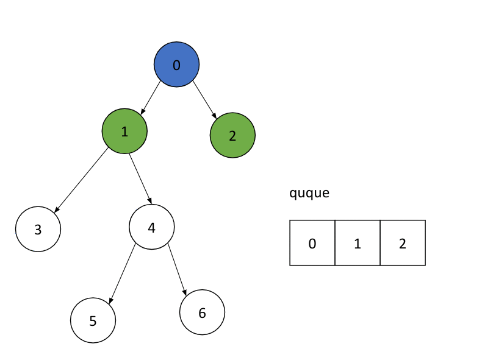
<iframe width="718" height="404" src="https://www.youtube.com/embed/Yuq8PWRRvhU" title="BFS" frameborder="0" allow="accelerometer; autoplay; clipboard-write; encrypted-media; gyroscope; picture-in-picture; web-share" referrerpolicy="strict-origin-when-cross-origin" allowfullscreen></iframe>  

> 步驟：    
> 1. 首先將第一個點加入佇列    
> 2. 接著走到第一個點（也就是佇列的第一個），將其子節點依序放入佇列    
> 3. 刪除佇列中第一個點    
>     
> 重複2~3直到佇列沒有東西(沒有下一個點)    


### 實作

> 在資料結構的部分我們需要：    
> 1. 存路徑的vector    
> 2. 存是否拜訪的陣列    
> 3. 一個queue儲存拜訪順序    
   
> 以上面的圖解為例   
      
輸入：      
第一行為節點數、路徑數（m）      
第二行為起點   
接下來有m行，為不同路徑   
```cpp
7 6
0
0 1
0 2
1 3
1 4
4 5
4 6
```
輸出：
```cpp
1 2 3 4 5 6
```
/// collapse-code  
```cpp     
#include<bits/stdc++.h>
using namespace std;
#define int long long
#define N 1000
vector<int>v[N];

void bfs(int ff){
    queue<int>q;
    bool vis[N];
    q.push(ff);
    vis[ff]=true;             //vis (1/3)
    while(!q.empty()){
        int f=q.front();q.pop();
        for(int i:v[f]){ 
            if(!vis[i]){      //vis(2/3)
                vis[i]=true;  // vis(3/3)
                q.push(i);
                cout<<i;
            }
        }
    }
}

signed main(){
    istringstream cin("7 6 \
0 \
0 1 \
0 2 \
1 3 \
1 4 \
4 5 \
4 6");//123456
    int n,m;
    cin>>n>>m;
    int f;
    cin>>f;
    for(int i=0;i<m;i++){
        int x,y;
        cin>>x>>y;
        v[x].push_back(y);
    }
    bfs(f);
}
```
///

/// danger | 注意！！！
1. 有三處需要 vis     
2. vis在雙向圖、邊的起點與終點未必不同時必須加上     
///     
     
#### P-7-1. 探索距離
https://judge.tcirc.tw/ShowProblem?problemid=d090

P-7-1. 探索距離
輸入一個有向圖 G 與一個起點 s，請計算由 s 出發可以到達的點數(不包含 s)，並且計算這些可以到達的點與 s 的距離和，假設每個邊的長度均為 1。兩點之間可能有多個邊，邊的起點與終點未必不同。

Time limit: 1 秒

輸入格式：
第一行是兩個正整數 n 與 m，代表圖的點數與邊數，圖的點是以 0~n-1 編號，第二行是 s 的編號，接下來有 m 行，每一行兩個整數 a 與 b 代表一個邊(a,b)。n 不超過 100，m 不超過 4000。

輸出：
第一行輸出可以到達的點數，第二行輸出與 s 的距離總和。

範例輸入：     
7 6     
1     
5 1     
1 3     
1 4     
2 3     
4 6     
6 0     
         
    
範例輸出：    
4    
7    


> 這題比較困難的部分是如何計算高度    
>     
> 我們可以知道「子節點的高度」為「父節點的高度」+1    
> 所以`dp[子]=dp[父]+1    `
>
> 另外，這題不能用DFS，因為這是圖不是樹，最短距離要用BFS
    
    
/// collapse-code  
```cpp  
#include<bits/stdc++.h>
using namespace std;
#define nn "\n"
#define N 101
// istream& ss=cin;
// stringstream ss(" ");


vector<int>v[N];
int ans_1=0;
int ans_2=0;
int d[N]={0};
bool vis[N]={false};


void bfs(int a){
    queue <int>q;
    q.push(a);
    vis[a]=true;  //不要忘記！！！！
    d[a]=0;
    while(!q.empty()){
        int f=q.front();
        q.pop();
        for(int i:v[f]){
            if(!vis[i]){//不要忘記！！！！
                vis[i]=true;//不要忘記！！！！
                d[i]=d[f]+1;
                ans_1++;
                ans_2+=d[i];
                q.push(i);
            }
        }
    }
}


int main(){
    int n,m,a;
    cin>>n>>m>>a;
    for(int i=0;i<m;i++){
        int x,y;
        cin>>x>>y;
        v[x].push_back(y);
    }

    bfs(a);
    cout<<ans_1<<nn<<ans_2;
    return 0;
}
```
///


## DFS

/// html|div.i
最基本寫法

```cpp
void dfs(int f){
    vis[f]=true;       //標記為走過
    for(int i:v[f]){
        if(!vis[i]){   //排除走過的
            cout<<i;
            dfs(i);
        }
    }
    return;
}
```

///
> 能走多深就走多深，走不下去就回頭
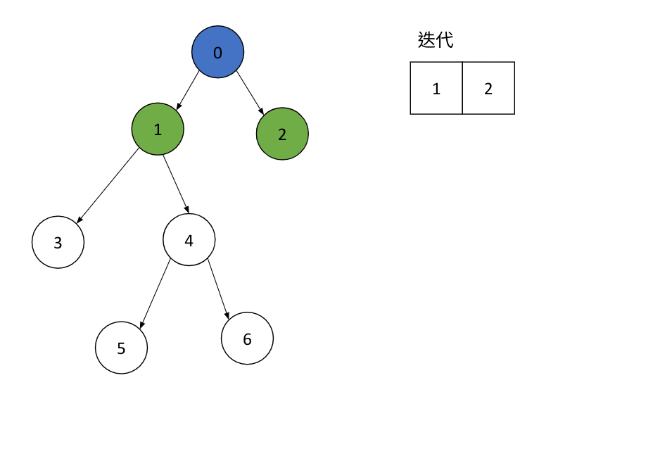
<iframe width="718" height="404" src="https://www.youtube.com/embed/rt5de19IbBA" title="BFS" frameborder="0" allow="accelerometer; autoplay; clipboard-write; encrypted-media; gyroscope; picture-in-picture; web-share" referrerpolicy="strict-origin-when-cross-origin" allowfullscreen></iframe>

> 做法：   
> 對於每個迭代到的節點進行迭代(遞迴)   
   
   
   
``` title="input，多加一條線4->2測vis"
7 7
0 1
0 2
1 3
1 4
4 5
4 6
4 2
```
``` title="output"
0 1 3 4 5 6 2
```
   
/// collapse-code  
```cpp  
#include<bits/stdc++.h>
using namespace std;
#define int long long
#define N 1000
vector<int>v[N];
bool vis[N];

void dfs(int f){
    vis[f]=true;
    for(int i:v[f]){
        if(!vis[i]){
            cout<<i;
            dfs(i);
        }
    }
    return;
}

signed main(){
    istringstream cin("7 6 \
0 \
0 1 \
0 2 \
1 3 \
1 4 \
4 5 \
4 6"); //134562
    int n,m;
    cin>>n>>m;
    int f;
    cin>>f;
    for(int i=0;i<m;i++){
        int x,y;
        cin>>x>>y;
        v[x].push_back(y);
    }
    dfs(f);
}
```
///
/// html | div.result
```
134562
```
///

### P-7-2. 開車蒐集寶物
https://judge.tcirc.tw/ShowProblem?problemid=d091

參加一個蒐集寶物的遊戲，你拿到一個地圖，地圖上有 n 個藏寶點，每個藏寶點有若干價值的寶物，由於你的團隊是最頂尖的，只要能到達藏寶點一定可以取得該藏寶點的寶藏。從地圖上看得到一共有 m 條道路，每條道路連接兩個藏寶點，而且每條道路都是雙向可以通行的。在遊戲的一開始，你可以要求直升機將你的團隊運送到某個藏    
寶點，而且你可以獲得一部車與充足的油料，但是直升機的載送只有一次，所以你必須決定要從哪裡開始才可以獲得最多的寶藏總價值。    
    
Time limit: 1 秒    
    
輸入格式：    
第一行是兩個正整數 n 與 m，代表藏寶地點數與道路數，地點是以 0~n-1 編號，第二行 n 個非負整數，依序是每一個地點的寶藏價值，每個地點的寶藏價值不超過 100。接下來有 m 行，每一行兩個整數 a 與 b 代表一個道路連接的兩個地點編號。n 不超過 5e4，m 不超過 5e5。兩點之間可能有多條道路，有些道路的兩端點可能是同一地點。

輸出：    
最大可以獲得的寶藏總價值。    
    
    
     
> 注意vis就好     
> 因為有vis，所以每個點只會跑到一次。     
     
/// collapse-code  
```cpp  
#include <bits/stdc++.h>
using namespace std;

vector<int> w, vis;
vector<vector<int>> v;
int x, y, sum, ans;

void dfs(int f) {
    vis[f] = 1;

    sum += w[f];

    // cout << f << " ";

    for (int i : v[f]) {
        if (!vis[i]) {
            dfs(i);
        }
    }

    return;
}

int main() {
    int n, m;
    cin >> n >> m;

    v.resize(n);
    w.resize(n);
    vis.resize(n);

    for (int i = 0; i < n; i++) {
        cin >> w[i];
    }

    for (int i = 0; i < m; i++) {
        cin >> x >> y;
        v[x].push_back(y);
        v[y].push_back(x);
    }

    for (int i = 0; i < n; i++) {
        if (!vis[i]) {
            sum = 0;

            dfs(i);

            ans = max(ans, sum);
        }
    }

    cout << ans;

    return 0;
}
```
///

## DAG 與 topological sort

> DAG:     
> DAG(directed acyclic graph)是指一種有向沒有環的圖     
>      
>      
> topological sort(拓樸順序):     
> 對於節點給予優先順序，像是先闖完哪一關才能到哪一關之類的     
     


     
>拓樸排序的方法:     
>     
>1. 找出所有in-degtee=的點放入陣列     
>2. 找到queue[head]的子節點，將他們的in-degtee減一，如果變成0，放入queue，將tail往後          
>3. 移動head往後      
>4. 一直重複2、3直到全部找完      
>      
>因為不一定是dag所以最後要檢查tail<n      
>    
>    
    
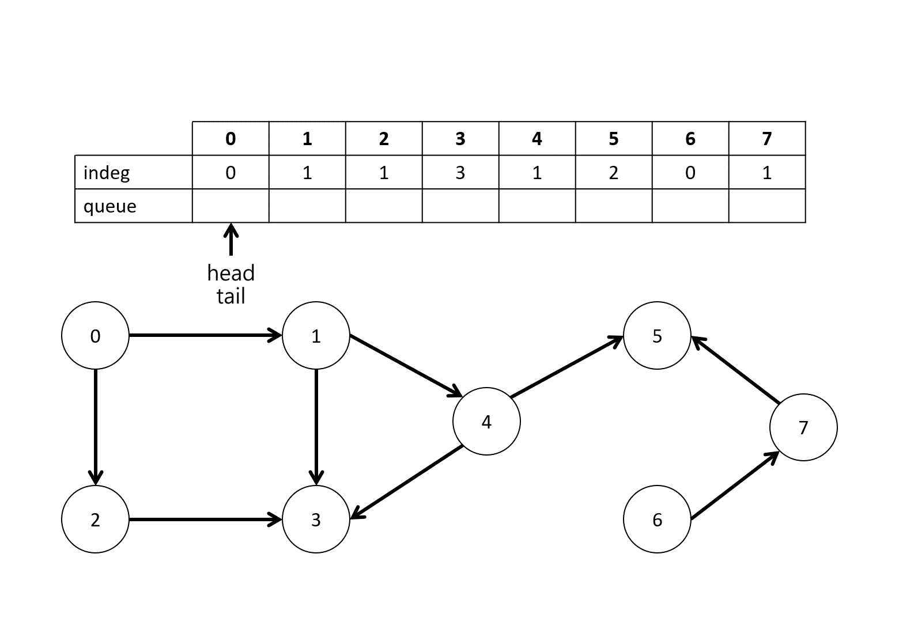
<iframe width="718" height="404" src="https://www.youtube.com/embed/KRQPETKfJT0" title="BFS" frameborder="0" allow="accelerometer; autoplay; clipboard-write; encrypted-media; gyroscope; picture-in-picture; web-share" referrerpolicy="strict-origin-when-cross-origin" allowfullscreen></iframe>
``` title="input"
8 9    
0 1    
0 2    
2 3    
1 3    
1 4    
4 3    
4 5    
6 7    
7 5    
```    
    
/// html | div.result
```
0 6 1 2 7 4 3 5    
```    
///


/// collapse-code  
```cpp 
#include <bits/stdc++.h>
using namespace std;

int main() {
    int n, m,x,y;
    cin >> n >> m;

    vector<vector<int>>v(n);
    vector<int>vis(n);
    vector<int>in(n);
    
    for(int i=0;i<m;i++){
        cin>>x>>y;
        v[x].push_back(y);
        in[y]++;
    }
    
    queue<int>q;
    
    for(int i=0;i<n;i++){
        if(in[i]==0){
            q.push(i);
            vis[i]=1;
        }
    }
    
    while(!q.empty()){
        
        int f=q.front();
        q.pop();
        
        cout<<f<<" ";
        
        
        for(int i:v[f]){
            if(!vis[i]){
                in[i]--;
                if(in[i]==0){
                    q.push(i);
                    vis[i]=1;
                }
            }
        }
        
        
    }
    return 0;
}
```
///


### 習題

####  UVA-10305

https://vjudge.net/problem/UVA-10305

>要選機器人帳號
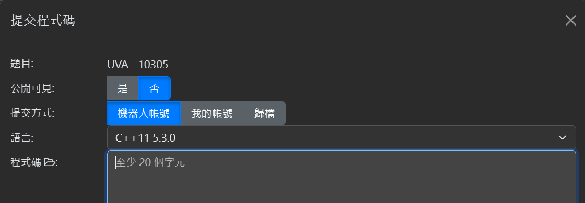

/// collapse-code  
```cpp  
#include <bits/stdc++.h>
using namespace std;

int main() {
    int n, m, x, y;
    while (cin >> n >> m) {
        
        if(n==0&&m==0)break;
        
        vector<vector<int>> v(n+1);
        vector<int> vis(n+1);
        vector<int> in(n+1);

        for (int i = 0; i < m; i++) {
            cin >> x >> y;
            v[x].push_back(y);
            in[y]++;
        }

        queue<int> q;

        for (int i = 1; i <=n; i++) {
            if (in[i] == 0) {
                q.push(i);
                vis[i] = 1;
            }
        }

        while (!q.empty()) {
            int f = q.front();
            q.pop();

            cout << f << " ";

            for (int i : v[f]) {
                if (!vis[i]) {
                    in[i]--;
                    if (in[i] == 0) {
                        q.push(i);
                        vis[i] = 1;
                    }
                }
            }
        }
        cout << "\n";
    }
    return 0;
}
```
///

#### f167. m4a1-社團 Club
https://zerojudge.tw/ShowProblem?problemid=f167

/// collapse-code  
```cpp  
#include <bits/stdc++.h>
using namespace std;

int main() {
    int n, m, x, y;
    cin >> n >> m;
    vector<vector<int>> v(n + 1);
    vector<int> vis(n + 1);
    vector<int> in(n + 1);
    vector<int> ans;

    for (int i = 0; i < m; i++) {
        cin >> x >> y;
        v[x].push_back(y);
        in[y]++;
    }

    queue<int> q;

    for (int i = 1; i <= n; i++) {
        if (in[i] == 0) {
            q.push(i);
            vis[i] = 1;
        }
    }

    while (!q.empty()) {
        int f = q.front();
        q.pop();

        ans.push_back(f);

        for (int i : v[f]) {
            if (!vis[i]) {
                in[i]--;
                if (in[i] == 0) {
                    q.push(i);
                    vis[i] = 1;
                }
            }
        }
    }

    if (ans.size() == n) {
        cout << "YES\n";
        for (int i : ans) {
            cout << i << "\n";
        }
    }
    else{
        cout<<"NO";
    }
    
    return 0;
}
```
///


#### a552. 模型
https://zerojudge.tw/ShowProblem?problemid=a552

送你一個範例測資：
```
6 4
0 3
3 1
0 2
5 4
```
```
0 2 3 1 5 4
```

/// collapse-code  
```cpp  title="解1"
#include <bits/stdc++.h>
using namespace std;

int main() {
    int n, m, x, y;
    while (cin >> n >> m) {
        vector<vector<int>> v(n);
        vector<int> vis(n);
        vector<int> in(n);

        for (int i = 0; i < m; i++) {
            cin >> x >> y;
            v[x].push_back(y);
            in[y]++;
        }

        queue<int> q;
        int found;
        while (1) {
            found = 0;
            for (int i = 0; i < n; i++) {
                if (in[i] == 0 && !vis[i]) {
                    
                    found = 1;
                    
                    vis[i] = 1;
                    cout << i << " ";

                    for (int i : v[i]) {
                        if (!vis[i]) {
                            in[i]--;
                        }
                    }
                    
                    break;  // 找到
                }
            }
            if(!found)break;
        }

        cout << "\n";
    }
    return 0;
}
```
///

/// collapse-code  
```cpp  title="解2"
//  https://seanxd.com/zh/zerojudge-a552/
#include <iostream>
#include <map>
using namespace std;

map<int, map<int, int>>MAP, before;
map<int, int>walk;

void BFS(map<int, int>start) {
    map<int, int>push;
    while(start.size() > 0) {
        const auto first = *start.begin();
        start.erase(start.begin());
        const int num = first.first;
        bool ok = true;
        for (auto it:before[num]) {
            if (walk[it.first] == 0) {
                ok = false;
                break;
            }
        }
        if (!ok) {
            push[num] = 0;
            continue;
        }
        cout << num << " ";
        walk[num]++;
        const map<int, int> mm = MAP[num];
        for (auto it:mm) {
            if (walk[it.first] == 0 && push[it.first] == 0) {
                push[it.first]++;
                start[it.first]++;
            }
        }
    }
}

int main() {
    cin.sync_with_stdio(0);
    cin.tie(0);
    int N, M;
    while (cin >> N >> M) {
        walk.clear();
        MAP.clear();
        before.clear();
        map<int, int>dad;
        for (int i = 0; i<M; i++) {
            int a, b;
            cin >> a >> b;
            dad[b]++;
            before[b][a]++;
            MAP[a][b]++;
        }
        map<int, int>start;
        for (int i = 0; i<N; i++) {
            if (dad[i] == 0) {
                start[i]++;
            }
        }
        BFS(start);
        cout << "\n";
    }
}

//ZeroJudge A552
//Dr. SeanXD
```
///


#### m933. 3. 邏輯電路
https://zerojudge.tw/ShowProblem?problemid=m933

/// collapse-code  
```cpp  
#include <bits/stdc++.h>
using namespace std;
#define int long long

signed main() {
    int p, q, r, m, x, y;
    cin >> p >> q >> r >> m;

    vector<int> type(p + q + r + 1);
    vector<vector<int>> input(p + q + r + 1);
    vector<int> indegree(p + q + r + 1);
    vector<vector<int>> v(p + q + r + 1);
    vector<int> output(p + q + r + 1);
    vector<int> d(p + q + r + 1);
    int maxd = 0;

    for (int i = 1; i <= p; i++) {
        cin >> x;
        input[i].push_back(x);
        output[i] = x;
    }

    for (int i = 1; i <= p; i++) {
        type[i] = -1;  // input gate
    }
    for (int i = p + 1; i <= p + q; i++) {
        cin >> type[i];
    }
    for (int i = p + q + 1; i <= p + q + r; i++) {
        type[i] = 0;  // output gate
    }

    for (int i = 0; i < m; i++) {
        cin >> x >> y;
        v[x].push_back(y);
        indegree[y]++;
    }

    queue<int> que;

    for (int i = 1; i <= p + q + r; i++) {
        if (indegree[i] == 0) {
            que.push(i);
        }
    }

    while (!que.empty()) {
        int f = que.front();
        que.pop();

        if (type[f] == -1 || type[f] == 0) {
            output[f] = input[f][0];
        } else if (type[f] == 1) {
            if (input[f][0] && input[f][1]) {
                output[f] = 1;
            } else {
                output[f] = 0;
            }

        } else if (type[f] == 2) {
            if (input[f][0] || input[f][1]) {
                output[f] = 1;
            } else {
                output[f] = 0;
            }

        } else if (type[f] == 3) {
            if (input[f][0] ^ input[f][1]) {
                output[f] = 1;
            } else {
                output[f] = 0;
            }

        } else if (type[f] == 4) {
            output[f] = !input[f][0];
        }

        for (int i : v[f]) {
            indegree[i]--;
            input[i].push_back(output[f]);

            d[i] = max(d[i], d[f] + 1);
            maxd = max(maxd, d[i]);

            if (!indegree[i]) {
                que.push(i);
            }
        }
    }

    cout << maxd - 1 << "\n";
    for (int i = p + q + 1; i <= p + q + r; i++) {
        cout << output[i] << " ";
    }

    return 0;
}

```
///


## 基礎習題
         
### d092: P-7-3. 機器人走棋盤 (APCS 201906)     
https://judge.hwsh.tc.edu.tw/ShowProblem?problemid=a121     
     
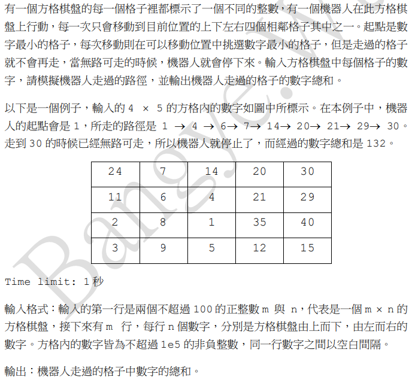
> 此題利用了一個技巧：`int dn[4]={0,1,-1,0},dm[4]={1,0,0,-1};   `  
    
     
         
/// collapse-code  
```cpp  
#include<bits/stdc++.h>
using namespace std;
#define N 111
#define inf 2147483640
#define nn "\n"
int v[N][N];
int x,y;
int vis[N][N];
int n,m;
int ans=0;

int vv(int i,int j){
    if( (i<0 || i>=n)|| (j<0 || j>=m)    ){
        return inf;
    }
    return v[i][j];
}

int main(){
    //istringstream cin("\
4 5 \
24 7 14 20 30 \
11 6 4 21 29 \
2 8 1 35 40 \
3 9 5 12 15\
");
    //istringstream cin("2 7 \
6 8 7 2 1 4 5 \
9 3 10 11 12 13 14");
    int mi_element=inf;
    cin>>n>>m;
    for(int i=0;i<n;i++){
        for(int j=0;j<m;j++){
            cin>>v[i][j];
            if(v[i][j]<mi_element){
                x=i;
                y=j;
                mi_element=v[i][j];
            }
        }
    }
    vis[x][y]=true;
    ans+=v[x][y];
    int ton[4]={0,1,0,-1};
    int tom[4]={1,0,-1,0};
    while(1){
        int mi=inf;
        int xx=-1,yy=-1;
        for(int i=0;i<4;i++){
            if(vv(x+ton[i],y+tom[i])<mi && !vis[x+ton[i]][y+tom[i]]){
                xx=x+ton[i];
                yy=y+tom[i];
                mi=vv(x+ton[i],y+tom[i]);
            }
        }
        if(mi==inf){
            cout<<ans;
            return 0;
        }
        x=xx;
        y=yy;
        vis[x][y]=true;
        ans+=vv(x,y);
    }
}
```
///

### d093: P-7-4. 方格棋盤的最少轉彎數路線
https://judge.tcirc.tw/ShowProblem?problemid=d093


有一個 m*n 的方格棋盤，每個格子可能是 0 或 1，其中 0 代表可以通過而 1 代表不 能通過。現在有一個機器人從左上角編號(1,1)的格子出發，要到達右下角編號 (m,n)的格子，每次可以往上下左右四個方向移動，我們要找到轉彎次數最少的路線。 Time limit: 1 秒 

輸入格式：第一行是兩個正整數 m 與 n，代表格子棋盤的列數與行數，接下來有 m 行， 每行是一個長度為 n 僅由 0 與 1 組成的字串，代表方格棋盤由上往下由左至右的內 容，出發與目的格子必然是 0。m 與 n 不超過 500。 

輸出：最少的轉彎數。如果無法到達，則輸出-1。     
     
     
     
> 這一題可以發現他的輸入之間並沒有空格，如下：     
> 3 6     
> 001010     
> 101000         
> 100010              
         
> 所以沒辦法使用數字陣列一個一個位置輸入，除非想要先字串分析         
         
> 這邊使用了一個方法：              
> 宣告為字串陣列，一列一列輸入                  
> &v[i][1] 指的是每列開頭的指標              
> cin>>&v[i][1]就是將字串放入&v[i][1~n]              
          
> 第35行的while (v[ti][tj] == '0')是為了一直沿著直線一走下去，每一「批」直線是一組，dis[]相同，如下圖。        
        
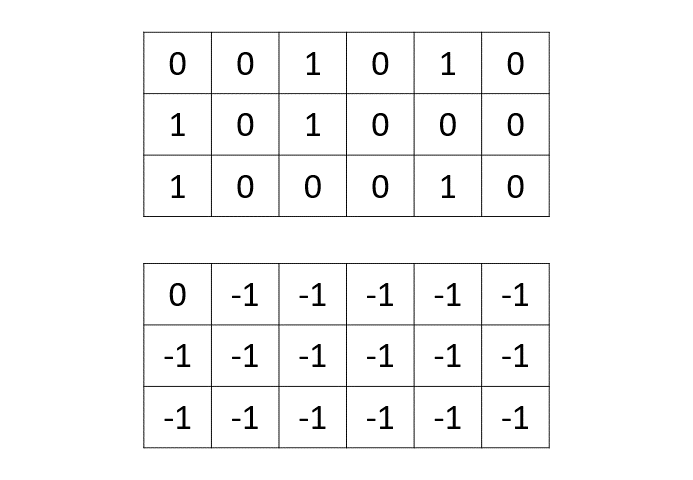
<iframe width="718" height="404" src="https://www.youtube.com/embed/Nn1hIpeN3cI" title="BFS" frameborder="0" allow="accelerometer; autoplay; clipboard-write; encrypted-media; gyroscope; picture-in-picture; web-share" referrerpolicy="strict-origin-when-cross-origin" allowfullscreen></iframe>


/// collapse-code  
```cpp  
#include <bits/stdc++.h>
using namespace std;
#define nn "\n"

istream &ss = cin;

// stringstream ss("3 6 001010 101000 100010");
struct st{
    int x;
    int y;
};
char v[501][501];
int dis[501][501];
int n, m;
int main(){
    ss >> n >> m;
    for (int i = 1; i <= m; i++){
        ss >> &v[i][1];
    }
    for (int i = 0; i < m + 2; i++){
        v[0][i] = '1';
        v[n + 1][i] = '1';
    }
    for (int i = 0; i < n + 2; i++){
        v[i][0] = '1';
        v[i][m + 1] = '1';
    }
    memset(dis, -1, sizeof(dis));
    // bfs
    st a = {1, 1};
    int di[4] = {0, 1, 0, -1}, dj[4] = {1, 0, -1, 0};
    queue<st> q;
    q.push({1, 1});
    dis[1][1] = 0;
    while (!q.empty() && dis[n][m] < 0){  //走完一條直線
        int fi = q.front().x, fj = q.front().y;
        q.pop();
        for (int i = 0; i < 4; i++){
            int ti = fi + di[i], tj = fj + dj[i];
            while (v[ti][tj] == '0'){
                if (dis[ti][tj] == -1){
                    dis[ti][tj] = dis[fi][fj] + 1;
                    q.push({ti, tj});
                }
                ti = ti + di[i], tj = tj + dj[i];
            }
        }
    }
    if (dis[n][m] > 0){
        dis[n][m]--;
    }

    cout << dis[n][m];
}
```
///

### d094: Q-7-5. 闖關路線 (APCS201910)
https://judge.tcirc.tw/ShowProblem?problemid=d094

某個闖關遊戲上有一隻神奇寶貝與兩個可控制左右移動的按鍵。神奇寶貝被安置在僅可左右移動的滑軌上。滑軌分成 n 個位置，由左到右分別以 0 ~ n – 1 表示。當遊 戲開始時，神奇寶貝從位置 0 開始，遊戲的資訊包含 P、L 與 R 三個數字，其中 P 表 示所須移至的目標位置，L 與 R 則分別表示每按一次左鍵或右鍵後，會往左或往右移 動的格子數。此外，每一個位置 x 都對應一個瞬間移動位置 S(x)；每一次按鍵後， 神奇寶貝會先依據按鍵往左或右移動到某個位置 x，接著瞬間移動至 S(x)。某些點 的瞬間移動位置等同原地點，也就是 S(x) = x，這些點稱為停留點。開始與目標位 置都一定是停留點；此外，每個點的瞬間移動位置都一定是停留點(除非超出界外)， 也就是不會發生連續瞬間移動的情形。 遊戲的目標是以最少的按鍵數操作神奇寶貝由開始位置到達目標位置，此外，在移動 過程中不可以超過滑軌的範圍\[0, n – 1\]，否則算闖關失敗；某些點的瞬間移動位 置也可能會超出滑軌的範圍，移動到這些點也會導致闖關失敗。 

Time limit: 1 秒    

輸入格式：輸入有兩行，第一行有 4 個數字，第 1 個為 n，第 2 個為目標位置 P，第 3 個為 L，第 4 個為 R，後三個數字皆為小於 n 之正整數，且 2 ≤ n ≤ 1e6。第二 行有 n 個整數，依序是各點的瞬間移動位置 S(0), S(1), …, S(n – 1)，這些數 字是絕對值不超過 1e8 的整數。    

輸出：輸出到達目標位置所需的最少按鍵數，如果無法到達目標位置，則輸出 –1。     
     
     
> 這題直接使用BFS，透過d來存放步數，也就是計算樹的高度。     
> 而父節點的高度是子節點的高度+1，遞迴式：dp[子]=dp[父]+1     
>      
> 而左、右走之後直接「瞬移」，因為如果可以瞬移會直接瞬移，否則會停留在原地，而且     
> 瞬移不會算是一個「移動」。     


/// collapse-code  
```cpp  
#include <iostream>
#include <queue>
#include <cstring>
using namespace std;
const int maxn = 1000005;
int n, p, l, r, a[maxn], d[maxn], now, nxt;
  
int main() {
    ios_base::sync_with_stdio(0);
    cin.tie(0);
    while (cin >> n >> p >> l >> r) {
        for (int i = 0; i < n; i++){
        cin >> a[i];
        if (a[i] >= n || a[i] < 0) a[i] = n;
    }
    memset(d, -1, sizeof(d));
    d[0] = 0;
    queue <int> q;
    q.push(0);
    while (!q.empty() && d[p] == -1){
        now = q.front();
        q.pop();
        nxt = now - l;
        if (nxt >= 0 && a[nxt] != n && d[a[nxt]] == -1){
            d[a[nxt]] = d[now] + 1;
            q.push(a[nxt]);
        }
        nxt = now + r;
        if (nxt < n && a[nxt] != n && d[a[nxt]] == -1){
            d[a[nxt]] = d[now] + 1;
            q.push(a[nxt]);
        }
    }
    cout << d[p] << "\n";
    }
    return 0;
}
```

///


/// details | 錯誤版

```cpp
#include <bits/stdc++.h>
using namespace std;
#define N 10000001
#define nn "\n"


int d[N];

int s[N];
int n,p,l,r;


bool can(int a){
    if(a<n && a>=0 && d[a]==-1){//
        return true;
    }
    return false;
}

set<int>se;


int main(){
    
    cin>>n>>p>>l>>r;

    for(int i=0;i<n;i++){
        cin>>s[i];
    }

    //bfs;

    queue<int>q;
    memset(d,-1,sizeof(d));
    
    q.push(0);
    d[0]=0;


    while(!q.empty()){
        int f=q.front();
        //cout<<"f:"<<f<<"   ";
        q.pop();

        if(f==p){
            se.insert(d[f]);
        }
        if(can(s[f])){
            d[s[f]]=d[f];
            q.push(s[f]);
            //cout<<"s[f]:"<<s[f]<<" ";
        }

        if(can(f-l)){
            d[f-l]=d[f]+1;
            q.push(f-l);

            //cout<<"l:"<<f-l<<" ";
        }

        if(can(f+r)){
            d[f+r]=d[f]+1;
            q.push(f+r);

            //cout<<"r:"<<f+r<<" ";
        }
        cout<<nn;
    }
    int c=1;
    if(!se.empty()){
        cout<<*se.rend();
        c=0;
    }
    
    if(c){
        cout<<-1;
    }
    
}
```
///


    

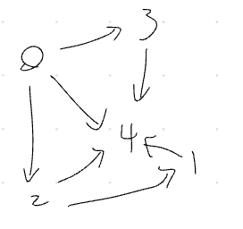
    
    
### Q-7-7. AOV 最早完工時間

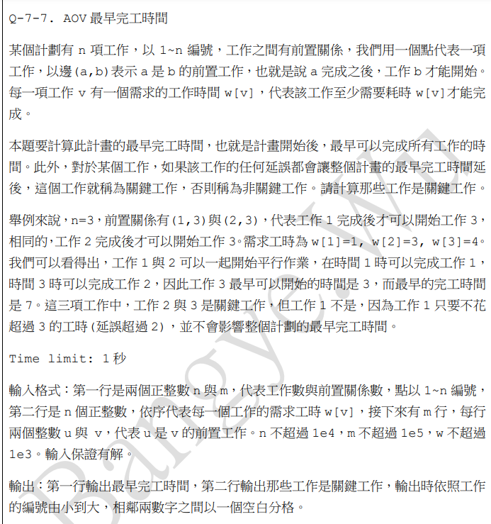
     
範例一輸入：      
3 2      
1 3 4      
1 3      
2 3      
範例一輸出：      
7      
2 3     
         
範例二輸入：      
4 4      
1 2 3 4      
1 2       
1 3       
1 4       
3 4      
      
範例二輸出：       
8       
1 3 4      
      
      
    
    
    
> 這題可能會有多個根如例題1的1、2（應該說有拓樸的樹，因為多個根其實可以拉成一棵樹），因此我們要依照拓樸對於每一個根看看高度，再對於每個高度取max，再將max加總。    
    

    
/// collapse-code  
```cpp  
#include<bits/stdc++.h>
using namespace std;
#define N 100001
#define nn "\n"


int w[N]={0};
vector<int>v[N];
bool vis[N]={false};
queue<int>q;
int inde[N]={0};
int h[N]={0};
vector<pair<int,int>>v_h[N];


bool cmp(pair<int,int> a , pair<int,int> b){
    return  a.second > b.second;
}

//stringstream ss("3 2 1 3 4 1 3 2 3 ");
&istream  ss= cin;

int main(){
    int  n,m;
    ss>>n>>m;//工作數量、前置關係數
    for(int i=1;i<=n;i++){
        ss>>w[i];
    }
    for(int i=0;i<m;i++){
        int x,y;
        ss>>x>>y;
        inde[y]++;
        v[x].push_back(y);
    }
    for(int i=1;i<n;i++){
        if(inde[i]==0){
            h[i]=0;
            v_h[0].push_back({i,w[i]});
            q.push(i);
        }
    }


    while(!q.empty()){
        int f=q.front();
        q.pop();
        for(int i:v[f]){
            inde[i]--;
            if(inde[i]==0){
                h[i]=h[f]+1;
                v_h[h[i]].push_back({i,w[i]});
                q.push(i);
            }
        }
    }


    cout<<nn;

    for(int i=0;i<n;i++){
        sort(v_h[i].begin(),v_h[i].end(),cmp);
    }

    int all=0;

    int w=0;
    while(v_h[w].size()){
        all+=v_h[w][0].second;
        w++;
    }
    cout<<all<<nn;

    w=0;
    while(v_h[w].size()){
        cout<<v_h[w][0].first<<" ";
        w++;
    }
}

```
///

## 有權重的邊


## [D - Transit Tree Path](https://atcoder.jp/contests/abc070/tasks/abc070_d)


/// collapse-code
```cpp
#include <bits/stdc++.h>
using namespace std;
#define int long long
#define pii pair<int, int>

signed main() {
    int n, x, y, z;
    cin >> n;

    vector<vector<pii>> v(n + 1);

    for (int i = 0; i < n - 1; i++) {
        cin >> x >> y >> z;

        v[x].push_back({y, z});
        v[y].push_back({x, z});
    }

    vector<int> dis(n + 1);
    vector<int> vis(n + 1);
    queue<int> que;

    int q, k;
    cin >> q >> k;

    que.push(k);
    vis[k] = 1;

    while (!que.empty()) {
        int f = que.front();
        que.pop();

        // cout << f;

        for (pii i : v[f]) {
            if (!vis[i.first]) {
                que.push(i.first);
                vis[i.first] = 1;

                dis[i.first] = dis[f] + i.second;
            }
        }
    }

    for (int i = 0; i < q; i++) {
        cin >> x >> y;
        cout << dis[x] + dis[y] << "\n";
    }

    return 0;
}
```
///

## [D - Even Relation](https://atcoder.jp/contests/abc126/tasks/abc126_d)


/// collapse-code
```cpp
#include <bits/stdc++.h>
using namespace std;
#define int long long
#define pii pair<int, int>

signed main() {
    int n, x, y, z;
    cin >> n;

    vector<vector<pii>> v(n + 1);

    for (int i = 0; i < n - 1; i++) {
        cin >> x >> y >> z;

        v[x].push_back({y, z});
        v[y].push_back({x, z});
    }

    vector<int> c(n + 1);
    vector<int> vis(n + 1);
    queue<int> que;

    que.push(1);
    vis[1] = 1;

    while (!que.empty()) {
        int f = que.front();
        que.pop();

        for (pii i : v[f]) {
            if (!vis[i.first]) {
                que.push(i.first);
                vis[i.first] = 1;

                if (i.second & 1)
                    c[i.first] = !c[f];
                else
                    c[i.first] = c[f];
            }
        }
    }

    for (int i = 1; i <= n; i++) {
        cout << c[i] << "\n";
    }

    return 0;
}

```
///

    
## Dijkstra 演算法用來計算一個圖中一點到其他點的最短路徑
### 1. 為什麼 pop 出來就能確定

Dijkstra Algorithm(Dijkstra 演算法) 解的是 **Single-Source Shortest Path(單源最短路徑)**：從一個起點 `s` 到所有點的最短距離。它要求邊權重是 **non-negative(非負數)**，也就是不能有負邊；這點是它正確性的核心限制。([CP Algorithms][1])

你可以把 Dijkstra 想成：

> **BFS 是每條邊成本都一樣時的最短路；Dijkstra 是每條邊成本不一樣、但都不會是負數時的 BFS。**

---

### 2. 核心概念：`dist[v]` 不是答案，一開始只是「目前找到的最好答案」

我們先定義：

```cpp
dist[v] = 從起點 s 到 v，目前已知的最短距離
```

注意，是「目前已知」，不是一開始就保證正確。

一開始：

```cpp
dist[s] = 0
dist[其他點] = INF
```

然後每次從 Priority Queue(優先佇列) 裡面拿出 **目前 dist 最小的點**。

這一步是整個 Dijkstra 最重要的貪婪選擇：

> 目前所有還沒確定的點裡，誰的 `dist` 最小，就先確定誰。

---

### 3. 為什麼「最小的點」可以直接確定？

假設現在 Priority Queue 裡面最小的是點 `u`，距離是 `dist[u]`。

你可能會想：

> 會不會之後繞一條路，讓 `u` 變更短？

Dijkstra 的回答是：**不會。**

原因是所有邊權重都是非負數。

如果之後要找到一條更短的路到 `u`，那條路一定會先經過某個還沒處理的點 `x`，再走到 `u`。

可是因為 `u` 已經是目前距離最小的點，所以：

```text
dist[u] <= dist[x]
```

而從 `x` 再走一些邊到 `u`，邊權重又不會是負數，所以距離只會增加或不變：

```text
dist[x] + 後面的邊 >= dist[x] >= dist[u]
```

所以不可能比 `dist[u]` 更短。

這就是 Dijkstra 的核心 Invariant(不變量)：

> **每次從 Priority Queue 取出的最小距離點，它的最短距離就已經確定了。**

---

### 4. Relaxation(鬆弛) 是什麼？

Relaxation(鬆弛) 其實就是檢查：

> 「如果我先到 `u`，再從 `u` 走到 `v`，會不會比原本到 `v` 的方法更短？」

公式是：

```cpp
if (dist[u] + w < dist[v]) {
    dist[v] = dist[u] + w;
}
```

生活化例子：

你目前知道：

```text
家 -> 學校 = 20 分鐘
```

現在發現：

```text
家 -> 捷運站 = 5 分鐘
捷運站 -> 學校 = 10 分鐘
```

所以：

```text
家 -> 捷運站 -> 學校 = 15 分鐘
```

比原本的 20 分鐘短，於是更新：

```text
dist[學校] = 15
```

這就是 Relaxation(鬆弛)。

---

### 5. 流程圖

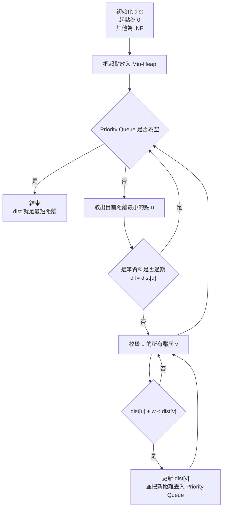


---

### 6. 用一個小圖走一次

假設從 `1` 出發：

```text
1 -> 2，成本 2
1 -> 3，成本 5
2 -> 3，成本 1
2 -> 4，成本 4
3 -> 4，成本 2
```

圖長這樣：

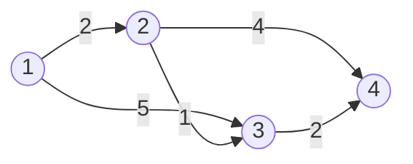

初始：

```text
dist[1] = 0
dist[2] = INF
dist[3] = INF
dist[4] = INF
```

---

### 7. 實際執行表

| 步驟 | pop 出來的點 | 目前距離 | 做的事         | dist 結果                |
| -: | -------- | ---: | ----------- | ---------------------- |
|  1 | 1        |    0 | 更新 2、3      | `dist[2]=2, dist[3]=5` |
|  2 | 2        |    2 | 透過 2 更新 3、4 | `dist[3]=3, dist[4]=6` |
|  3 | 3        |    3 | 透過 3 更新 4   | `dist[4]=5`            |
|  4 | 3        |    5 | 這是舊資料，跳過    | 不變                     |
|  5 | 4        |    5 | 沒有更短路       | 完成                     |

最後答案：

```text
dist[1] = 0
dist[2] = 2
dist[3] = 3
dist[4] = 5
```

注意第 4 步很重要。

Priority Queue 裡可能有舊資料，例如：

```text
一開始 1 -> 3 = 5，所以丟入 (5, 3)
後來 1 -> 2 -> 3 = 3，又丟入 (3, 3)
```

所以 `(5, 3)` 變成過期資料。

競程常見寫法是：

```cpp
if (d != dist[u]) continue;
```

這叫 lazy deletion(懶刪除)，因為 C++ 的 `priority_queue` 不方便直接修改裡面舊的 key，所以我們讓舊資料留著，取出來時再跳過。CP-algorithms 也採用 Priority Queue(優先佇列) 版本來處理 sparse graph(稀疏圖) 的 Dijkstra 實作。([CP Algorithms][2])

---

### 8. C++ 標準模板

///collapse-code 
```cpp title="模板程式碼"
#include <bits/stdc++.h>
using namespace std;
#define int long long

int INF = 2e4;

signed main() {
    int n, m, s;
    cin >> n >> m >> s;

    vector<vector<pair<int, int>>> g(n + 1);

    for (int i = 0; i < m; i++) {
        int u, v;
        int w;
        cin >> u >> v >> w;

        g[u].push_back({v, w});

        // 如果是無向圖，才加這行：
        // g[v].push_back({u, w});
    }

    vector<int> dist(n + 1, INF);
    dist[s] = 0;

    priority_queue<
        pair<int, int>,
        vector<pair<int, int>>,
        greater<pair<int, int>>>
        pq;

    pq.push({0, s});

    while (!pq.empty()) {
        auto cur = pq.top();
        pq.pop();

        int d = cur.first;
        int u = cur.second;

        if (d != dist[u]) continue;  // 遇到比較舊比較長的路徑，直接跳過

        for (auto e : g[u]) {
            int v = e.first;
            int w = e.second;

            if (dist[u] + w < dist[v]) {
                dist[v] = dist[u] + w;
                pq.push({dist[v], v});
            }
        }
    }

    for (int i = 1; i <= n; i++) {
        printf("dis[%lld] = ", i);
        if (dist[i] == INF)
            cout << "INF\n";
        else
            cout << dist[i] << "\n";
    }

    return 0;
}
```
///


<iframe src="\筆記素材\Dijkstra.pdf" width="100%" height="550px"></iframe>

輸入：
```
7 6      
0 2 3
0 1 1
2 3 4
1 4 0
3 4 2
5 4 3
```

輸出：
```
dis[1] = 0
dis[2] = 2
dis[3] = 3
dis[4] = 5
```


///collapse-code 
```cpp title="輸出過程的程式碼"
#include <bits/stdc++.h>
using namespace std;
#define int long long

int INF = 2e4;

signed main() {
    int n, m, s;
    cin >> n >> m >> s;

    vector<vector<pair<int, int>>> g(n + 1);

    for (int i = 0; i < m; i++) {
        int u, v;
        int w;
        cin >> u >> v >> w;

        g[u].push_back({v, w});

        // 如果是無向圖，才加這行：
        // g[v].push_back({u, w});
    }

    vector<int> dist(n + 1, INF);
    dist[s] = 0;

    priority_queue<
        pair<int, int>,
        vector<pair<int, int>>,
        greater<pair<int, int>>>
        pq;

    pq.push({0, s});
    //================================
    printf("push {0,%lld}\n", s);
    //================================

    while (!pq.empty()) {
        auto cur = pq.top();
        pq.pop();

        int d = cur.first;
        int u = cur.second;

        //================================
        printf("pop {%lld,%lld}\n", d, u);
        //================================

        if (d != dist[u]) {  // 遇到比較舊比較長的路徑，直接跳過

            //================================
            printf("continue {%lld,%lld}\n", d, u);
            //================================

            continue;
        }

        for (auto e : g[u]) {
            int v = e.first;
            int w = e.second;

            if (dist[u] + w < dist[v]) {
                dist[v] = dist[u] + w;
                //================================
                printf("dist[%lld] = %lld  ", v, dist[u] + w);
                //================================

                pq.push({dist[v], v});
                //================================
                printf("push {%lld,%lld}\n", dist[v], v);
                //================================
            }
        }
    }

    cout << "\n";

    for (int i = 1; i <= n; i++) {
        printf("dis[%lld] = ", i);
        if (dist[i] == INF)
            cout << "INF\n";
        else
            cout << dist[i] << "\n";
    }

    return 0;
}
```
///

輸出
```
push {0,1}
pop {0,1}
dist[2] = 2  push {2,2}
dist[3] = 5  push {5,3}
pop {2,2}
dist[3] = 3  push {3,3}
dist[4] = 6  push {6,4}
pop {3,3}
dist[4] = 5  push {5,4}
pop {5,3}
continue {5,3}
pop {5,4}
pop {6,4}
continue {6,4}

dis[1] = 0
dis[2] = 2
dis[3] = 3
dis[4] = 5

```

---

### 9. 你可以這樣記 Dijkstra

不要背「流程」，要背這個核心：

```text
dist[v] = 目前找到的最短路

每次挑 dist 最小的點 u

因為邊權非負，
所以其他還沒處理的點不可能繞出更短路回來救 u

因此 u 的答案確定

然後用 u 去更新鄰居
```

一句話版：

> **Dijkstra 每次確定離起點最近的未確定點，然後用這個點去改善其他點的距離。**

---

### 10. 最常見錯誤

#### 10.1 把點 push 進 Priority Queue 時就當成確定

錯誤想法：

```text
點 v 被 push 進 pq，所以 v 的答案確定了
```

這是錯的。

正確是：

```text
點 v 從 pq pop 出來，而且它是目前最新 dist，才確定
```

---

#### 10.2 有負邊還用 Dijkstra

如果有負邊，Dijkstra 的「pop 出來就確定」會壞掉。

例子：

```text
1 -> 2 = 2
1 -> 3 = 5
3 -> 2 = -10
```

一開始看起來：

```text
dist[2] = 2
dist[3] = 5
```

Dijkstra 會先確定 `2`。

但其實：

```text
1 -> 3 -> 2 = -5
```

更短。

所以負邊要用 Bellman-Ford Algorithm(Bellman-Ford 演算法)、SPFA，或其他處理負權圖的方法。Dijkstra 標準版本的前提是 non-negative edge weights(非負邊權)。([CP Algorithms][1])

---

#### 10.3 `priority_queue` 預設是 Max-Heap

C++ 預設：

```cpp
priority_queue<int> pq;
```

是最大值優先。

Dijkstra 要 Min-Heap(最小堆)，所以要寫：

```cpp
priority_queue<
    pair<ll, int>,
    vector<pair<ll, int>>,
    greater<pair<ll, int>>
> pq;
```

---

### 11. 最後用一句直覺收斂

Dijkstra 其實不是魔法。

它只是一直問：

```text
目前我最有把握、距離最短的點是誰？
```

然後因為所有路都不會有負成本，所以：

```text
更遠的點不可能繞一圈讓這個最近的點變更近
```

因此最近的點可以被安全確定。

你真正要抓住的是這句：

> **非負邊權保證：目前最小的暫定距離，未來不可能再變小。**

[1]: https://cp-algorithms.com/graph/dijkstra.html?utm_source=chatgpt.com "Dijkstra - finding shortest paths from given vertex"
[2]: https://cp-algorithms.com/graph/dijkstra_sparse.html?utm_source=chatgpt.com "Dijkstra on sparse graphs"

### 例題    

https://judge.tcirc.tw/problem/d096    

P-7-9. 最短路徑 (*) 輸入一個無向圖 G=(V,E,w)，其中點以 0~n-1 編號，而邊的權重是非負整數。計算 0 號點到其他點的最短路徑長度。兩點之間可能有多個邊。 Time limit: 1 秒 輸入格式：第一行是兩個正整數 n 與 m，代表點數與邊數，接下來有 m 行，每行三個 整數 u, v, w 代表一條無向邊(u,v)的長度是 w。n 不超過 1e4，m 不超過 1e5, w 是不超過 1e4 的非負整數。 輸出：第一行輸出 0 到各點之最短路徑長度中的最大值，也就是在可以到達的點中， 最短距離最大的是多少，第二行輸出有多少點無法從抵達。

範例一輸入：      
7 6      
0 2 3      
0 1 1      
2 3 4      
1 4 0      
3 4 2      
5 4 3     
     
範例一輸出：      
4      
1     
      
範例二輸入：       
3 3       
2 1 5       
1 0 0       
0 1 1      
      
範例二輸出：       
5       
0      
            
範例一示意圖：      

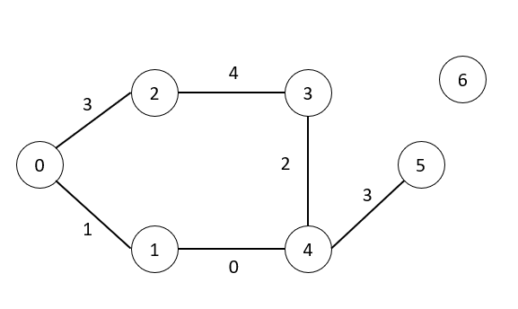


<!-- <iframe width="718" height="404" src="https://www.youtube.com/embed/O_AQIJtY3xE" title="BFS" frameborder="0" allow="accelerometer; autoplay; clipboard-write; encrypted-media; gyroscope; picture-in-picture; web-share" referrerpolicy="strict-origin-when-cross-origin" allowfullscreen></iframe> -->


/// collapse-code  
```cpp  
#include <bits/stdc++.h>
using namespace std;
#define int long long
#define pii pair<int, int>

int INF = 2e4;

signed main() {
    int n, m;
    cin >> n >> m;  // 點:0~n-1, 邊數:m

    vector<vector<pii>> v(n);
    vector<int> dis(n, INF);

    for (int i = 0; i < m; i++) {
        int x, y, w;
        cin >> x >> y >> w;

        v[x].push_back({y, w});
        v[y].push_back({x, w});  // 雙向
    }

    priority_queue<
        pii,
        vector<pii>,
        greater<pii>>
        pq;  // 小到大

    pq.push({0, 0});

    //=====================
    // printf("push {0,0}\n");
    //=====================

    dis[0] = 0;

    while (!pq.empty()) {
        int d = pq.top().first;
        int u = pq.top().second;
        pq.pop();
        // =====================
        // printf("pop {%lld,%lld}\n", d, u);
        //=====================

        if (d != dis[u]) continue;

        for (pii pp : v[u]) {
            int v = pp.first;  // 這邊是從 v 拿出來的所以要是正常的順序，v 是 first，w 是 second。
            int w = pp.second;

            if (dis[u] + w < dis[v]) {
                dis[v] = dis[u] + w;
                pq.push({dis[v], v});

                //=====================
                // printf("push {%lld,%lld}\n", dis[v], v);
                //=====================
            }
        }
    }

    int ans1 = 0, ans2 = 0;
    for (int i = 0; i < n; i++) {
        if (dis[i] == INF) {
            ans2++;
        } else {
            ans1 = max(ans1, dis[i]);
        }
    }
    cout << ans1 << "\n"
         << ans2;

    return 0;
}
```

///


### 練習題


#### D - Super Takahashi Bros.

https://atcoder.jp/contests/abc340/tasks/abc340_d


#### Single Source Shortest Path

https://judge.u-aizu.ac.jp/onlinejudge/description.jsp?id=GRL_1_A
    
## 併查集    

### 1. 併查集在解決什麼問題

Disjoint Set Union(併查集)，也常叫 Union-Find(合併查找)，專門處理這種問題：

> 有很多個元素，我們需要一直做兩件事：
>
> 1. 把兩個元素所在的群組合併
> 2. 查兩個元素是否在同一個群組

例如：

```text
1 和 2 是朋友
2 和 3 是朋友
問：1 和 3 是不是同一群？
```

答案是：是。因為：

```text
1 -- 2 -- 3
```

所以 1、2、3 屬於同一個集合。

併查集的標準做法會用 rooted tree(有根樹) 表示集合，每個集合用一個 representative(代表點)，也就是 root(根節點) 代表整群。Boost 的 `disjoint_sets` 文件也把這個資料結構描述為用 parent tree(父節點樹) 維護不相交集合，並搭配 path compression(路徑壓縮) 和 union by rank(依秩合併) 加速操作。([boost.org][1])

---

### 2. 核心原理

我們開一個陣列：

```cpp
parent[i]
```

意思是：

```text
i 的爸爸是 parent[i]
```

一開始每個人都是自己一群，所以：

```cpp
parent[i] = i;
```

例如有 5 個點：

```text
1  2  3  4  5
```

一開始：

```text
parent[1] = 1
parent[2] = 2
parent[3] = 3
parent[4] = 4
parent[5] = 5
```

每個點自己就是 root(根)。

---

### 3. find_root 是什麼

`find_root(x)` 的目的：

> 找出 x 所在集合的 root(根節點)。

例如：

```text
1 -> 2 -> 3
```

代表：

```cpp
parent[1] = 2;
parent[2] = 3;
parent[3] = 3;
```

那麼：

```cpp
find_root(1)
```

會一路往上找：

```text
1 的爸爸是 2
2 的爸爸是 3
3 的爸爸是 3，所以 3 是 root
```

所以：

```cpp
find_root(1) == 3
```

---

### 4. path compression(路徑壓縮)

如果每次都慢慢往上找，樹太高會變慢。

所以我們找 root 的時候，順便把路徑上的點直接接到 root。

原本：

```text
1 -> 2 -> 3 -> 4
```

執行：

```cpp
find_root(1)
```

之後變成：

```text
1 -> 4
2 -> 4
3 -> 4
4 -> 4
```

也就是下次查 1、2、3 都會很快。

核心程式只有這樣：

```cpp
int find_root(int x) {
    if (parent[x] == x) return x;
    return parent[x] = find_root(parent[x]);
}
```

這行最重要：

```cpp
return parent[x] = find_root(parent[x]);
```

它同時做兩件事：

```text
1. 找到 root
2. 把 parent[x] 直接改成 root
```

---

### 5. 合併兩個集合

假設要合併 `a` 和 `b`。

錯誤想法是：

```cpp
parent[a] = b;
```

這樣不穩，因為 `a` 不一定是 root。

正確做法是：

```cpp
int ra = find_root(a);
int rb = find_root(b);
```

意思是：

```text
ra = a 那一群的代表
rb = b 那一群的代表
```

如果：

```cpp
ra == rb
```

代表它們本來就在同一群，不用合併。

如果：

```cpp
ra != rb
```

就把其中一個 root 接到另一個 root 底下。

---

### 6. union by size(依大小合併)

我們再開一個：

```cpp
sz[i]
```

意思是：

```text
如果 i 是 root，sz[i] 表示這一群有幾個元素
```

合併時，把小集合接到大集合下面，樹會比較矮。

```cpp
if (sz[ra] < sz[rb]) swap(ra, rb);

parent[rb] = ra;
sz[ra] += sz[rb];
```

意思是：

```text
如果 ra 那群比較小，就交換 ra 和 rb
保證 ra 是比較大的那群
然後把 rb 接到 ra 底下
```

搭配 path compression(路徑壓縮) 後，併查集的操作非常接近 O(1)。較正式地說，經典分析會用 inverse Ackermann function(反阿克曼函數) 描述其成長，非常慢；Tarjan 的集合合併演算法分析就是這類複雜度的代表性來源。([OA Monitor Ireland][2])

---

### 7. 視覺化流程

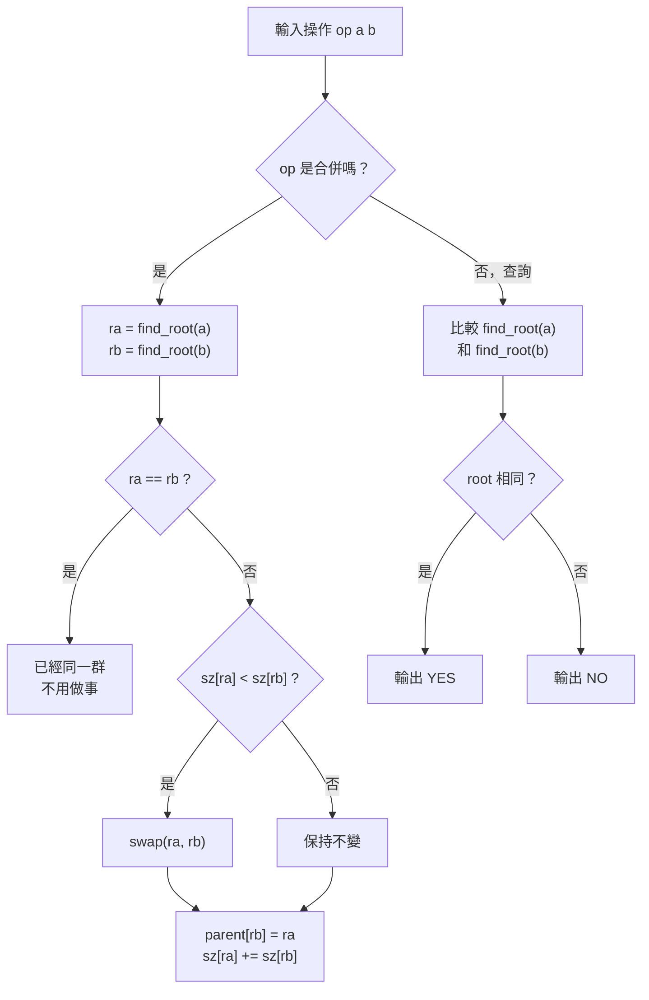

---

### 8. 完整 C++ 程式模板：

這份程式假設輸入格式是：

```text
n q
op a b
op a b
...
```

其中：

```text
op = 1：合併 a 和 b
op = 2：查詢 a 和 b 是否同一群
```

完整程式：
/// collapse-code
```cpp
#include <bits/stdc++.h>
using namespace std;
#define int long long

vector<int> sz;
vector<int> parent;

int find_root(int x) {
    if (parent[x] == x) return x;  // 遞迴終止條件
    return parent[x] = find_root(parent[x]);
}

signed main() {
    ios::sync_with_stdio(false);
    cin.tie(nullptr);
    
    int n, m;
    cin >> n >> m;  // n = 點的數量, m = 操作數量

    sz.assign(n + 1, 1);
    parent.resize(n + 1);

    for (int i = 1; i <= n; i++) {
        parent[i] = i;
    }

    int op, a, b;
    for (int i = 0; i < m; i++) {
        cin >> op >> a >> b;
        int ra = find_root(a);
        int rb = find_root(b);
        if (op == 1) {  // 合併

            if (ra == rb) continue;                     // 兩個已經合併了，所以不用再合併。
            if (sz[ra] < sz[rb]) swap(ra, rb);  // 大的當 a ，讓小的 b 接到大的 a。

            parent[rb] = ra;
            sz[ra] += sz[rb];

        } else {  // 查詢是否同組
            if (ra == rb) {
                cout << "YES\n";
            } else {
                cout << "NO\n";
            }
        }
    }

    return 0;
}
```
///


---

### 9. 範例測試

輸入：

```text
5 6
1 1 2
1 2 3
2 1 3
2 1 4
1 4 5
2 4 5
```

過程：

```text
1 1 2：合併 1 和 2
1 2 3：合併 2 和 3，所以 1、2、3 同群
2 1 3：查詢 1 和 3，是同群
2 1 4：查詢 1 和 4，不同群
1 4 5：合併 4 和 5
2 4 5：查詢 4 和 5，是同群
```

輸出：

```text
YES
NO
YES
```

[1]: https://www.boost.org/doc/libs/1_65_1/libs/disjoint_sets/disjoint_sets.html "Boost Disjoint Sets"
[2]: https://oamonitor.ireland.openaire.eu/rpo/rcsi/search/publication?pid=10.1145%2F321879.321884 "Efficiency of a Good But Not Linear Set Union Algorithm"


### 例題
    
[P-7-2. 開車蒐集寶物  ](https://judge.tcirc.tw/problem/d091)  
參加一個蒐集寶物的遊戲，你拿到一個地圖，地圖上有 n 個藏寶點，每個藏寶點有若    
干價值的寶物，由於你的團隊是最頂尖的，只要能到達藏寶點一定可以取得該藏寶點    
的寶藏。從地圖上看得到一共有 m 條道路，每條道路連接兩個藏寶點，而且每條道路    
都是雙向可以通行的。在遊戲的一開始，你可以要求直升機將你的團隊運送到某個藏    
寶點，而且你可以獲得一部車與充足的油料，但是直升機的載送只有一次，所以你必    
須決定要從哪裡開始才可以獲得最多的寶藏總價值。    
Time limit: 1 秒    
輸入格式：第一行是兩個正整數 n 與 m，代表藏寶地點數與道路數，地點是以 0~n-1編號，第二行 n 個非負整數，依序是每一個地點的寶藏價值，每個地點的寶藏價值     
不超過 100。接下來有 m 行，每一行兩個整數 a 與 b 代表一個道路連接的兩個地點     
編號。n 不超過 5e4，m 不超過 5e5。兩點之間可能有多條道路，有些道路的兩端點     
可能是同一地點。     
輸出：最大可以獲得的寶藏總價值。     
     
              
範例一輸入：     
7 6     
5 2 4 2 1 1 8     
5 1     
1 3     
1 4     
2 0     
2 0     
3 3     
範例一輸出：     
9     
    

<!-- 
以範例一為例：   
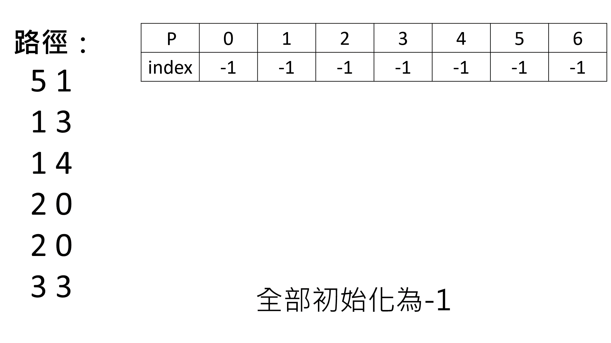
<iframe width="718" height="404" src="https://www.youtube.com/embed/q_k2AT5BjX4" title="BFS" frameborder="0" allow="accelerometer; autoplay; clipboard-write; encrypted-media; gyroscope; picture-in-picture; web-share" referrerpolicy="strict-origin-when-cross-origin" allowfullscreen></iframe> -->
    


    
    
/// collapse-code  
```cpp title="解答"
#include<bits/stdc++.h>
using namespace std;
#define int long long

vector<int> parent;
vector<int> sz;
vector<int> w;


int find_root(int x){
    if(parent[x] == x) return x;
    return parent[x] = find_root(parent[x]);
}

signed main(){
    ios::sync_with_stdio(0);
    cin.tie(0);
    
    int n,m;
    cin>>n>>m;          // 點 = 0~n-1, m = 邊數
    
    parent.resize(n);
    sz.resize(n,1);
    w.resize(n);
    
    for(int i=0;i<n;i++){
        parent[i] = i;
        cin>>w[i];
    }
    
    int a,b;
    for(int i=0;i<m;i++){
        cin>>a>>b;
        
        int ra = find_root(a);
        int rb = find_root(b);
        
        if(ra == rb) continue;
        if(sz[ra] < sz[rb]) swap(ra,rb);
        
        parent[rb] = ra;
        sz[ra] += sz[rb];
        w[ra] += w[rb];
        
    }
    
    
    int ma=0;
    for(int i:w){
        ma=max(ma,i);
    }
    
    cout<<ma;
    
    
    return 0;
}
```
///
<!-- 
### 練習題：[a445. 新手訓練系列- 我的朋友很少](https://zerojudge.tw/ShowProblem?problemid=a445)


/// collapse-code  
```cpp title="程式碼"
#include<bits/stdc++.h>
using namespace std;


vector<int>f;

int leader(int x){
    if(f[x]<0){
        return x;
    }
    return f[x]=leader(f[x]);
}


int main(){
    
    ios::sync_with_stdio(0);
    cin.tie(0);
    
    int n,m,t;
    cin>>n>>m>>t;

    f.resize(n+1,-1);
    for(int i=0;i<m;i++){
        int x,y;
        cin>>x>>y;

        int r1=leader(x);
        int r2=leader(y);

        if(r1==r2)continue;

        if(f[r1]>f[r2])swap(r1,r2);

        f[r1]+=f[r2];

        f[r2]=r1;
    }
    for(int i=0;i<t;i++){
        int x,y;
        cin>>x>>y;
        int r1=leader(x);
        int r2=leader(y);


        if(r1==r2)cout<<":)"<<"\n";
        else cout<<":("<<"\n";
    }
}
```
///


### 練習題：[d831. 畢業旅行](https://zerojudge.tw/ShowProblem?problemid=d831)


/// collapse-code  
```cpp title="程式碼"
#include <bits/stdc++.h>
using namespace std;
#define int long long
#define nn "\n"
int n,m;
vector<int>f;
int r(int x){
    if(f[x]<0)return x;
    return f[x]=r(f[x]);
}
signed main(){
    ios::sync_with_stdio(0);
    cin.tie(0);
    //istringstream cin("6 4 \
0 1 \
2 3 \
1 3 \
5 4 \
1000000 0 \
1000000 1 \
0 999999");
    while(cin>>n>>m){
        f.clear();
        f.resize(n+1,-1);
        for(int i=0;i<m;i++){
            int a,b;
            cin>>a>>b;
            int ra=r(a),rb=r(b);
            if(ra==rb)continue;
            if(f[ra]>f[rb])swap(ra,rb);
            f[ra]+=f[rb];
            f[rb]=ra;
        }
        int mi=0;
        for(int i:f){
            mi=min(mi,i);
        }
        cout<<-mi<<nn;
    }
}
```
/// -->


<!-- ### 練習題：[b412. 【記憶中】之記憶中的并查集](https://zerojudge.tw/ShowProblem?problemid=b412)

/// collapse-code  
```cpp title="程式碼"

```
/// -->

### 練習題：[A - Disjoint Set Union ](https://atcoder.jp/contests/practice2/tasks/practice2_a?utm_source=chatgpt.com)
/// collapse-code  
```cpp title="程式碼"
#include <bits/stdc++.h>
using namespace std;

vector<int> parent;
vector<int> sz;

int find_root(int x) {
    if (parent[x] == x) return x;
    return parent[x] = find_root(parent[x]);
}

int main() {
    ios::sync_with_stdio(0);
    cin.tie(0);

    int n, m;
    cin >> n >> m;  // 信件： 1~n ，操作數：m

    parent.assign(n + 1, 0);
    sz.assign(n + 1, 1);

    for (int i = 1; i <= n; i++) {
        parent[i] = i;
    }

    int op, a, b;
    while (m--) {
        cin >> op >> a >> b;
        int ra = find_root(a);
        int rb = find_root(b);
        if (op == 0) {
            if (ra == rb) continue;
            if (sz[ra] < sz[rb]) swap(ra, rb);

            parent[rb] = ra;
            sz[ra] += sz[rb];

        } else {
            cout << (ra == rb) << "\n";
        }
    }
    return 0;
}
```
///
### 練習題(較難)：[d449. 垃圾信件](https://zerojudge.tw/ShowProblem?problemid=d449)
/// collapse-code  
```cpp title="程式碼"
#include <bits/stdc++.h>
using namespace std;
#define int long long

vector<int> parent;
vector<int> sz;
vector<int> id;

int find_root(int x) {
    if (parent[x] == x) return x;
    return parent[x] = find_root(parent[x]);
}

signed main() {
    ios::sync_with_stdio(false);
    cin.tie(nullptr);

    int n, m;

    while (cin >> n >> m) {
        // 最多每次 op=2 都新增一個節點，所以要開 n + m + 5
        parent.assign(n + m + 5, 0);
        sz.assign(n + m + 5, 0);
        id.assign(n + 1, 0);

        int tot = n;     // 目前用到的 DSU 節點編號
        int ans = n;     // 目前類別數

        for (int i = 1; i <= n; i++) {
            parent[i] = i;
            sz[i] = 1;
            id[i] = i;
        }

        while (m--) {
            int op;
            cin >> op;

            if (op == 1) {
                int a, b;
                cin >> a >> b;

                int ra = find_root(id[a]);
                int rb = find_root(id[b]);

                if (ra == rb) continue;

                if (sz[ra] < sz[rb]) swap(ra, rb);

                parent[rb] = ra;
                sz[ra] += sz[rb];

                ans--;

            } else {
                int a;
                cin >> a;

                int ra = find_root(id[a]);

                // a 本來就自己一類，不用再獨立
                if (sz[ra] == 1) continue;

                // 從原本那一類移出 a
                sz[ra]--;

                // 建立一個新節點代表 a 的新類別
                tot++;
                parent[tot] = tot;
                sz[tot] = 1;
                id[a] = tot;

                ans++;
            }
        }

        cout << ans << "\n";
    }

    return 0;
}
```
///


## 最小生成樹
                              
> 在一個地圖中有很多條連線，需要將其變成一顆樹(沒有環)而且要路徑最小的演算法，稱為最小生成樹。
                              
                              

### [P-7-12. 最小生成樹 (*)    ](https://judge.tcirc.tw/problem/d098)  
輸入一個無向圖 G=(V,E,w)，其中點以 0~n-1 編號，而邊的權重是非負整數。計算      
G 的最小生成樹的成本。兩點之間可能有多個邊。      
Time limit: 1 秒      
輸入格式：第一行是兩個正整數 n 與 m，代表點數與邊數，接下來有 m 行，每行三個      
整數 u, v, w 代表一條無向邊(u,v)的長度是 w。n 不超過 1e4，m 不超過 1e5, w      
是不超過 1e4 的非負整數。              
輸出：輸出最小生成樹的成本，如果不存在則輸出-1。        
範例一輸入：        
8 10        
0 1 6     
0 2 4     
1 2 5     
2 3 9     
1 4 1            
1 5 1            
2 6 2       
4 5 3       
5 6 8       
7 6 1       
範例一輸出：       
23       
       
                                           
> 以此題為例             
> 如下圖：      
                                    
                                  
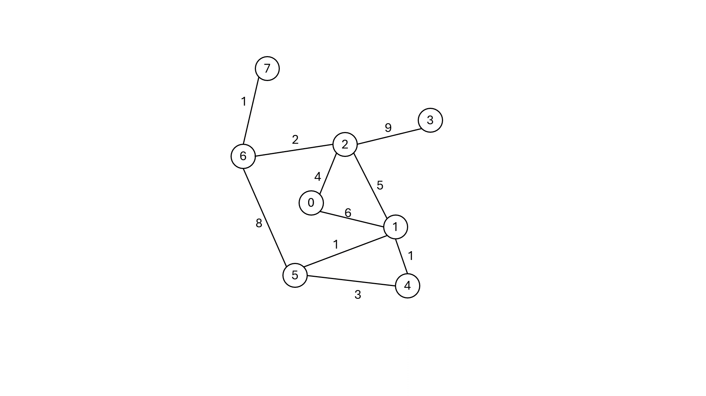
<iframe width="718" height="404" src="https://www.youtube.com/embed/Ty4e-heQn7U" title="BFS" frameborder="0" allow="accelerometer; autoplay; clipboard-write; encrypted-media; gyroscope; picture-in-picture; web-share" referrerpolicy="strict-origin-when-cross-origin" allowfullscreen></iframe>
     
> 要找出最小生成樹有兩種方法：     
     
### 法一：併查集(最小生成樹)     
            
> 將路徑按照權重排序後一一取出，如果連線的兩個點已經在同一集合，代表會形成環，丟棄(略過)即可。       
>        
> /// danger |    注意  
> 其實就是在併查集的基礎上把路徑先排序再使用而已       
> ///
       

/// collapse-code  
```cpp  
#include <bits/stdc++.h>
using namespace std;
#define nn "\n"
#define N 100000
istream& ss=cin;
int f[N];
int p[N];
struct st{
    int x;
    int y;
};
int r(int x){
    if(f[x]<0){
        return x;
    }
    return f[x]=r(f[x]);
}
int main(){
    ios::sync_with_stdio(0);
    cin.tie(0);
    int ans=0;
    int t=0;
    int w,s;
    ss>>s>>w;
    for(int i=0;i<s;i++){
        f[i]=-1;
        p[i]=0;
    }
    priority_queue<pair<int,pair<int,int>>>pq;
    //power,value,value
    for(int i=0;i<w;i++){
        int x,y,z;
        ss>>x>>y>>z;
        pq.push({-z,{x,y}});
    }
    while(!pq.empty()){
        int r1=r(pq.top().second.first);
        int r2=r(pq.top().second.second);
        int pow=-pq.top().first;
        pq.pop();
        if(r1==r2){
            continue;
        }
        if(f[r1]<f[r2]){
            f[r1]+=f[r2];
            f[r2]=r1;
            ans+=pow;
            t++;
        }
        else{
            f[r2]+=f[r1];
            f[r1]=r2;
            ans+=pow;
            t++;
        }
    }
    if(t<s-1){
        cout<<"-1";
        return 0;
    }
    cout<<ans;
}
```
///


### 法二：Dijkstra-演算法


> 使用這方法找出所有最短路徑，最後加在一起。     
>      
> ///danger | 注意     
> 在54、55行只需要比較 i.p<d[i.v] 即可，因為它比原本大就好。     
> ///     
     
     

/// collapse-code  
```cpp  
#include <bits/stdc++.h>
using namespace std;


#define nn "\n"
#define N 1000000

istream& ss=cin;
//stringstream ss("8 10 \
0 1 6 \
0 2 4 \
1 2 5 \
2 3 9 \
1 4 1 \
1 5 1 \
2 6 2 \
4 5 3 \
5 6 8 \
7 6 1");


struct st{
    int v,p;
};


vector<st> v[N];

bool vis[N]={false};
int d[N];

int main(){
    int n,m;
    ss>>n>>m;
    for(int i=0;i<n;i++){
        d[i]=N;
    }
    for(int i=0;i<m;i++){
        int x,y,z;
        ss>>x>>y>>z;
        v[x].push_back({y,z});
        v[y].push_back({x,z});
    }
    
    priority_queue<pair<int,int>>pq;
    pq.push({0,0});
    d[0]=0;
    
    while(!pq.empty()){
        pair<int,int> f=pq.top();
        pq.pop();
        vis[f.second]=true;
        for(st i:v[f.second]){
            if(!vis[i.v] && i.p<d[i.v]){
                d[i.v]=i.p;
                pq.push({-d[i.v],i.v});
            }
        }
    }
    int ans=0;
    for(int i=0;i<n;i++){
        if(d[i]==N){
            cout<<-1;
            return 0;
        }
        else{
            ans+=d[i];
        }
    }
    cout<<ans;
}
```
///
